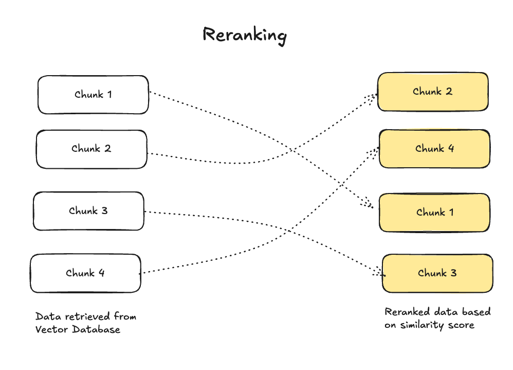
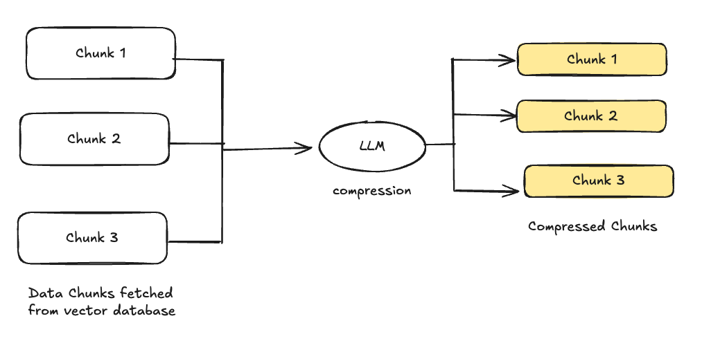

<!-- 
 Copyright Amazon.com, Inc. or its affiliates. All Rights Reserved.
 SPDX-License-Identifier: CC-BY-SA-4.0
 -->

# Post-retrieval optimization 

**Content Level: 300**

## Suggested Pre-Reading
- [RAG](../../../2_0_technical_foundations_and_patterns/2_1_key_primitives/2_1_7_rag/2_1_7_rag.md)
- [Pre-retrieval-techniques](../3_3_1_pre-retrieval_techniques/3_3_1_pre-retrieval_techniques.md)
- [retrieval-techniques](../3_3_2_retrieval_optimization/3_3_2_retrieval_optimization.md)

## TL;DR

After retrieving relevant data from a knowledge store, the next important phase is **post-retrieval optimization**. This process refines the results before they are passed to the language model, enhancing relevance and coherence. Techniques like **re-ranking retrieved chunks** and **context compression and selection** help optimize the quality of the retrieved information, so that it is concise, relevant, and usable for generating accurate responses.


## Introduction

Post-retrieval optimization represents an important phase in the RAG pipeline, focusing on refining and enhancing retrieved content before it reaches the language model. This stage involves multiple sophisticated techniques that work together to improve the quality, relevance, and usability of retrieved information. The optimization process helps bridge the gap between raw retrieval results and the specific needs of the language model, ultimately leading to more accurate and contextually appropriate responses.


## Re-Ranking Retrieved Chunks

When data is retrieved, the order in which it appears may not reflect its relevance or usefulness. **Re-ranking** organizes these chunks based on relevance scores, which are determined by factors like semantic matching to the query, content quality, and contextual alignment. A **ranking model**, often a fine-tuned machine learning algorithm, evaluates these factors and re-orders the chunks accordingly, so the most valuable and contextually appropriate information is processed first, enhancing the overall response quality.

<div style="margin:auto;text-align:center;width:100%;">

<p style="font-style: italic; margin-top: 5px;">Figure 1: Context Management System Architecture</p>
</div>

### Basic Re-ranking

Re-ranking reorganizes these chunks based on multiple factors:

* Semantic similarity scores
* Content quality metrics
* Contextual alignment
* Document freshness
* Source authority

### Advanced Re-ranking Techniques

#### Cross-Encoder Re-ranking

* Uses transformer models to perform deep comparison between query and documents
* More computationally intensive but provides higher accuracy
* Particularly effective for complex queries requiring nuanced understanding

**When to use:** Best for scenarios requiring high precision and when processing time isn't critical
**Benefits:** Higher accuracy than bi-encoders, better understanding of query-document relationships
**Limitations:** Computationally expensive, slower processing time, not suitable for initial retrieval of large document sets

#### Multi-stage Re-ranking

* Initial fast filtering using lightweight models
* Secondary detailed analysis of top candidates
* Final re-ranking using sophisticated algorithms

**When to use:** Large-scale applications with varying performance requirements
**Benefits:** Balances computational cost with accuracy, progressive filtering reduces overall processing time
**Limitations:** Complex to implement and tune, requires careful threshold setting at each stage

#### Learning-to-Rank (LTR)

* Trains on historical query-document pairs
* Incorporates multiple features for ranking decisions
* Continuously improves through feedback loops

**When to use:** Systems with historical user interaction data and multiple ranking signals
**Benefits:** Can combine multiple features, learns from user behavior, customizable to specific use cases
**Limitations:** Requires significant training data, can be complex to maintain and update

## Context Compression and Selection

Given the size limitations of language models, it’s vital to condense the retrieved data without losing important details. **Context compression** reduces the length of retrieved chunks by eliminating redundancy and focusing on the most important content. **Context selection** determines which pieces of the retrieved information are most relevant to the user’s query, so that only the most pertinent data is fed into the model.

<div style="margin:auto;text-align:center;width:100%;">

<p style="font-style: italic; margin-top: 5px;">Figure 1: Context Management System Architecture</p>
</div>

### Compression Techniques

#### Extractive Summarization

* Identifies and extracts key sentences
* Maintains original text integrity
* Preserves key facts and figures

**When to use:** When preserving original text and factual accuracy is a priority
**Benefits:** Maintains original wording, easier to verify, preserves key statistics and quotes
**Limitations:** May lack coherence, can be redundant, limited ability to synthesize information

#### Abstractive Compression

* Generates concise reformulations
* Maintains semantic meaning
* Reduces token count significantly

**When to use:** When concise, fluent summaries are needed and exact wording is less important
**Benefits:** More natural summaries, better information synthesis, reduced redundancy
**Limitations:** May introduce inaccuracies, harder to verify against source

#### Hybrid Approaches

* Combines extractive and abstractive methods
* Balances preservation and compression
* Optimizes for specific use cases

**When to use:** Complex scenarios requiring both accuracy and readability
**Benefits:** Combines advantages of both extractive and abstractive methods, more flexible
**Limitations:** More complex to implement, requires careful balancing of methods

### Context Selection Strategies

#### Query-Focused Selection

* Analyzes query intent
* Prioritizes directly relevant content
* Filters out tangential information

**When to use:** Time-sensitive applications requiring immediate query relevance.
**Benefits:** Highly relevant to user queries and efficient token usage.
**Limitations:** May miss important background context or over-emphasize keywords.

#### Importance Scoring

* Evaluates information density
* Considers semantic relevance
* Weights recent vs. historical content

**When to use:** Time-sensitive applications requiring immediate query relevance.
**Benefits:** Highly relevant to user queries and efficient token usage.
**Limitations:** May miss important background context or over-emphasize keywords.

#### Redundancy Elimination

* Identifies duplicate information
* Merges complementary content
* Maintains information completeness

**When to use:** Multiple source documents or limited context window environments.
**Benefits:** Maximizes information diversity and efficient token utilization.
**Limitations:** May remove useful reinforcement or subtle differences in information.

Together, these techniques should result in input that is focused, concise, and fits within the model's token constraints while maintaining relevance. For example, if a user asks about a historical event, context compression might summarize long documents, while context selection would retain key facts like dates and key participants. This combination of processes helps the language model generate more accurate, high-quality responses.

## Advanced Optimization Techniques

### Dynamic Context Window Adjustment

* Adapts context window size based on query complexity
* Balances information completeness with model constraints
* Optimizes token usage efficiency

### Semantic Filtering

* Removes irrelevant content post-retrieval
* Enhances context coherence
* Improves response accuracy

### Multi-Document Synthesis

* Combines information from multiple sources
* Resolves conflicts between sources
* Creates coherent unified context

## Making it Practical

### Common Pitfalls to Avoid

1. Over-optimization
    1. Excessive compression leading to context loss
    2. Over-aggressive filtering removing important details
    3. Too many re-ranking passes increasing latency
2. Implementation Issues
    1. Inadequate error handling
    2. Poor optimization parameter tuning
    3. Lack of monitoring and logging
3. System Design Problems
    1. Insufficient scalability consideration
    2. High latency in critical paths
    3. Resource inefficient implementations

### Performance Monitoring

#### Key Metrics to Track

* Response relevance scores
* Processing latency
* Compression ratios
* Context window utilization

#### Optimization Feedback Loop

* Monitor user satisfaction
* Track answer accuracy
* Adjust parameters based on performance
* Implement continuous improvement

### Get Hands-On

#### Example implementation of Cross-Encoder Reranking using Cohere model

```
def cross_encoder_rerank_bedrock(query, documents, model_id="cohere.embed-english-v3"):
    bedrock = boto3.client('bedrock-runtime')
    
    # Prepare the input for Cohere rerank
    request_body = {
        "input": {
            "query": query,
            "documents": documents,
            "top_n": len(documents)  # Return all reranked documents
        }
    }
    
    # Call Cohere rerank
    response = bedrock.invoke_model(
        modelId=model_id,
        contentType="application/json",
        accept="application/json",
        body=json.dumps(request_body)
    )
    
    # Parse response
    response_body = json.loads(response['body'].read())
    reranked_results = response_body['results']
    
    return reranked_results
```

#### Example Implementation for Multistage Reranking

```
class BedrockMultiStageReranker:
    def __init__(self):
        self.bedrock = boto3.client('bedrock-runtime')
        
    def initial_embedding_stage(self, query: str, documents: List[str], 
                              model_id: str = "amazon.titan-embed-text-v1") -> List[str]:
        """First stage: Use Titan Embeddings to filter documents"""
        request_body = {
            "inputText": query
        }
        
        # Get query embedding
        response = self.bedrock.invoke_model(
            modelId=model_id,
            contentType="application/json",
            accept="application/json",
            body=json.dumps(request_body)
        )
        query_embedding = json.loads(response['body'].read())['embedding']
        
        # Get document embeddings and calculate similarity
        doc_scores = []
        for doc in documents:
            request_body['inputText'] = doc
            response = self.bedrock.invoke_model(
                modelId=model_id,
                contentType="application/json",
                accept="application/json",
                body=json.dumps(request_body)
            )
            doc_embedding = json.loads(response['body'].read())['embedding']
            
            # Calculate unnormalized cosine similarity
            similarity = sum(q * d for q, d in zip(query_embedding, doc_embedding))
            doc_scores.append((similarity, doc))
        
        # Return top 5 documents from first stage
        return [doc for _, doc in sorted(doc_scores, reverse=True)[:5]]
    
    def final_reranking_stage(self, query: str, filtered_docs: List[str],
                             model_id: str = "cohere.embed-english-v3") -> List[Dict]:
        """Second stage: Use Cohere rerank for final ordering"""
        request_body = {
            "input": {
                "query": query,
                "documents": filtered_docs,
                "top_n": len(filtered_docs)
            }
        }
        
        response = self.bedrock.invoke_model(
            modelId=model_id,
            contentType="application/json",
            accept="application/json",
            body=json.dumps(request_body)
        )
        
        return json.loads(response['body'].read())['results']

    def multi_stage_rerank(self, query: str, documents: List[str]) -> List[Dict]:
        """Complete multi-stage reranking pipeline"""
        # Stage 1: Initial filtering using embeddings
        filtered_docs = self.initial_embedding_stage(query, documents)
        
        # Stage 2: Final reranking using Cohere
        final_results = self.final_reranking_stage(query, filtered_docs)
        
        """Note that a combination of scores from initial filtering and 
        final reranking (if available) can be used for final ranking."""
        
        return final_results
```

## Further Reading

1. Amazon Bedrock provides built-in re-ranking capabilities through the Cohere Rerank model. Here's a practical example: [Improving RAG with Cohere Rerank](https://aws.amazon.com/blogs/machine-learning/improve-rag-performance-using-cohere-rerank/){:target="_blank" rel="noopener noreferrer"}
2. [Amazon Bedrock Re-ranking Tutorial](https://docs.aws.amazon.com/bedrock/latest/userguide/rerank.html){:target="_blank" rel="noopener noreferrer"}

## Contributors

**Authors:**

- Hari Prasanna Das, Applied Scientist 

- Ramprasath S - Sr Applied AI Architect 