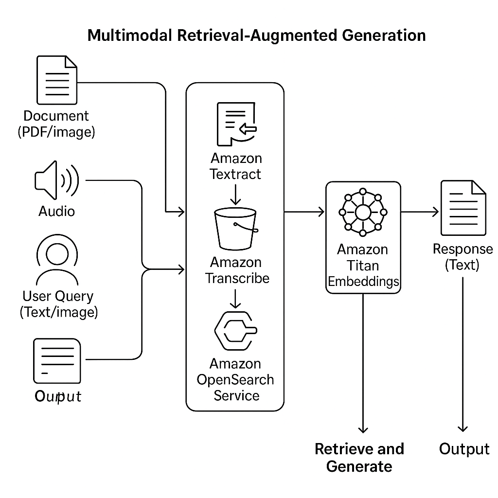

<!-- 
 Copyright Amazon.com, Inc. or its affiliates. All Rights Reserved.
 SPDX-License-Identifier: CC-BY-SA-4.0
 -->

# Multimodal Retrieval-Augmented Generation (RAG) with AWS Bedrock

**Content Level: 300**

## Suggested Pre-Reading
- [RAG](../../../2_0_technical_foundations_and_patterns/2_1_key_primitives/2_1_7_rag/2_1_7_rag.md)
- [Pre-retrieval-techniques](../3_3_1_pre-retrieval_techniques/3_3_1_pre-retrieval_techniques.md)
- [retrieval-techniques](../3_3_2_retrieval_optimization/3_3_2_retrieval_optimization.md)

## TL;DR


## Executive Summary
Multimodal Retrieval-Augmented Generation (RAG) extends traditional RAG capabilities by processing multiple data formats—text, images, audio, and video—to provide comprehensive, context-aware AI responses. Built on AWS Bedrock, this solution leverages serverless foundation models to deliver accurate, grounded answers while minimizing hallucinations.


## Understanding Multimodal RAG
Multimodal RAG extends traditional text-based RAG to process and reason across multiple data formats:

### Definition and Scope

Multimodal RAG extends traditional text-based RAG to process and reason across multiple data formats:

#### Text
- **Examples**: Reports, articles, documents
- **Processing Method**: Direct processing

#### Images
- **Examples**: Diagrams, charts, scanned documents
- **Processing Method**: OCR via Amazon Textract

#### Audio
- **Examples**: Call recordings, meetings
- **Processing Method**: Transcription via Amazon Transcribe

#### Video
- **Examples**: Training videos, presentations
- **Processing Method**: Transcription + frame analysis

### Business Value Proposition

Multimodal RAG addresses a fundamental limitation of traditional systems by:

    1. Processing the full spectrum of enterprise data assets
    2. Enabling richer, contextually-aware insights across formats
    3. Supporting complex use cases like medical diagnosis from multiple sources
    4. Providing unified analysis across previously siloed data formats


## Problem Statement: Limitations of Traditional RAG
Traditional RAG systems face significant constraints in enterprise environments:

**Format Limitations:** Cannot process non-textual data like images or audio
**Information Silos:** Unable to connect insights across different media types
**Context Gaps: Miss:** critical information contained in charts, diagrams, or spoken content
**Manual Processing:** Require human intervention to extract insights from multimedia

## Strategic Importance for Enterprises
Multimodal RAG delivers strategic advantages in high-stakes domains:

#### Legal
* Contract analysis across scanned documents and amendments
* Automatic clause detection and risk assessment
* Compliance verification with visual evidence
#### Healthcare
* Integrated analysis of imaging, patient records, and clinical notes
* Diagnostic support combining multiple information sources
* Medical research acceleration through comprehensive data analysis
#### Financial Services
* Audit trail verification across documents and recorded meetings
* Fraud detection through multi-source pattern recognition
* Regulatory compliance monitoring across diverse document types
#### Customer Support
* Voice call analysis integrated with knowledge base retrieval
* Visual troubleshooting from user-submitted images
* Comprehensive case resolution through unified information access

## Technical Architecture
AWS Bedrock is a fully managed service that allows developers to build and scale generative AI applications using foundation models from FM providers including but not limited to Amazon itself. Bedrock supports both text-based and multimodal RAG implementations by integrating with the broader AWS ecosystem. Key components involved in a multimodal RAG solution on AWS include:

- **Amazon S3**: Serves as the central repository for storing raw multimodal data, including documents, audio, images, and video.
- **Amazon Textract**: Automatically extracts text and table data from scanned documents and PDFs using OCR.
- **Amazon Transcribe**: Converts speech from audio or video files into text for downstream processing.
- **Amazon Titan Embeddings**: Transforms processed text into numerical vector representations for similarity search.
- **Amazon OpenSearch or Amazon Kendra**: Stores and indexes embeddings for fast retrieval of semantically similar content.
- **Agents for Amazon Bedrock**: Manage the RAG orchestration workflow, including calling external APIs, retrieving data, and passing context to LLMs.
- **Foundation Models via Bedrock**: Handle the final generation step, the appropriate foundation models to craft grounded, natural language responses based on the retrieved content.

This modular architecture enables a plug-and-play approach to building sophisticated RAG workflows that scale securely and reliably across industries.

## Architecture Design: How Multimodal RAG Works on AWS
<div style="margin:auto;text-align:center;width:100%;">

<p style="font-style: italic; margin-top: 5px;">Figure 1: Multi Modal RAG Architecture</p>
</div>

A typical multimodal RAG architecture on AWS begins with ingesting enterprise data of varying formats into an Amazon S3 bucket. For scanned or image-based files, Amazon Textract is invoked to perform OCR and extract structured text. For audio or video inputs, Amazon Transcribe generates transcripts. These processed text outputs are then chunked and embedded using an embedding model like Amazon Titan Embeddings. The resulting vectors are stored in a vector database such as Amazon OpenSearch. When a user submits a query, the system computes an embedding for the query and retrieves semantically similar chunks. The retrieved chunks are appended to the prompt and sent to a foundation model via Amazon Bedrock, where the final answer is generated. Agents for Bedrock can orchestrate the full lifecycle — including calling preprocessing services, handling retrieval logic, and formatting the final output. This design enables enterprise-scale RAG with multimodal input pipelines, minimal infrastructure management, and high flexibility.

## Cost Optimization Strategies for Multimodal RAG on AWS
Implementing multimodal RAG cost-effectively requires strategic optimization:

### Processing Optimization

* Batch preprocessing documents during ingestion rather than at query time
* Cache extracted text and embeddings to avoid redundant processing
* Use asynchronous pipelines with Lambda, SQS, and Step Functions

### Token Usage Efficiency

* Implement metadata filtering to reduce vector search scope
* Apply chunking strategies to minimize context sent to LLMs
* Use tiered retrieval approaches for progressive context expansion

### Infrastructure Selection

* **Amazon OpenSearch:** Optimal for in-region, ElasticSearch-compatible deployments
* **Amazon Kendra:** Best for enterprise search with built-in connectors
* **External Vector DBs:** Consider for specialized needs or global deployments

### Serverless Advantages

* Scale compute resources based on actual usage
* Minimize idle infrastructure costs
* Leverage Agents for Bedrock to reduce custom code maintenance


## Enterprise Use Cases Powered by Multimodal RAG
### Legal Document Analysis
* **Challenge:** Analyzing thousands of contract pages with embedded tables and amendments
* **Solution:** Extract text from scanned contracts, identify clauses, and provide risk assessments
* **Outcome:** 80% reduction in contract review time with higher accuracy
### Healthcare Diagnostics
* **Challenge:** Integrating patient records across formats for comprehensive diagnosis
* **Solution:** Combine imaging results, clinical notes, and lab reports for unified analysis
* **Outcome:** More accurate diagnoses through comprehensive data integration
### Financial Compliance
* **Challenge:** Auditing financial documents with complex tables and charts
* **Solution:** Extract and analyze numerical data alongside textual content
* **Outcome:** Automated compliance verification with full audit trail
### Customer Support Enhancement
* **Challenge:** Resolving issues requiring knowledge across multiple formats
* **Solution:** Integrate call transcripts with product documentation and user-submitted images
* **Outcome:** Faster resolution times and improved customer satisfaction

## Getting Started: Steps to Build Multimodal RAG with AWS Bedrock
To build a multimodal RAG system on AWS, begin by uploading your diverse content formats (e.g., scanned documents, audio files, PDFs, images) into Amazon S3. Next, create preprocessing pipelines using Amazon Textract for OCR and Amazon Transcribe for speech-to-text conversion. Store processed content and metadata in a structured format. Generate embeddings using Amazon Titan Embeddings via Bedrock, and index them in OpenSearch or your preferred vector store. Set up a retrieval workflow that transforms a user query into an embedding, retrieves top-k relevant results, and constructs a prompt for the foundation model. Use the `RetrieveAndGenerate` API or configure an Agent for Bedrock to manage this end-to-end flow. Integrate the system into your application via API Gateway or Lambda, and monitor performance and cost through CloudWatch and Cost Explorer. As a next step, test iteratively with your enterprise data, refine chunking strategies, and enforce guardrails for accuracy, traceability, and privacy.

### Prerequisites

1. **AWS Account:** with access to:

* Amazon S3
* Amazon Textract
* Amazon Transcribe (for audio processing)
* Amazon Bedrock
* Amazon OpenSearch Service or alternative vector database

2. **IAM Permissions:** for all required services

Local Development Environment:

* Python 3.8+
* Required libraries: boto3, opensearch-py
* Installation command: pip install boto3 opensearch-py

### Step 1: Configure S3 Storage
```
import boto3

s3 = boto3.client('s3')
bucket = 'your-bucket-name'
file_path = 'sample.pdf'
s3.upload_file(file_path, bucket, 'documents/sample.pdf')

```

### Step 2: Extract Text from Documents

```
textract = boto3.client('textract')

response = textract.detect_document_text(
    Document={'S3Object': {'Bucket': bucket, 'Name': 'documents/sample.pdf'}}
)
extracted_text = ' '.join([b['Text'] for b in response['Blocks'] if b['BlockType'] == 'LINE'])
print(extracted_text)

```

### Step 3: Generate Embeddings

```
bedrock_runtime = boto3.client('bedrock-runtime')

def get_embeddings(text):
    response = bedrock_runtime.invoke_model(
        modelId='amazon.titan-embed-text-v1',
        body=json.dumps({"inputText": text}),
        accept='application/json',
        contentType='application/json'
    )
    return json.loads(response['body'].read())['embedding']

```
### Step 4: Index into Vector Database

```
from opensearchpy import OpenSearch

opensearch = OpenSearch(
    hosts=[{'host': 'your-endpoint', 'port': 443}],
    http_auth=('user', 'pass'),
    use_ssl=True
)

embedding = get_embeddings(extracted_text)

doc = {
    "text": extracted_text,
    "embedding": embedding,
    "source": "documents/sample.pdf"
}
opensearch.index(index="rag-docs", body=doc)

```
### Step 5: Perform Vector Search
```
query = "What are the key terms of the agreement?"
query_embedding = get_embeddings(query)

search_body = {
    "size": 3,
    "query": {
        "knn": {
            "embedding": {
                "vector": query_embedding,
                "k": 3
            }
        }
    }
}
results = opensearch.search(index="rag-docs", body=search_body)
context = ' '.join([r['_source']['text'] for r in results['hits']['hits']])

```
### Step 6: Generate Response with LLM
```
def query_claude(query, context):
    prompt = f"Answer the following based on the context:\n\nContext:\n{context}\n\nQuestion:\n{query}"
    response = bedrock_runtime.invoke_model(
        modelId='anthropic.claude-3-sonnet-20240229-v1:0',
        body=json.dumps({
            "prompt": prompt,
            "max_tokens_to_sample": 300,
            "temperature": 0.7
        }),
        contentType='application/json',
        accept='application/json'
    )
    return json.loads(response['body'].read())['completion']

answer = query_claude(query, context)
print("Answer:", answer)

```
## Further Reading

1. [AWS Bedrock Documentation](https://docs.aws.amazon.com/bedrock/){:target="_blank" rel="noopener noreferrer"}
2. [Amazon Textract Developer Guide](https://docs.aws.amazon.com/textract/){:target="_blank" rel="noopener noreferrer"}
3. [Amazon Transcribe Developer Guide](https://docs.aws.amazon.com/transcribe/){:target="_blank" rel="noopener noreferrer"}
4. [Amazon OpenSearch Service Documentation](https://docs.aws.amazon.com/opensearch-service/){:target="_blank" rel="noopener noreferrer"}
5. [Agents for Amazon Bedrock](https://docs.aws.amazon.com/bedrock/latest/userguide/agents.html){:target="_blank" rel="noopener noreferrer"}

## Contributors

**Authors:**

- Sriram Sethumadhavan, Deliver Consultant 
- George Belsian, Sr.Deliver Consultant 