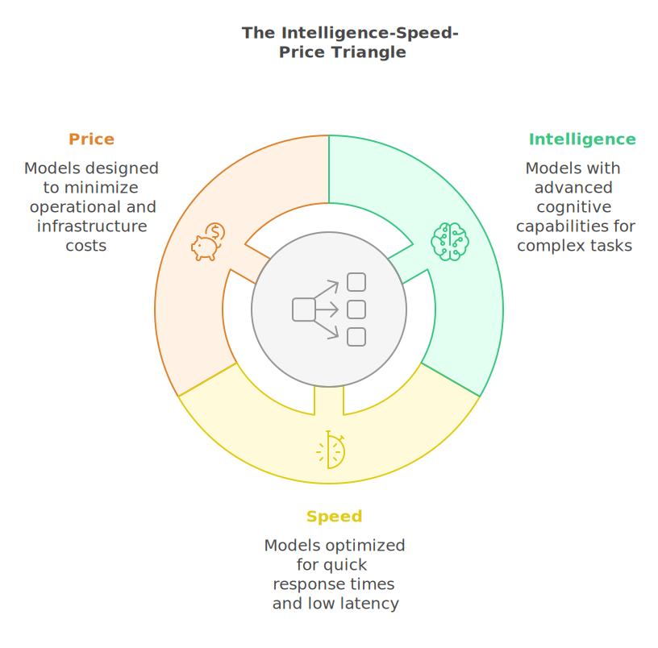

<!-- 
 Copyright Amazon.com, Inc. or its affiliates. All Rights Reserved.
 SPDX-License-Identifier: CC-BY-SA-4.0
 -->

# Model Selection

**Content Level: 300**

## TL;DR

In the rapidly evolving landscape of generative AI, selecting the right model has become more nuanced than simply choosing the largest or newest option available. The Amazon Bedrock service now offers a diverse set of models spanning multiple providers, architectures, and specializations - from Amazon's own cost-effective Nova family to various high-performance options available through the service.

## Model Selection

The decision matrix for model selection extends beyond parameter count to encompass an important triangulation between intelligence, speed, and price. This document provides a comprehensive guide to navigating these tradeoffs within Amazon Bedrock, helping engineering teams make informed decisions that align with their application requirements and business objectives.

*Figure 1: The triangular relationship between Intelligence, Speed, and Price in model selection*{: style="text-align: center; display: block"}

## The Intelligence-Speed-Price Triangle

At the heart of model selection lies a fundamental trilemma – you can typically optimize for two of these three dimensions, but rarely all three simultaneously. Understanding these dimensions is important for aligning model capabilities with application requirements.

### Intelligence

Intelligence represents a model's cognitive capabilities – its knowledge breadth, reasoning depth, instruction-following ability, and output quality. More intelligent models can handle complex tasks, produce nuanced responses, and demonstrate deeper understanding of specialized domains. They typically excel at complex reasoning chains, creative tasks, and addressing ambiguous queries with greater precision.

When we speak of intelligence in this context, we're evaluating how well a model can understand and respond to complex instructions, reason through multi-step problems, and generate high-quality outputs that demonstrate both factual accuracy and nuanced understanding. The most intelligent models available on Amazon Bedrock represent the cutting edge of this capability, incorporating sophisticated reasoning architectures that enable them to tackle complex analytical tasks.

### Speed

Speed encompasses multiple performance metrics, including Time to First Token (TTFT), token generation throughput, and overall response latency. For real-time applications, TTFT often matters more than total completion time, as it directly impacts user-perceived responsiveness. Meanwhile, batch processing applications may prioritize overall throughput to process large volumes efficiently.

Latency considerations extend beyond raw processing speed to include consistency and predictability. A model that occasionally experiences significant latency spikes may deliver a poorer user experience than one with slightly higher but more consistent response times. This is particularly relevant for customer-facing applications where responsiveness directly impacts user satisfaction and engagement metrics.

### Price

The cost dimension includes both direct API costs (typically measured per input and output token) and the associated infrastructure requirements. Larger models typically demand more resources, translating to higher costs in computational infrastructure, memory requirements, and energy consumption. When evaluating price, teams should consider the total cost of ownership, including potential hidden costs like resource overprovisioning or redundancy requirements.

For high-volume applications, even small per-token cost differences can accumulate significantly over time. Consequently, cost optimization strategies like model cascading, response caching, and efficient prompt engineering are becoming increasingly important considerations in the model selection process.

## Contemporary Selection Considerations

**Key Selection Factors:**

- **Architecture Evolution**: MoE models now often outperform larger traditional models
- **Context Window**: Longer isn't always better - match to actual application needs
- **Specialization**: Domain-specific models frequently outperform general-purpose ones
- **Adaptability**: Consider a model's responsiveness to fine-tuning and prompt engineering

### Model Architecture Evolution

The landscape of model architectures has evolved significantly, with innovations that challenge the traditional assumption that larger models are necessarily better. While parameter count remains a relevant metric, architecture efficiency has become equally important.

Mixture of Experts (MoE) architectures have emerged as a particularly transformative approach, deploying specialized sub-networks for different types of tasks. Rather than activating the entire network for every prompt, MoE models selectively route queries to appropriate experts, significantly improving computational efficiency. This approach enables models to maintain high intelligence while reducing computational demands.

Amazon Bedrock now offers several MoE-based models, which provide impressive performance improvements in specific domains like code generation and technical content creation. These architecture improvements mean that in many cases, a well-designed specialized model may outperform a larger general-purpose model for specific applications.

### Context Window Optimization

The expansion of context windows has been a significant advancement in recent years, with models on Amazon Bedrock now supporting contexts ranging from 8K to 1M+ tokens. However, longer context windows come with computational costs and diminishing returns for many applications.

When selecting a model, it's important to assess your application's actual context needs rather than defaulting to the longest available window. For document processing and summarization tasks, longer contexts may be key. Conversely, for conversational AI or customer service applications, more modest context windows often suffice, potentially offering substantial performance improvements.

Some models now implement intelligent context management techniques like token rationing or window sliding, which can maintain the benefits of extended context while mitigating the associated computational overhead. When evaluating models with different context capabilities, consider both the technical requirements of your application and the practical impact on user experience.

### Specialization vs. Generalization

The current model landscape demonstrates increasing specialization, with models optimized for specific domains or tasks. This specialization trend challenges the conventional wisdom of selecting the most generally capable model and instead suggests considering purpose-built alternatives.

Domain-specific models often outperform general-purpose counterparts in their area of focus while offering better performance characteristics. For instance, Amazon's Nova models excel at specific tasks like image generation (Nova Canvas) and video production (Nova Reel), while providing cost-effective text processing options (Nova Lite, Nova Micro).

Amazon Bedrock offers several specialized models, including Amazon Nova for creative content generation, various reasoning models, and text embedding models optimized for retrieval and semantic search. These specialized offerings can provide superior results for specific applications while often delivering better performance characteristics than more general alternatives.

### Adaptability and Fine-tuning

A model's adaptability to specific domains through fine-tuning or prompt engineering has become an increasingly important selection criterion. Some models are inherently more responsive to fine-tuning, requiring less data and computational resources to adapt to new domains or tasks.

AWS SageMaker AI JumpStart and Bedrock Custom Models provide robust tooling for fine-tuning, allowing teams to leverage pre-trained models as starting points rather than training from scratch. When evaluating models, consider not just their out-of-the-box performance, but also their adaptability to your specific domain through these customization pathways.

Even without formal fine-tuning, some models respond better to prompt engineering techniques than others. Models with strong instruction-following capabilities and meta-learning abilities can often be effectively adapted through careful prompt design, potentially eliminating the need for more resource-intensive customization approaches.

## Strategic Model Selection in AWS Environments

### Comprehensive Bedrock Portfolio Assessment

Amazon Bedrock offers a diverse portfolio of models from multiple providers, including Amazon's own Nova and Titan families and various third-party providers. This selection presents both opportunities and challenges for model selection, requiring a systematic evaluation approach aligned with application requirements.

Amazon's Nova model family represents a comprehensive suite of purpose-built foundation models optimized for different use cases and cost profiles. The Nova family's tiered approach provides clear upgrade paths based on application sophistication, from high-throughput simple tasks (Micro) to complex multimodal reasoning (Pro/Premier).

Various model families available through Amazon Bedrock provide different tiering structures representing different intelligence-speed-price tradeoff points. These models offer consistently high performance across a range of tasks, with different models providing various reasoning capabilities while maintaining efficient processing.

Available model families include options with sizes ranging from small to very large parameters. These models offer strong performance at different resource levels, with the largest variants approaching the capabilities of premium alternatives.

Different models demonstrate particular strengths in various domains such as technical content, structured data processing, and reasoning tasks, making them suitable choices for applications requiring specific analytical capabilities.

### Advanced Multi-Model Strategies

Rather than selecting a single model for all tasks, many sophisticated applications now implement multi-model strategies that leverage different models for different aspects of their workflow.

Model cascading represents one such approach, starting with smaller, faster models for initial processing and escalating to larger, more capable models only when necessary. This pattern can be particularly effective for customer service applications, where a significant percentage of queries may be addressed by more efficient models, reserving premium resources for complex cases.

Ensemble approaches combine outputs from multiple models to improve accuracy and reduce uncertainty. By aggregating predictions or generating content from several models, ensembles can mitigate individual model weaknesses while leveraging their respective strengths. AWS Step Functions provides an ideal orchestration layer for implementing these complex workflows.

Specialized pipelines assign different models to distinct processing stages based on their respective strengths. For example, an information retrieval system might use one model for query understanding, another for document ranking, and a third for response generation. This division of labor can optimize both performance and quality by matching model capabilities to task requirements.

## Case Studies in Model Selection

!!! example "Hypothetical Implementation Scenarios"
    The following examples illustrate potential model selection strategies and are provided for illustrative purposes only.

### Example: Financial Services Support Triage

A multi-tier model approach can significantly improve both performance and cost efficiency for customer-facing applications. Consider this implementation pattern:

| Model Tier | Use Case | Benefits |
|------------|----------|----------|
| **Nova Micro** | High-volume simple queries (FAQs, basic account info) | Ultra-fast responses, lowest cost per token |
| **Claude Haiku** | Standard customer queries (account info, transaction status) | Sub-500ms responses, optimized cost-performance |
| **Claude Sonnet** | Complex inquiries requiring deeper reasoning | Sophisticated responses for complex issues |

This approach employs a simple classifier for initial routing, with escalation mechanisms when confidence scores fall below thresholds. Response caching for common queries further improves overall system performance.

### Example: Technical Documentation Generation

Domain-specific model selection can optimize both output quality and cost efficiency:

| Content Type | Recommended Model | Rationale |
|--------------|-------------------|-----------|
| Explanatory Content | Claude Sonnet | Balanced performance for complex explanations |
| Visual Diagrams | Amazon Nova Canvas | Image generation for technical illustrations |
| Video Tutorials | Amazon Nova Reel | Video content creation for training materials |
| High-Volume FAQs | Amazon Nova Micro | Cost-effective for simple, repetitive content |

By matching model capabilities to specific content requirements, teams can achieve both quality improvements and cost optimization through efficient token utilization.

## Practical Selection Framework

5-Step Selection Framework

1. **Define Performance Requirements**: Establish clear metrics for acceptable intelligence (accuracy, reasoning depth), speed (TTFT, throughput), and cost parameters.

2. **Benchmark Against Application-Specific Tasks**: Test candidate models against representative tasks from your domain rather than relying solely on general benchmarks.

3. **Start Simple, Then Escalate**: Begin with the smallest, simplest model that meets your minimum requirements, then evaluate whether larger or more specialized alternatives deliver sufficient improvements to justify their additional cost.

4. **Consider the Complete Lifecycle**: Factor in not just initial implementation but ongoing maintenance, potential fine-tuning needs, and expected model evolution over time.

5. **Implement Continuous Evaluation**: As new models and optimizations become available, systematically reassess your selection to identify potential improvements.

## Conclusion

Model selection in AWS represents a sophisticated decision process that extends far beyond simply choosing the largest or newest available option. By understanding the fundamental tradeoffs between intelligence, speed, and price – and evaluating how these dimensions align with application requirements – teams can identify optimal model configurations that balance capability, performance, and cost.

Amazon Bedrock's diverse model selection provides numerous options spanning this decision space, from high-performance reasoning models to specialized multimodal options like Amazon Nova Pro and Canvas, and cost-efficient alternatives like Nova Micro. By leveraging Amazon Bedrock strategically, implementing multi-model approaches where appropriate, and continually reassessing as both models and requirements evolve, teams can enable their generative AI implementations to deliver maximum value at minimum cost.

## Further Reading

- [Supported Foundation Models in Amazon Bedrock](https://docs.aws.amazon.com/bedrock/latest/userguide/models-supported.html){:target="_blank" rel="noopener noreferrer"}
- [Available foundation models](https://docs.aws.amazon.com/sagemaker/latest/dg/jumpstart-foundation-models-latest.html){:target="_blank" rel="noopener noreferrer"}
- [Strands Agents Amazon Bedrock Integration](https://strandsagents.com/latest/documentation/docs/user-guide/concepts/model-providers/amazon-bedrock/){:target="_blank" rel="noopener noreferrer"}
- [Strands AgentCore Deployment Guide](https://strandsagents.com/latest/documentation/docs/user-guide/deploy/deploy_to_bedrock_agentcore/){:target="_blank" rel="noopener noreferrer"}

## Contributors

**Author:** Sanghwa Na - Specialist SA, Gen AI 
