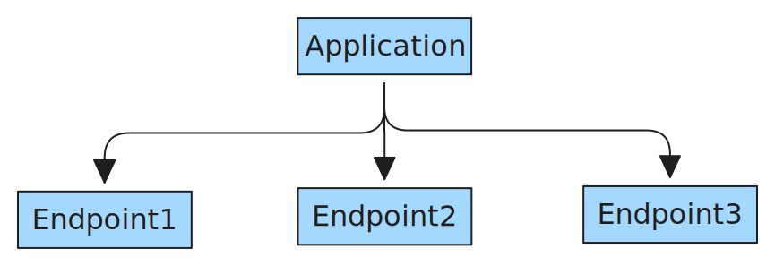
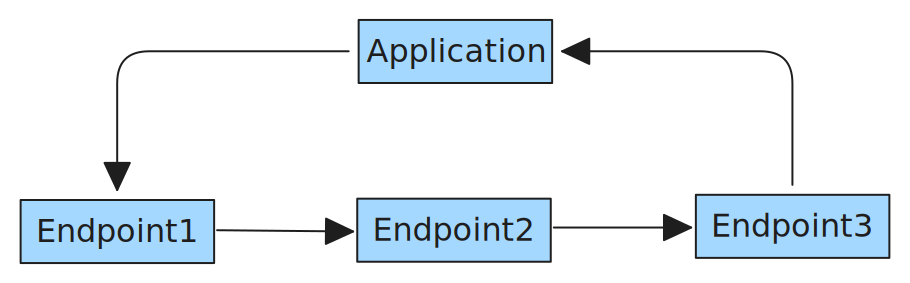

<!-- 
 Copyright Amazon.com, Inc. or its affiliates. All Rights Reserved.
 SPDX-License-Identifier: CC-BY-SA-4.0
 -->

# Inference Pipelines

**Content Level: 300**

## **Suggested Pre-Reading:**
- [Core Architectural Concepts - Inference](../../../2_0_technical_foundations_and_patterns/2_3_core_archtectural_concepts/2_3_5_inference/2_3_5-1_online_inference/online_inference.md)

## TL;DR

Inferencing is basically putting the trained models to use. If the model I am building is a chatbot, inference would be when a user of my application actually sends a message.

But what if we have a complex inference requirement which is not a single inference but a series of inferences from multiple models? That is when we are required to create an inference pipeline which is a series of models working as a single unit to complete an inference task.

## Setting up an inference pipeline

One approach to implement such an inference would be to have multiple endpoints and manage the orchestration between every endpoint in the application layer

<div style="margin:auto;text-align:center;width:100%;"></div>

*Figure 1: Application Layer managing multiple endpoints*{: style="text-align: center; display: block"}

A better alternative would be to have an end to end pipeline to handle all the inference steps as a single inference invocation and retrieve the results:

<div style="margin:auto;text-align:center;width:100%;"></div>
*Figure 2: Inference pipeline *{: style="text-align: center; display: block"}

This is a concept in ML landscape beyond GenAI applications. For LLM inferencing, an inference pipeline can include inference endpoints for tasks like pre-processing, post-processing, retrieval augmentation etc. Packaging all the tasks into an inference pipeline enables a easier versioning and deployment of the models.


## Typical components of an inference pipeline
Note: Except the actual training component, remaining portions of the inference pipeline will overlap with training pipeline. Why you may ask. You will have to get the data in similar state as the data the llm has been trained on. 

 * Preprocessing
 This stage is typically the very first process that gets triggered when a user makes an inference invocation. Preprocessing typically involves preparing the input data or query for inference. For llm processing with transformers, this step would typically be a tokenizer. 

 * Embedding
 Although embedding is commonly thought of as a pre-processing step, it is a trainable large matrix with one row per vocabulary token. It serves as a lookup table, mapping each token to a unique vector representation. During model training, the embedding vectors are updated along with the rest of the model parameters via backpropagation, in order to minimize the loss function. As a result, the values in the embedding matrix are optimized such that tokens with similar semantics are associated with vectors that are close together in the embedding space, enhancing the model’s ability to capture meaning and context.

* Retrieval Augmented Generation (optional)
This is not necessarily a part of the pipeline itself but we see it used more often than not in actual customer implementations. 

* Inference
The crux of the inference pipeline and the component that actually performs the prediction.

* Post Processing
This is where the predicted tokens are converted back to human readable format. 
     
## Making it Practical
Here is a slightly complicated example of creating an inference pipeline, primarily to showcase how each comprising component can execute on its own hardware. The usecase here is a simple illustration of utilizing different hardware for every stage of inference.

For use cases involving extremely large models, or scenarios demanding peak performance and cost efficiency, building a dedicated inference pipeline introduces additional complexity up front, but it enables aggressive tuning of each component for speed, memory usage, and operational cost.  

Notice how multiple stages of inferencing are linked. 

```
import torch
from transformers import AutoTokenizer, AutoModelForCausalLM

# Function to determine available devices
def get_available_devices():
    # Check if CUDA is available
    if torch.cuda.is_available():
        num_gpus = torch.cuda.device_count()
        print(f"Found {num_gpus} GPU(s)")
        
        # Define device strategy based on available GPUs
        if num_gpus >= 3:
            # Use multiple GPUs if available
            return {
                "tokenizer": torch.device("cpu"),
                "embedding": torch.device("cuda:0"),
                "inference": torch.device("cuda:1"),
                "postprocess": torch.device("cuda:2")
            }
        elif num_gpus == 2:
            # Use 2 GPUs
            return {
                "tokenizer": torch.device("cpu"),
                "embedding": torch.device("cuda:0"),
                "inference": torch.device("cuda:1"),
                "postprocess": torch.device("cpu")
            }
        elif num_gpus == 1:
            # Use single GPU for everything
            return {
                "tokenizer": torch.device("cpu"),
                "embedding": torch.device("cuda:0"),
                "inference": torch.device("cuda:0"),
                "postprocess": torch.device("cpu")
            }
    else:
        # CPU only
        print("No GPUs found, using CPU only")
        return {
            "tokenizer": torch.device("cpu"),
            "embedding": torch.device("cpu"),
            "inference": torch.device("cpu"),
            "postprocess": torch.device("cpu")
        }
```

### Get available devices
Utilizing the convenience method above, you can set devices for every stage of the pipeline. The method get_available_devices() checks if CUDA is available, counts the number of available GPUs and assigns different components of the pipeline to different stages.
```
# Get available devices
DEVICES = get_available_devices()
print(f"Using devices: {DEVICES}")

MODEL_NAME = "gpt2" #"distilgpt2" # These are smaller models and can run on a t3.medium notebook. Convenient for testing 
#MODEL_NAME = "meta-llama/Llama-3.3-70B-Instruct" #"mistralai/Mistral-7B-v0.3"  ## Ensure you have submitted access request on huggingface and have approval for the model use

```

### 1. Tokenization (CPU)
Tokenization is primarily a lookup and string manipulation operation and hence a low-intensity computation which does not benefit from GPU parallelization. 
```
def tokenize(text, tokenizer):
    # Tokenizer is always on CPU
    return tokenizer(text, return_tensors="pt")
```

### 2. Embedding
Embedding although appears as a pre-processing step, is another inference step in itself, with a trained neural network model. This step involves multiple matrix multiplications which can be sped up with the parallelizablility of a GPU.
```
def embed(tokens, model):
    # Move input to embedding device
    input_ids = tokens["input_ids"].to(DEVICES["embedding"])
    try:
        model = model.to(DEVICES["embedding"])
        with torch.no_grad():
            try:
                outputs = model.transformer(input_ids)
                embeddings = outputs.last_hidden_state
            except AttributeError:
                # Some models use different attribute names
                try:
                    outputs = model.model(input_ids)
                    embeddings = outputs.last_hidden_state
                except:
                    # Fallback to direct generation if transformer/model attributes aren't available
                    print("Model architecture not compatible with separate embedding step, skipping...")
                    return None, input_ids
        return embeddings, input_ids
    except RuntimeError as e:
        print(f"Error during embedding: {e}")
        print("Falling back to CPU for embedding")
        # Try on CPU as fallback
        input_ids = tokens["input_ids"].to("cpu")
        model = model.to("cpu")
        return None, input_ids
```

### 3. Inference
Separating embedding and inference allows for parallel processing of batches. While one GPU is busy inferencing, i.e. generating tokens, another GPU can trigger embedding for the next batch. 

```
def infer(input_ids, model, tokens=None):
    try:
        # Move input to inference device
        input_ids = input_ids.to(DEVICES["inference"])
        attention_mask = tokens["attention_mask"].to(DEVICES["inference"]) if tokens else None
        model = model.to(DEVICES["inference"])
        
        with torch.no_grad():
            # Pass attention_mask to generate
            generation_kwargs = {
                "max_new_tokens": 30,
                "pad_token_id": model.config.eos_token_id
            }
            
            if attention_mask is not None:
                generation_kwargs["attention_mask"] = attention_mask
                
            generated_ids = model.generate(input_ids, **generation_kwargs)
        return generated_ids
    except RuntimeError as e:
        print(f"Error during inference on {DEVICES['inference']}: {e}")
        print("Falling back to CPU for inference")
        # Try on CPU as fallback
        input_ids = input_ids.to("cpu")
        attention_mask = tokens["attention_mask"].to("cpu") if tokens else None
        model = model.to("cpu")
        
        with torch.no_grad():
            generation_kwargs = {
                "max_new_tokens": 30,
                "pad_token_id": model.config.eos_token_id
            }
            
            if attention_mask is not None:
                generation_kwargs["attention_mask"] = attention_mask
                
            generated_ids = model.generate(input_ids, **generation_kwargs)
        return generated_ids
```

### 4. Postprocessing
Just as with tokenizing, the final step of LLM inferencing is de-tokenizing. For the same reasons as with tokenizing, CPUs are ideal for this stage of inferencing as well.
```
def postprocess(generated_ids, tokenizer):
    # Move output to CPU for detokenization
    generated_ids = generated_ids.to("cpu")
    return tokenizer.decode(generated_ids[0], skip_special_tokens=True)
```

### 5. Pipeline Orchestration
Lets construct the inference pipeline using the components defined above:

```
# ---- Pipeline Orchestration ----
def pipeline(text, model_name=None):
    # Use provided model name or default
    model_name = model_name or MODEL_NAME
    
    # Load tokenizer and model (model loaded on CPU initially)
    tokenizer = AutoTokenizer.from_pretrained(model_name)
    model = AutoModelForCausalLM.from_pretrained(model_name)
    model.eval()

    # 1. Tokenization
    tokens = tokenize(text, tokenizer)

    # 2. Embedding (may be skipped depending on model architecture)
    embeddings, input_ids = embed(tokens, model)
    
    # If embedding step was skipped, ensure input_ids are on the right device
    if embeddings is None:
        input_ids = tokens["input_ids"]

    # 3. Inference - pass tokens to have access to attention_mask
    generated_ids = infer(input_ids, model, tokens)

    # 4. Postprocessing
    result = postprocess(generated_ids, tokenizer)
    return result
```    
When tested on notebooks, below is the output you will see:

```No GPUs found, using CPU only
Using devices: {'tokenizer': device(type='cpu'), 'embedding': device(type='cpu'), 'inference': device(type='cpu'), 'postprocess': device(type='cpu')}```

### ---- Example Usage ----
Below code can be used to trigger the inference pipeline through a python script. 
```
prompt = "Explain the difference between AI and machine learning."
output = pipeline(prompt)
print("\nOutput:")
print(output)
```

Test output:
```Output:
Explain the difference between AI and machine learning.

The AI is a machine learning system that learns to recognize and respond to information. It is a machine learning system that learns to recognize and respond
Selection deleted
```
You can test this on accelerated compute instance types which have GPUs, thus enabling embed and inference stages to leverage GPU.

### Inference pipeline vs ML pipelines
This can be confusing for beginners. When we refer to ML Pipelines, we typically refer to orchestration and distributed (typically serverless) execution blocks of each of the above components. The primary objective of a Sagemaker Pipeline is to allow for horizontal scaling and managed execution of every component in the pipeline. Both inference pipeline and sagemaker ml pipeline are mutually complementary. Refer [llmops workshop](https://github.com/aws-samples/llmops-workshop/blob/main/lab2-sagemaker-pipeline-llm.ipynb){:target="_blank" rel="noopener noreferrer"}


## Conclusion
The evolution of AI as a discipline has made creation of inference pipelines so easy that we tend to lose sight of the fact that what have been strung together are independent models acting as a unit. 


## Further Reading

- [Inference pipelines in Amazon SageMaker AI](https://docs.aws.amazon.com/sagemaker/latest/dg/inference-pipelines.html){:target="_blank" rel="noopener noreferrer"}

- [Huggingface Pipelines](https://huggingface.co/docs/transformers/en/main_classes/pipelines){:target="_blank" rel="noopener noreferrer"}

- [SageMaker AI Pipelines](https://docs.aws.amazon.com/sagemaker/latest/dg/pipelines-overview.html){:target="_blank" rel="noopener noreferrer"}

- [Efficient Memory Management for LLM serving with Paged Attention](https://arxiv.org/pdf/2309.06180){:target="_blank" rel="noopener noreferrer"}

- [SageMaker AI Pipeline creation through console using multiple docker images](https://docs.aws.amazon.com/sagemaker/latest/dg/inference-pipeline-create-console.html){:target="_blank" rel="noopener noreferrer"}

## Contributors

**Author:** Sunita Koppar - Sr. Specialist SA, Gen AI 

**Primary Reviewer**:
Kihyeon Myung - Sr Applied AI Architect 

**Additional Reviewer**:

Sanghwa Na - Specialist SA, Gen AI 

Don Simpson - Principal Technologist 
