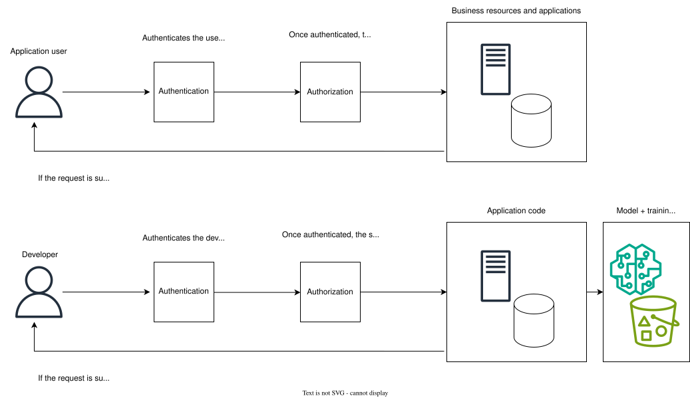

<!-- 
 Copyright Amazon.com, Inc. or its affiliates. All Rights Reserved.
 SPDX-License-Identifier: CC-BY-SA-4.0
 -->

# Authentication and Authorization

**Content Level: 300**

## Suggested Pre-Reading

* [Establishing Your Cloud Foundation on AWS](https://docs.aws.amazon.com/whitepapers/latest/establishing-your-cloud-foundation-on-aws/welcome.html){:target="_blank" rel="noopener noreferrer"}
* [Use these six user authentication types to secure networks](https://www.techtarget.com/searchsecurity/tip/Use-these-6-user-authentication-types-to-secure-networks){:target="_blank" rel="noopener noreferrer"}
* [AWS Identity and Access Management: How permissions and policies provide access management](https://docs.aws.amazon.com/IAM/latest/UserGuide/introduction_access-management.html){:target="_blank" rel="noopener noreferrer"}
* [Securing generative AI](https://aws.amazon.com/ai/generative-ai/security/){:target="_blank" rel="noopener noreferrer"}

## TL;DR

Authentication and authorization serve as critical security pillars in generative AI systems by verifying user identities and controlling permissions, working with data protection and logging and monitoring strategies to create a robust security framework, taking into consideration the defense-in-depth approach needed for data access, model changes, and autonomous AI agents as the amount of agents and their tasks grow and evolve.

## Overview of section

Well-designed access controls are fundamental to securing generative AI systems, with authentication and authorization (sometimes referred to as authN and authZ) serving as the critical security pillars. Authentication verifies the identity of users and entities attempting to gain access to the system through methods like multi-factor authentication (MFA), biometrics, or secure token-based systems. Authorization determines what authenticated users are allowed to do within the system through carefully-designed, granular permissions policies. These controls are especially important in generative AI applications where unauthorized access could lead to prompt injection attacks, data exposure, or model manipulation. Authentication and authorization mechanisms work alongside data protection strategies, as well as logging, monitoring, and alerting to create a complete security framework that protects sensitive data while maintaining functionality.

## Authentication

Authentication for AI systems encompasses a wide array of topics that fall under secure credential management. When implementing authentication methods for AI systems, consider the different layers of the application that will include authentication. From model access to data pipeline security, each component requires authentication mechanisms that balance security with usability.

### Cross-layer authentication

Cross-layer authentication refers to the implementation of security controls across different layers of the stack. It is a coordination of authentication between data ingestion, model training, inference endpoints, API gateways, and client applications. A holistic approach to authentication enables consistent verification across system boundaries, and manages service-to-service authentication for automated processes. For example, you might generate a new token at each layer while preserving the original request ID for tracing purposes. These tokens may have a short TTL in order to limit access to the data.

### Multi-factor authentication

Multi-factor authentication is critical for actions that require elevated privileges, like model deployment, model training, data modifications, hyperparameter adjustments, and system configuration changes.

### X.509 certificates

X.509 certificates secure machine-to-machine communication in distributed AI systems. They manage model-serving authentication, validate model origins and versioning, implement mutual TLS for secure inference endpoints, and authenticate edge devices in deployments.

### Single sign-on (SSO)

Single sign-on centralizes authentication for AI services, integrating with existing enterprise identity providers. SSO manages access across model development environments, training applications, monitoring tools, and resource management. SSO also supports role-based access controls, and attribute-based access controls.

### Passwordless authentication

Passwordless authentication uses protocols like FIDO2, which allows developers and systems to authenticate without sharing secrets across networks. Passwordless authentication can also include public key cryptography, which extends beyond human users to service-to-service authentication within a pipeline. Automated processes use asymmetric keys stored in secure modules, or key management systems to authenticate operations like data preprocessing, model training, and inference. These keys can be automatically rotated, maintaining security while minimizing human intervention. Finally, hardware security keys reduce friction in development workflows by enabling efficient development cycles, eliminating the potential need to enter a password multiple times per day, wait for time-based OTP, or push notifications.

### Biometrics

Biometrics as an authentication method implement high-security access for sensitive operations. This authentication method can be used to protect critical model parameters and weights, secure access to highly sensitive training data, control physical access to the training infrastructure, and integrate with hardware security models.

### Recovery

Any secure handling of credentials should also include mechanisms for recovery, including password reset flows, backup authentication methods (for example, a secondary hardware key and recovery codes), account key rotation, and emergency "break glass" access procedures. These emergency access procedures may look like temporary privileges assigned by a PAM tool, or dedicated "break glass" users with direct access to the stack (these should be part of a monitoring and alerting strategy that allows security teams to audit their usage).

## Authorization

Authorization in AI systems requires access control mechanisms that extend beyond traditional role-based permissions. When implementing authorization frameworks for AI systems, architects should consider the granular nature of permissions across model development, training resources, and inference. Each component of the stack demands precise authorization controls that balance security and governance with innovation and speed.

### Least-privilege access

Agentic AI systems present unique challenges around managing permissions for autonomous systems, and can include dynamic privilege escalation based on demonstrated competence, realtime adjustment of privileges, and validation of privilege requests and revocation. In each of these cases, careful policy writing can ensure each autonomous system has only the permissions it needs to complete its dedicated task, with periodic review of these privileges to revoke unused permissions.

For example, an agentic AI workflow designed to optimize model training pipelines might start with read-only access to training metrics and logs. As it demonstrates reliable performance, it could gradually receive elevated privileges to modify hyperparameters, adjust batch sizes, or reallocate resources. The incremental elevation of privileges should be controlled through granular policy definitions with monitoring of these systems to confirm appropriate use of permissions.

### Policy granularity

Granular policies determine the precision with which permissions can be defined and enforced for agentic AI workloads. Fine-grained policies allow for exact specification of what resources an agent has access to, what actions it can take, and under which conditions. For example, rather than granting access to an entire data store, a granular policy might specify that an agent can only read certain data columns when performing a specific task, with rate limits on its queries. The more granular policies become, the more complex they can be to manage. Consider implementing policies that are granular enough to meaningfully restrict access while remaining scalable.

### Scalable policy design

As these autonomous systems grow and change, so will the policies they depend on in order  to carry out their functions. Given that, scalable policy design is key for creating a strong foundation of common actions, allowed actions, and denied actions can be reused and expanded upon for other agents to use. This approach requires both hierarchical policy structures and composable policy elements that can be reused across different agent types and operational contexts. Version control and migration paths for policy evolution, dynamic management of allow/deny lists based on risk assessments, and comprehensive testing and validation of policy changes will maintain consistency while allowing for growth and adaptation as agent capabilities and requirements evolve.

### Auditing

An auditing strategy is critical for maintaining security, compliance, governance, and thinking ahead to system improvements. A robust auditing approach should include immutable logs of agent actions, active permissions, resource states, and reasoning chains that led to certain decisions. Realtime analysis of these audit trails allows for immediate detection of anomalous behavior and potential security threats. The system should balance performance optimization with complete record keeping, with proper retention policies and potentially leveraging machine learning for pattern identification. Beyond just logging, the auditing system should provide insights for policy refinements and system behavior improvements as agents evolve and require more permissions for a growing set of capabilities. Regular compliance verification alongside performance analysis helps ensure the systems remain secure and operationally efficient while providing the necessary security controls and meeting regulatory requirements.

### Role-based access controls

Role-based access control (RBAC) manages permissions by assigning users or agents to specific roles. Each role contains a predefined set of permissions. In AI systems, these roles might correspond to model training, data science, or inference, each with carefully written policies that align to their specific function. RBAC support least-privilege principles by verifying that users and agents receive only the permissions necessary for their primary tasks. These permissions are straightforward to manage and audit; however, the static nature of RBAC can potentially compromise least privilege in agentic workflows. As agents' capabilities evolve, their permission requirements may change. For example, an agent that begins with a narrow task of analyzing customer sentiment might gradually expand to summarizing feedback, generating responses, and eventually modifying existing templates. To avoid assigning too broad permissions, administrators would need to constantly create new roles or modify existing ones to match the agent's evolving capabilities—creating significant operational overhead. This challenge becomes exponentially more complex in environments with dozens or hundreds of agents, each following unique evolutionary paths, making traditional RBAC models difficult to maintain.

### Attribute-based access controls

Attribute-based access control (ABAC) is more dynamic than RBAC, offering contextual access management by evaluating multiple attributes to make authorization decisions. These attributes might include the agent's identity, the resource being acted upon, the environmental conditions (for example, time or location), and the specific action. ABAC can make fine-grained decisions based on model sensitivity, data classification, resource availability, or risk levels. ABAC allows for precise implementation of least privilege, as access decisions can adapt to changing conditions and requirements. It is more complex to implement than ABAC, but ultimately is more flexible in systems with rapidly changing requirements.

### Multi-tenancy support

Authorization across multiple tenants in AI systems requires careful isolation and resource management across multiple organizational boundaries while maintaining efficient resource usage. The system should handle resource allocation, quotas, data sovereignty, and cross-tenant interactions through well-defined protocols and security boundaries. Each tenant operates within its own segmented context with dedicated resources, encryption keys, and compliance rules. A foundational aspect of this architecture is fine-grained, reusable policies and roles that can serve as the building blocks across the different tenants. These base policies, while likely never sharing actual resources or data, can provide a consistent and proven security foundation to be extended and customized for each tenant's specific requirements. This "reusable foundation" approach to permissions promotes best practices in secure implementation while reducing overhead of policy management, and enforcing a standard across each tenant. The result is a scalable system that balances security, efficiency, and maintainability across an organization with multiple environments.

## Get hands-on

The workshop below focuses on the security risks and vulnerabilities associated with generative AI applications. It covers topics like testing, detection and automated response, guardrails, and sensitive data protection. 

[Securing generative AI applications on AWS](https://catalog.us-east-1.prod.workshops.aws/workshops/bdee9027-ee96-4651-a8d3-833c2a847206/en-US){:target="_blank" rel="noopener noreferrer"}

## Further reading

* [Exploring the Intersection of IAM and Generative AI in the Cloud](https://cloudsecurityalliance.org/blog/2023/09/15/exploring-the-intersection-of-iam-and-generative-ai-in-the-cloud){:target="_blank" rel="noopener noreferrer"}
* [Manage access controls in generative AI-powered search applications using Amazon OpenSearch Service and Amazon Cognito](https://aws.amazon.com/blogs/big-data/manage-access-controls-in-generative-ai-powered-search-applications-using-amazon-opensearch-service-and-aws-cognito/){:target="_blank" rel="noopener noreferrer"}

## Contributors

**Author**

* Samantha Wylatowska - Solutions Architect 

**Reviewers** 

* Alicja Kwasniewska - Senior Solutions Architect 

* Andrew Kane - GenAI Security/Compliance Lead 
