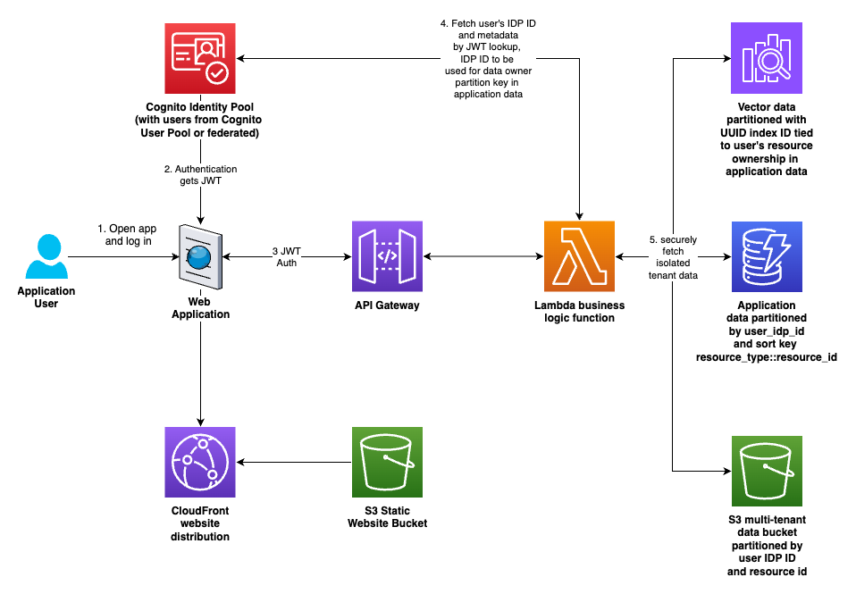

<!-- 
 Copyright Amazon.com, Inc. or its affiliates. All Rights Reserved.
 SPDX-License-Identifier: CC-BY-SA-4.0
 -->

# Multi-tenant Security


**Content Level: 300**


## Suggested Pre-Reading

[Previous page: Authentication and Authorization](../3_5_2-1_authentication_authorization/authentication_authorization.md) 

## TL;DR

This section will discuss implementing multi-tenant data isolation in your generative AI application. It doesn't assume any specific vendor implementation, but instead discusses the concepts and best practices. It may use AWS services for example discussions but the concepts here are widely applicable.

The crux of multi-tenancy is ensuring that one tenant's data isn't accessible to another tenant. In a generative AI application, that data typically lives in multiple places:

* File data may be stored in object storage like S3 or a file system.
* Application lookup data like user resource ownership information may be stored in a SQL or no-SQL database.
* RAG context data may be stored in a vector index.
* Graph entity data may be stored in a graph database.

Application owners need a way to securely track which of their users or tenants own which resources, and find reliable tenant identifiers that are preferably never exposed on the frontend to users. This section will discuss how to implement multi-tenancy in your generative AI application.

Here's an overview of the solution discussed here:

<div style="margin:auto;text-align:center;width:100%;"></a></div>

_Figure 1: Overview of multi-tenant data isolation_

## Determining appropriate tenant identifiers

In order to segregate customer data, you first need a unique identifier for each customer. Simple ordered numbering schemes or identifiers like email addresses are not sufficient; an attacker could successfully guess identifiers. A more robust approach is to use [universally unique identifiers (UUIDs)](https://en.wikipedia.org/wiki/Universally_unique_identifier){:target="_blank" rel="noopener noreferrer"} with a function like Python's uuid.uuid4 used to generate random unique hexadecimal strings.

Preferably, you could use a mechanism built into your authentication provider service. 

For example, with Amazon Cognito, a user can be defined in a Cognito User Pool or can be federated from a third party SAML provider like Okta. Those user sources (either Cognito or federated) are associated with a Cognito Identity Pool Provider (IDP). When a user is first authenticated, a record is created for them in the IDP, with a unique ID associated with it.

Those IDP IDs are not exposed to frontend clients via security tokens or cookies. That makes them a great unique key that is not guessable by users. An example IDP ID might look like this:

`us-west-2:12345678-abcd-1234-462b-123456789abc`

When a user authenticates to an Amazon API Gateway with a JSON Web Token (JWT), the API Gateway adds information about the authenticated user to the payload, and sends it on to the request handler, for example, a Lambda function. 

The AWS SDK allows developers to take the trusted JWT from the authenticated payload arriving in your compute environment and query Cognito to get the IDP ID of that user. The IDP ID (like the example above) is then used as an identifier when storing customer data. [Here's an example implementation of retrieving the IDP ID from Cognito](https://github.com/aws-samples/multi-tenant-full-stack-rag-application-demo/blob/9471b3555278c842855c4b7c7e8809b46c2093b4/backend/src/multi_tenant_full_stack_rag_application/auth_provider/cognito_auth_provider.py#L91C1-L101C41){:target="_blank" rel="noopener noreferrer"}.

In order to avoid passing those IDP IDs to the frontend by accident, the recommended approach is to send responses through a utility function or class that checks for and filters these IDs (and implements any other checks and filtering) before sending the response to the client. [Here's an example implementation](https://github.com/aws-samples/multi-tenant-full-stack-rag-application-demo/blob/9471b3555278c842855c4b7c7e8809b46c2093b4/backend/src/multi_tenant_full_stack_rag_application/utils/utils.py#L117){:target="_blank" rel="noopener noreferrer"}.

## Securing data sources

### Secure multi-tenancy in S3

For S3, we can borrow the prescriptive directory structure and IAM policy conditions that AWS Amplify uses as its pattern to secure private user uploads.

The S3 path structure looks like this:

`s3://bucketname/private/{cognito-user-idp-identity}/user-files-here...`

where {cognito-user-idp-identity} is of the example form above. 

Assuming that S3 path structure, create an IAM policy that looks like this, in order to lock down each user's access to their own private directory:

```
{
    "Version": "2012-10-17",
    "Statement": [
        {
            "Action": [
                "s3:DeleteObject",
                "s3:GetObject",
                "s3:PutObject"
            ],
            "Resource": "arn:aws:s3::BUCKET_NAME/private/${cognito-identity.amazonaws.com:sub}/*",
            "Effect": "Allow"
        },
        {
            "Action": "s3:ListBucket",
            "Resource": "arn:aws:s3:::BUCKET_NAME",
            "Effect": "Allow",
            "Condition": {
                "StringLike": {
                    "s3:prefix": [
                        "private/${cognito-identity.amazonaws.com:sub}/",
                        "private/${cognito-identity.amazonaws.com:sub}/*"
                    ]
                }
            },
        }
    ]
}
```

The strings `${cognito-identity.amazonaws.com:sub}` above are literal. Leave them like that and S3 will determine from the authenticated context which user is making the request and whether those conditions are met to allow access. Do not substitute other values in the policy above, except for replacing the 'BUCKET_NAME' in the resource ARNs for your actual bucket name.

### Secure multi-tenancy in SQL and no-SQL databases

In all data locations, use the same tenant ID for operational and code consistency. No-SQL databases like Amazon DynamoDB require a partition key and an optional sort key to determine record uniqueness. In its example, we'll continue with the IDP ID from Cognito as the partition key. Using that as the partition key should ensure that users' data is kept separate.

The sort key should allow you to fetch or page through all of a user's data of a given type easily. It should also enforce uniqueness, since data with the same partition key and sort key will be overwritten.

For example, if a system has multi-tenant RAG document collections built in, and if we wanted to enforce that the document collection name be unique for that user, then the sort key might be `document_collection::document collection name`.

Queries can then fetch all records where the partition key equals the tenant's unique ID and the sort keys start with "document_collection::" to fetch all of a tenant's document collections, for example.

Likewise, for SQL databases, you can either create separate tables for each user, with their unique tenant ID as a suffix (like document_collections_userid12345, multi-tenant WordPress does it this way), or use an indexed column with the tenant IDs in it, and confirm that the where clause filters by the tenant ID column. This is one reason why making all data access go through specific, controlled classes in your code is a good idea: to prevent developers accidentally forgetting critical tenant filters in _where_ clauses. It's also why unit testing is critical, so you can confirm insecure code was not committed.


### Secure multi-tenancy in vector indexes

AWS offers multiple vector database options. Whether you're using Bedrock Knowledge Bases backed by OpenSearch, PgVector, or other choices, like using OpenSearch Managed directly or other options, the considerations for secure multi-tenancy should be similar. 

At a high level, it's similar to the choices when handling SQL multi-tenancy. You can create a separate index for each user or document collection, or you can use metadata in the index records to specify tenant ID and collection ID.

Consider the limitations imposed by your vector index provider of choice when selecting a strategy here. For example, Bedrock Knowledge Bases has a limit of 100 knowledge bases per account. That's not enough to run multi-tenant vector indexes with one knowledge base per customer or per document index, so in that case specifying a tenant ID and a document collection ID on each vector index record will allow for secure multi-tenant data retrieval using the tenant ID and document collection ID as metadata pre-search-result filters in addition to the vector similarity search.

Alternatively, if customers want more flexibility in number of indexes, using OpenSearch Provisioned or Serverless directly is an option, which provide OpenSearch managed pipelines for ingestion. Builders should use the solution that meets their needs while offloading as much "undifferentiated heavy lifting" as possible to managed services, so they can focus as much technical time as possible on delivering business value code.

### Secure multi-tenancy in graph databases.

A common AI application pattern is to ingest the data into your vector database and also extract graph entities (nodes for conceptual objects and edges connecting them with specified meanings).

In these cases, the graph data must be connected to the associated vector data. Bedrock Knowledge Bases provides a managed graph RAG option that uses Neptune Analytics to manage vector data _and_ graph data in one location. Bedrock also has Bedrock Data Automation, a new feature that automatically extracts graph entity information and integrates with Bedrock graph RAG and Neptune Analytics. These represent the managed offerings for graph and semantic RAG on AWS.

If the managed offerings are not flexible enough for a given use case, customers can use any vector index provider with any graph database provider. When creating vector index assign a UUID4 string as the identifier. This enables global uniqueness across all tenants, even while scaling. Create a document collection record for the vector index and save it to your application user data location (no-SQL or SQL as described above).

When ingesting data, save the chunked and vectorized records to the vector index. Also extract nodes and edges with a prompt of your choice, using a Bedrock model of your choice.

Then create nodes and edges in the graph database whose IDs are prefixed by the UUID for the vector index to which they are associated. That way you can use those UUIDs on the node and edge IDs as filters to confirm that the multi-tenancy of the graph data is handled securely and tied to the correct associated vector index.

The instructions above use the concept vector index associated with a single tenant for simplicity of explanation, but you could easily add tenant ID and document collection ID fields to the index and have all multi-tenant data in a single index. In that case replace the concept of vector index above with using one UUID for a tenant ID and another UUID for every document collection, and add those metadata fields to each record in the vector index.

Note that the pattern in the articles above predates the release of managed graph RAG on Bedrock Knowledge Bases with Bedrock Data Automation to extract entities. The Bedrock Knowledge Bases graph RAG option is now the easier route. The articles above will enable customers who need a more customized experience to learn the core concepts and consider an alternate implementation. They can then make an informed decision about which route is right for their specific use case.

## Further Reading

  * [Introduction to JSON Web Tokens](https://jwt.io/introduction){:target="_blank" rel="noopener noreferrer"}

  * [Identity Provider (Wikipedia)](https://en.wikipedia.org/wiki/Identity_provider){:target="_blank" rel="noopener noreferrer"}

  * [Multi-tenant RAG with Amazon Bedrock Knowlege Bases](https://aws.amazon.com/blogs/machine-learning/multi-tenant-rag-with-amazon-bedrock-knowledge-bases/){:target="_blank" rel="noopener noreferrer"}

  * [Multi-tenancy in RAG applications in a single Amazon Bedrock Knowledge Base with metadata filtering](https://aws.amazon.com/blogs/machine-learning/multi-tenancy-in-rag-applications-in-a-single-amazon-bedrock-knowledge-base-with-metadata-filtering/){:target="_blank" rel="noopener noreferrer"}

  * [Building Multi-Tenant Agents on AWS](https://builder.aws.com/content/2v91CARGir2sm1Bh5jyFw6kDEge/building-multi-tenant-agents-on-aws){:target="_blank" rel="noopener noreferrer"}

  * [SaaS and RAG: Maximizing generative AI value in multi-tenant solutions](https://catalog.us-east-1.prod.workshops.aws/workshops/224f4cc0-cefb-4e29-95fa-365ad5a7ef28/en-US){:target="_blank" rel="noopener noreferrer"}

  * [Hands-on SaaS and AI/ML: Inside a multi-tenant AI/ML solution](https://catalog.workshops.aws/inside-a-multi-tenant-ml-solution/en-US){:target="_blank" rel="noopener noreferrer"}

  * [Graph RAG Part 1: what is it, when you need it, & how to do it](https://davetbo.medium.com/graph-rag-part-1-what-is-it-when-you-need-it-how-to-do-it-ea99bc7cfcc9?source=friends_link&sk=640840761468aee58ebf97d89d6be6e5){:target="_blank" rel="noopener noreferrer"}

  * [Graph RAG Part 2: adding multi-tenancy, semantic search, and multi-context retrieval](https://davetbo.medium.com/graph-rag-part-2-adding-multi-tenancy-semantic-search-and-multi-context-retrieval-ee675b339c63?source=friends_link&sk=0c93c911b1a56964cdd9cadf168d8186){:target="_blank" rel="noopener noreferrer"}


## Contributors

**Author**

* Dave Thibault - Sr. Applied AI Architect 

* Felix Huthmacher - Sr. Applied AI Architect 

**Reviewers**

* Don Simpson - Principal Technologist 

* Samantha Wylatowska - Solutions Architect 

* Andrew Kane - GenAI Security/Compliance Lead 

* Felix Huthmacher - Sr. Applied AI Architect 


