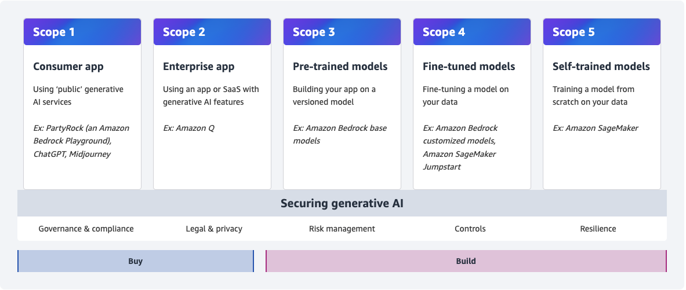

<!-- 
 Copyright Amazon.com, Inc. or its affiliates. All Rights Reserved.
 SPDX-License-Identifier: CC-BY-SA-4.0
 -->

# Compliance and Data Protection

**Content Level: 300**

## Suggested Pre-Reading

 - [Core Concepts and Terminology](../../../1_0_generative_ai_fundamentals/1_1_core_concepts_and_terminology/core_concepts_and_terminology.md)

## Overview of section
To make it easier to understand compliance and data protection it is important what scope your use case fits into. To assist with this we have created the [Generative AI Security Scoping Matrix](https://aws.amazon.com/ai/generative-ai/security/scoping-matrix/){:target="_blank" rel="noopener noreferrer"}.

  

In this section we'll explore compliance and data protection expectations across all scopes. There are dedicated areas which dive further into [Regulatory Governance](./3_5_3-2_regulatory_governance/regulatory_governance.md){:target="_blank" rel="noopener noreferrer"}.

With the scoping matrix, as you work with generative AI capabilities, your compliance and data protection responsibilities will shift as you consider various scopes. With buy vs build, you are trading off control with convenience through abstraction layers. Let's explore both scope categories from a compliance and data protection perspective.

## Buy scopes (Scope 1 and Scope 2)
With scope 1 and 2, you are consuming generative AI capabilities, these could be from third party (3P) providers directly, through SaaS or internally. Ensuring you meet your compliance and data protection requirements as part of your application are important, although those areas are beyond the scope of this Atlas. 

When consuming generative AI capabilities through an API, it is important to understand compliance and data protection implemented by the external providers. To understand how Amazon Bedrock implements data protection refer to our [documentation](https://docs.aws.amazon.com/bedrock/latest/userguide/data-protection.html){:target="_blank" rel="noopener noreferrer"}. We also capture [compliance validation](https://docs.aws.amazon.com/bedrock/latest/userguide/compliance-validation.html){:target="_blank" rel="noopener noreferrer"} details for Amazon Bedrock. Leverage compliance reports which are available via [AWS Artifacts](https://aws.amazon.com/artifact/){:target="_blank" rel="noopener noreferrer"}.

As a consumer of generative AI services, ensure that your providers align with your risk appetite, compliance requirements and data protection rules and regulations. When interacting with 3P APIs, you should leverage secure and encrypted connections using TLS. Consider using  [deep packet inspection patterns](https://aws.amazon.com/blogs/security/tls-inspection-configuration-for-encrypted-traffic-and-aws-network-firewall/){:target="_blank" rel="noopener noreferrer"} if applicable to your requirements.

When consuming 3P APIs, especially for generative AI capabilities, data loss protection (DLP) becomes increasingly important. Sending large amounts of data through prompts in the form of tokens increases the DLP risk. Leverage partner solutions to do ingress/egress inspection. Other partner solutions can do data leak detection by leveraging prompt responses from Amazon Bedrock. Reducing the amount of data sent to the LLM, leveraging differential privacy, securing prompts and using strong authorization and authentication are other mechanisms to reduce the risk of DLP when consuming 3P APIs for generative AI capabilities (read more in the [Navigating Security Landscape](https://docs.aws.amazon.com/pdfs/whitepapers/latest/navigating-security-landscape-genai/navigating-security-landscape-genai.pdf){:target="_blank" rel="noopener noreferrer"} whitepaper). Leverage [Amazon Bedrock Guardrail](https://docs.aws.amazon.com/bedrock/latest/userguide/guardrails-sensitive-filters.html){:target="_blank" rel="noopener noreferrer"} to further protect your data to help ensure no PII data is exfiltrated.

Finally as new technologies and patterns emerge, verify that you have the right controls and training in place to understand these before leveraging them. For example, with Amazon Bedrock's [prompt caching](https://docs.aws.amazon.com/bedrock/latest/userguide/prompt-caching.html){:target="_blank" rel="noopener noreferrer"} capabilities it is important to understand if caching sensitive data falls within your risk posture and what control levers (e.g. TTL) are available to help ensure compliance.

## Build Scopes (Scope 3, Scope 4 and Scope 5)
Moving to Scope 3, Scope 4 and Scope 5; data protection responsibilities broaden. Let's dive further into each scope.

### Scope 3
The most common example for an application which falls into Scope 3 is a [Retrieval-Augmented Generation) RAG application](https://aws.amazon.com/what-is/retrieval-augmented-generation/){:target="_blank" rel="noopener noreferrer"}. 

  

Let's break the above down in terms of data protection and compliance. Considering compliance, there are several moving pieces in a simple setup as above. Consider the user input channels (1) and how they are interacting with the application. Ensure all interactions are over a secure channel (e.g. TLS) and follow best practices in terms of authentication and authorization. As your application accepts the prompts/queries, ensure that the application maintains only the needed information in it's memory to complete the task at hand. As you start building context, conversation buffers and chains, the scope of compliance broadens and the risk increases. Provide end users with the relevant controls to clear this "cached" data as needed to meet relevant compliance and data protection requirements. 

In (2) the application interacts with potential knowledge sources to augment the query with relevant information. Your knowledge sources should ensure they meet relevant compliance requirements. Knowledge sources like [Amazon Kendra](https://aws.amazon.com/blogs/machine-learning/quickly-build-high-accuracy-generative-ai-applications-on-enterprise-data-using-amazon-kendra-langchain-and-large-language-models/){:target="_blank" rel="noopener noreferrer"}, [Amazon Aurora](https://aws.amazon.com/blogs/machine-learning/develop-a-rag-based-application-using-amazon-aurora-with-amazon-kendra/){:target="_blank" rel="noopener noreferrer"} or third party providers that allow you to use industry established best practices to meet your compliance and data requirements. For example you can reduce your risk by [identifying and redact sensitive information](https://aws.amazon.com/blogs/machine-learning/protect-sensitive-data-in-rag-applications-with-amazon-bedrock/){:target="_blank" rel="noopener noreferrer"} even before storing into your knowledge source(s).

As you get the relevant results back (3) from your knowledge sources, only pass in what's required to the LLM (4). When using LLMs available via Amazon Bedrock, you should ensure their compliance and data protection standards align with your expectations. Leverage [Amazon Bedrock Guardrails](https://aws.amazon.com/bedrock/guardrails/){:target="_blank" rel="noopener noreferrer"} to further secure input and output to/from the LLMs.

Finally, you should ensure your observability patterns across all of Scope 3 don't leak any information which might compromise compliance or data protection expectations. If you are using Amazon CloudWatch, leverage its [masking capabilities](https://docs.aws.amazon.com/AmazonCloudWatch/latest/logs/mask-sensitive-log-data.html){:target="_blank" rel="noopener noreferrer"}. Most logging frameworks also provide masking capabilities so that you can protect your data even before it is written to any potential log sinks.

### Scope 4 and Scope 5
When fine tuning your models or self-training your models, you should ensure that your entire pipeline adheres to your compliance and data protection requirements. Starting from data collection, data analysis, data processing, building/fine-tuning model, training model, testing model, deploying the model and finally monitoring your model. Anonymize data often and early in the process where possible using techniques like data masking, pseudonymization, redaction, aggregation, generalizing and tokenization. Store data securely and leverage encryption at rest. Ensure the correct RBAC controls to minimize the number of "humans" that can touch the data. Deploy your models during testing and inference using secure pipelines. Monitor your models to ensure they continually meet your compliance and data protection requirements using capabilities like [Amazon SageMaker Model Monitor](https://docs.aws.amazon.com/sagemaker/latest/dg/model-monitor.html){:target="_blank" rel="noopener noreferrer"}. And ensure your EULAs capture the correct terms and conditions which need to be exposed to the consumers of these models.

## Further Reading

- [Regulatory Governance](./3_5_3-2_regulatory_governance/regulatory_governance.md)
- [Choosing an AWS vector database](https://docs.aws.amazon.com/prescriptive-guidance/latest/choosing-an-aws-vector-database-for-rag-use-cases/introduction.html){:target="_blank" rel="noopener noreferrer"}

## Contributors

**Author** 

* Ruskin Dantra - Senior Solutions Architect

**Reviewers**

* Raj Bagwe - Senior Solutions Architect