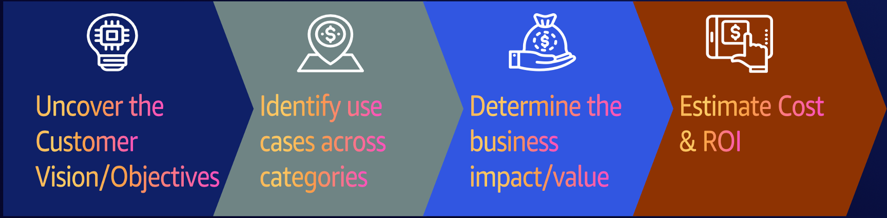

<!-- 
 Copyright Amazon.com, Inc. or its affiliates. All Rights Reserved.
 SPDX-License-Identifier: CC-BY-SA-4.0
 -->

# Business Strategy and Value Assessment for Generative AI

**Content Level: 200**


## Suggested Pre-Reading

* [AWS GenAI value e-book](https://aws.amazon.com/resources/global-in-gc-400-genai-gen-ai-value-ebook-learn/){:target="_blank" rel="noopener noreferrer"}

## TL;DR

Successful generative AI implementation requires alignment across three core business pillars: Growth/Innovation, Cost/Efficiency, and Customer/Risk Management. Organizations progress through Quick Wins (10-15% productivity gains), Process Reshaping (30-60% efficiency gains), and Business Reinvention (revenue growth) stages. This structured approach enables effective assessment, implementation, and measurement of GenAI initiatives while maintaining strategic alignment.


## Value Framework Components

A comprehensive business value framework for generative AI consists of four essential components that help organizations plan, execute, and measure their AI initiatives:

* **Vision Alignment** - Maps AI initiatives to strategic objectives
* **Use Case Identification** - Determines specific applications and implementations
* **Impact Assessment** - Measures business effects across key metrics
* **ROI Analysis** - Calculates financial returns and justification

### Vision Alignment 

Organizations must establish a clear vision that serves as the strategic foundation for GenAI initiatives. This vision aligns with three core value pillars:

* **Growth/Innovation**
  - What it is: Focus on expansion and advancement through new opportunities
  - Why it matters: Creates new revenue streams and expands customer base

* **Cost/Efficiency** 
  - What it is: Optimization of operations and resources
  - Why it matters: Improves productivity while reducing waste

* **Customer/Risk Management**
  - What it is: Protection of customers and organizational assets
  - Why it matters: Builds trust and ensures compliance

### Implementation Stages

Organizations typically progress through three main stages of GenAI adoption:

1. **Quick Wins (10-15% productivity gain)**
   - Immediate workplace improvements
   - Lower complexity
   - Fast time to value (3-6 months)

2. **Process Reshaping (30-60% efficiency gain)**
   - Organizational process redesign
   - Medium complexity
   - Medium time to value (6-24 months)

3. **Business Reinvention (Revenue focused)**
   - Transform customer experiences
   - Highest complexity
   - Longer time to value but highest potential impact

### Value Assessment Framework

To measure success, organizations should track both quantitative and qualitative metrics:

**Quantitative Metrics:**

* Cost reduction

* Revenue growth

* Time savings

* Error rate reduction

**Qualitative Benefits:**

* Employee satisfaction

* Customer experience

* Innovation capability

* Market positioning

## Making it practical

### Business Goals/Vision Framework

Cost optimization for generative AI depends on which phase of the project is currently in. In early stages, it comes down to getting a rough estimate of the cost of the solution to validate the solution is economically viable. As the product becomes more mature, cost tracking and optimization will be priorities.

If the customer is identifying the opportunity, start with laying out the business case with the customer. The goal is to develop a model of value derived from the product, which will informs the maximum cost that a solution can bear and still be financial viable. This can be efficiency gained, risk management, business process automation, overall optimizing the operating cost. 

<div style="margin:auto;text-align:center;width:100%;">identify use cases->determine business value->Estimate ROI" width="800"/></div>

## Get Hands-On

When implementing a GenAI business strategy, consider these key practical aspects:

### Example ROI Calculation

```
Annual Savings = (Time Saved per Task) × (Hourly Cost) × (Annual Volume)

Where:
- Time Saved = 30 minutes per task
- Hourly Cost = $50
- Annual Volume = 10,000 tasks

Annual Savings = (0.5 hrs × $50 × 10,000) = $250,000
```

Components to consider:

**Costs:**
- Implementation 
- Training
- Maintenance
- Licensing
- Infrastructure

**Benefits:**
- Direct cost savings
- Time savings
- Revenue increases
- Quality improvements
- Risk reduction

### Value Measurement Examples

1. **Time Savings:**
```
Annual Savings = (Hours saved per task) × (Hourly cost) × (Annual task volume)
```

2. **Efficiency KPIs:**
```
Process Improvement = (Original time - New time) / Original time × 100%
Error Reduction = (Original errors - New errors) / Original errors × 100%
```

## Further Reading
* [Sample AWS Cost Breakdown](https://docs.aws.amazon.com/solutions/latest/generative-ai-application-builder-on-aws/cost.html){:target="_blank" rel="noopener noreferrer"}

* [Business value](https://aws.amazon.com/blogs/publicsector/working-backwards-from-generative-ai-business-value-in-the-public-sector/){:target="_blank" rel="noopener noreferrer"}

* [GenAI Usecases](https://aws.amazon.com/ai/generative-ai/use-cases/){:target="_blank" rel="noopener noreferrer"}

## Contributors
**Author**: Neelam Koshiya - Principal Applied AI Architect 

**Primary Reviewer**: Randy Defauw - Senior Principal Solutions Architect 

**Additional Reviewer**: Mike Gillespie - Principal Solutions Architect 