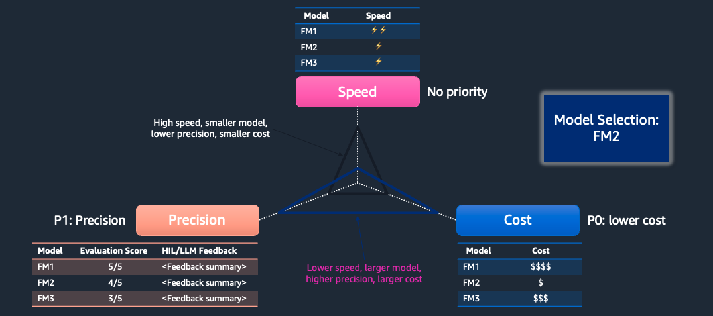

<!-- 
 Copyright Amazon.com, Inc. or its affiliates. All Rights Reserved.
 SPDX-License-Identifier: CC-BY-SA-4.0
 -->

# Generative AI Application Cost Estimation

**Content Level: 300**

## Suggested Pre-Reading

* [Generative AI overview](https://aws.amazon.com/ai/generative-ai/){:target="_blank" rel="noopener noreferrer"}

## TL;DR

Cost estimation for generative AI involves calculating token-based inference costs for text, processing fees for images and videos, and additional costs for RAG implementations including vector stores and embeddings. Pricing models include on-demand (pay-as-you-go), provisioned throughput (committed time with guaranteed performance), and batch inference (bulk processing at reduced rates). The total cost must also factor in supporting infrastructure, development tools, and experimentation phases, with various calculators available to help organizations plan their AI investments effectively.

### Bedrock Cost

Amazon Bedrock is a fully managed service that offers a choice of high-performing foundation models (FMs) through a single API, along with a broad set of capabilities you need to build generative AI applications with security, privacy, and responsible AI.With Amazon Bedrock, you will be charged for model inference and customization. 

Bedrock Cost pricing concepts depends on the following factors:
Request specifications  - 
* Token (input and output)
* Frequency 
* Throughput

Throughput is the pace at which Bedrock can process the requests. Two main ways to measure includes - TPM(tokens per minute) , RPM( requests per minute). When estimating the cost

We will be describing the token calculation in the below section. 

#### Model input/output cost estimation

Amazon Bedrock's pricing model for Foundation Models is based on a dual-input/output system, where costs are incurred for both the number of tokens sent to the model and the response tokens generated. Estimating the input side requires an understanding of the size of the input prompt, while the output side is generally more straightforward, being the average size of the response returned.

#### Token and Tokenization:

The cost unit calculation is based on tokens. Token is a sequence of characters that a model can interpret or predict as a single unit of meaning. For example, with text models, a token could correspond not just to a word, but also to a part of a word with grammatical meaning (such as "-ed"), a punctuation mark (such as "?"), or a common phrase (such as "a lot"). Tokens are converted into embeddings which is a numerical representation  that the model can understand. Since tokenization is LLM specific, same input to different model led to different number of tokens and hence resulted in different cost.

##### Example
| Model                            | Input Token | Output Token | Latency  | Cost per Input Token | Cost per Output Token | Daily Cost (5000 calls per day) | Monthly Cost |
|----------------------------------|------------|--------------|----------|----------------------|----------------------|--------------------------------|--------------|
| Deepseek R1                     | 6800       | 1200         | 20 sec   | $0.00135             | $0.0054              | $78.30                         | $2349        |
| Haiku 3.5                       | 7400       | 900          | 26 sec   | $0.0008              | $0.004               | $47.60                         | $1428        |
| Nova Pro                         | 6900       | 1000         | 15 sec   | $0.0008              | $0.0032              | $43.60                         | $1308        |
| Sonnet 3.7 v2                    | 7400       | 1400         | 42 sec   | $0.003               | $0.015               | $216.00                        | $6480        |
| Haiku 3.5 - latency optimized    | 7400       | 900          | 12 sec   | $0.001               | $0.005               | $59.50                         | $1785        |
| Nova Pro - *latency optimized*   | 6900       | 1000         | 10 sec   | $0.001               | $0.004               | $54.50                         | $1635        |

For details on Bedrock pricing refer to [Bedrock pricing page](https://aws.amazon.com/bedrock/pricing/){:target="_blank" rel="noopener noreferrer"}

#### Model and prompt evaluation at scale

Prompt engineering and LLM evaluation work together in AI applications

Key Best Practices:
• Iterative Improvement
  - Continuous refinement based on feedback
  - Ongoing optimization process

• Context Importance
  - Provide sufficient background information
  - Choose appropriate techniques based on task complexity
  - Consult Amazon Bedrock documentation and model provider resources

• Specificity
  - Use detailed, specific prompts
  - Include clear, well-defined instructions
  - Reduce ambiguity in prompts

• Testing & Evaluation
  - Test edge cases for prompt robustness
  - Run multiple evaluations
  - Compare outputs for consistency
  - Verify reliability across different inputs

### Cost estimation for multimodal data

Multiple LLMs in Bedrock comes with multimodal capabilities to understand and analyze images,videos and documents opening up exciting possibilities for multimodal interaction.

#### Image
When the input contains images, the input token count is calculated based on the width and height pixel.

Example:
The pricing for Claude 3.7 Sonnet(rate of $3 per million input tokens).

tokens = (width px * height px)/750

| Image Size | # of Tokens | Cost / Image | Cost / 1K Images |
|------------|-------------|--------------|------------------|
| 200x200 px (0.04 megapixels) | ~54 | ~$0.00016 | ~$0.16 |
| 1000x1000 px (1 megapixel) | ~1,334 | ~$0.004 | ~$4.00 |
| 1092x1092 px (1.19 megapixels) | ~1,590 | ~$0.0048 | ~$4.80 |

For Amazon Nova models:

 Amazon Nova automatically rescales input images up or down depending on their aspect ratio and original resolution. For each image, Amazon Nova first identifies the closest aspect ratio from 1:1, 1:2, 1:3, 1:4, 1:5, 1:6, 1:7, 1:8, 1:9 2:3, 2:4 and their transposes. Then the image is rescaled so that at least one side of the image is greater than 896px or the length of shorter side of the original image, while maintaining the closest aspect ratio. There's a maximum resolution of 8,000x8,000 pixels

| Image Resolution (WxH) | Estimated Token Count |
|------------------------|------------------------|
| 900 x 450 | ~800 |
| 900 x 900 | ~1,300 |
| 1400 x 900 | ~1,800 |
| 1.8K x 900 | ~2,400 |
| 1.3K x 1.3K | ~2,600 |

#### Video

When the input consists of video, the video tokens is calculated primarily by duration or length of the video. 

Here is table of some approximation for Amazon Nova models which support video input

| Video Duration | Frames to Sample | Sample Rate (fps) | Estimated Token Count |
|----------------|------------------|-------------------|---------------------|
| 10 sec | 10 | 1 | 2,880 |
| 30 sec | 30 | 1 | 8,640 |
| 16 min | 960 | 1 | 276,480 |
| 20 min | 960 | 0.755 | 276,480 |
| 30 min | 960 | 0.5 | 276,480 |
| 45 min | 960 | 0.35556 | 276,480 |
| 1 hr | 960 | 0.14 | 276,480 |
| 1.5 hr | 960 | 0.096 | 276,480 |

### Cost estimation for RAG workloads

Cost estimation for RAG workload leveraging Amazon Bedrock knowledgebase is broken down into the following components:

#### Embedding cost
The cost for generating the embedding from your knowledge corpus is calculated based on token document, size of the document and number of documents which needs to be processed. For cost estimation, consider the average token per document and average size of the document. If there is knowledge corpus refresh required, you can also consider the incremental update in addition to one time/ first time cost for embedding the data. 

Cost Components:

* How many documents need to be processed?
* What is the average token per document?
* What is the average document size (in MB)?
* Incremental update

#### Vector store cost 

Cost of the vector store depends on the vector store you have choosen. For example for Opensearch Serverless, there are three main cost components:
* OpenSearch Compute Unit (OCU) - Indexing
* OpenSearch Compute Unit (OCU) - Search and Query
* Managed Storage (calcuated per GB per month)

Note: While the vector store specs/configuration can be downsized for non-production environment. During cost estimation consider production specification for the vector store to ensure resiliency and scalability. 

#### LLM cost for response generation
The cost for LLM is foundationally based on input and output tokens. However in RAG applications, we will have to consider components like chat history to be included in the request, retrieved data as well. 

Cost Components:
* How many questions per minute?
* What is the expected duration in hours?
* Avg Input tokens per request
* If chat history included in the request, Avg input token per history
* Avg Output tokens per request

### Cost estimation for Agents

The cost component for Agents would include:
* LLM cost
* Lambda cost 
* Tool cost - for example accessing database, external API
* If knowledgebase is used then refer the earlier section for calculating the code. 

You have a choice of two pricing plans for inference: 1. On-Demand and Batch: This mode allows you to use FMs on a pay-as-you-go basis without having to make any time-based term commitments. 2. Provisioned Throughput: This mode allows you to provision sufficient throughput to meet your application's performance requirements in exchange for a time-based term commitment.

### Amazon Bedrock Inference Consumption Options

| Category | On-demand | Provisioned throughput | Batch Inference |
|----------|-----------|----------------------|-----------------|
| **Cost Model** | Pay-as-you-go | Fixed cost with commitment | 50% of on-demand pricing |
| **Commitment** | None | 1 or 6 months flexible | None |
| **Pricing Based On** | Input/output tokens | Reserved throughput | Batch processing volume |
| **Best For** | • Prototyping • POCs • Small workloads | • Production workloads • Custom models | • Large data volumes • Model evaluation • Offline processing |
| **Limitations** | RPM and TPM limits | - | - |
| **Key Features** | • Cross-region support • Flexible usage | • Guaranteed throughput • Hourly PT (2MU) • Multi-model support | • No throttling • Foundation models from multiple providers |
| **Performance** | Relaxed requirements | Guaranteed performance | Optimized for batch jobs |

* Abbreviations:
- RPM: Requests per minute
- TPM: Tokens per minute
- PT: Provisioned throughput 
- MU: Model Units
- POC: Proof of Concept

### Bedrock Guardrail cost 
Amazon Bedrock Guardrails helps you to implement customized safeguards and responsible AI policies for your generative AI applications. You use Amazon Bedrock Guardrails to evaluate user inputs and model responses generated by all FMs in Amazon Bedrock, as well as fine-tuned models,Amazon Bedrock Agents and Amazon Bedrock Knowledge Bases, any custom or third-party FM outside of Bedrock.

Cost components is priced per text units( not tokens). A text unit can contain up to 1000 characters. If a text input is more than 1000 characters, it is processed as multiple text units, each containing 1000 characters or less. For example, if a text input contains 5600 characters, it will be charged for 6 text units.

The cost is based on the policy applied. Policy for Sensitive information filters (regular expression) and Word filters is free. 

### Bedrock Knowledge Bases structured data retrieval

Structured Data Retrieval is charged for each request to generate a SQL query. The SQL query generated is used to retrieve the data from structured data stores. The feature is charged per 1000 queries.

### Bedrock Knowledge Bases rerank models

Rerank models are designed to improve the relevance and accuracy of responses in Retrieval Augmented Generation (RAG) applications. They are charged per query.

### Bedrock Data Automation inference API

Amazon Bedrock Data Automation transforms unstructured, multimodal content into structured data formats for use cases like intelligent document processing, video analysis, and RAG. 
The cost is based on whether the output is standard or custom. The unit for audio and video asset type is charged per minute and for document is per page and image is per image. 

### Model customization

| Aspect | Details |
|--------|---------|
| **Customization Methods** | - Fine-tuning with labeled data - Continued pretraining with unlabeled data |
| **Cost Components** | 1. Model Training:    - (Total tokens × Number of epochs) 2. Model Storage:    - Monthly storage fee per model 3. Inference Costs:    - Provisioned Throughput plan required |
| **Throughput Model Units** | - First unit: No commitment, pay-per-hour - Additional units: Requires 1 or 6-month commitment |
| **Key Terms** | - Epoch: One complete pass through training dataset - Model Unit: Base unit for inference capacity |
| **Pricing Structure** | 1. Training: Pay per processed token 2. Storage: Monthly fee 3. Inference: Provisioned throughput fees |

### Model Distillation

| Component | Pricing Structure | Notes |
|-----------|------------------|--------|
| **Synthetic Data Generation** | On-demand pricing of teacher model | Based on selected foundation model rates |
| **Student Model Fine-tuning** | Model customization rates | Standard fine-tuning pricing applies |
| **Inference** | Provisioned Throughput plan | - Requires purchase of Provisioned Throughput - Treated as customized model for billing |

**Cost Flow Summary:**
1. Pay for synthetic data creation (teacher model rates)
2. Pay for student model training (customization rates)
3. Pay for inference via Provisioned Throughput

### Custom Model Import

| Aspect | Details |
|--------|---------|
| **Service Overview** | - Import custom weights for supported architectures - Fully managed like standard Bedrock models - On-Demand mode serving |
| **Import Cost** | No charge for model import |
| **Billing Components** | 1. Model inference charges only 2. Based on:    - Number of model copies    - Duration of active copies 3. Billed in 5-minute windows |
| **Pricing Factors** | - Model architecture - Context length - AWS Region - Compute unit version - Model copy size tier |
| **Key Benefits** | - Leverage existing customizations - No control plane action needed - Pay-as-you-go model |

**Cost Structure:**
- **Import**: Free
- **Storage**: Included
- **Usage**: Pay only for active inference time
- **Billing Unit**: 5-minute windows

### Misc Cost 
While estimating the generative AI workload, the focus is priamrily on the LLM cost however, please also add cost for the supporting services including:

* Logging, monitoring and observability layer including cloudwatch or other tools like Langfuse

* Data storage and pipeline

* API layer: For example is there is abstraction via API Gateway and Lambda, or containers in EKS/ECS/EC2

* Orchestration: If the use is for intelligent data processing or batch processing, and if a orchestrator like step function is used. 

* Guardrail cost

* Prompt catalog - Bedrock prompt management and prompt flow. 

* Cost for model evaluation during POC/experimentation phase

## Making it practical

### Generative AI Application Cost Estimation
Generative AI cost estimation involves multiple components, with AWS customers particularly struggling to estimate LLM costs despite their experience with traditional workloads. The process begins with experimentation and model evaluation to understand performance characteristics. When implementing GenAI applications, organizations must balance three key factors: model accuracy, latency, and cost, often requiring trade-offs based on specific use case requirements.

Key Points:
• Cost Components:
  - Traditional elements (compute, storage, database)
  - LLM-specific costs
  - Experimentation costs

• Performance Triangle:
  - Model accuracy
  - Latency requirements
  - Cost constraints

• Trade-off Considerations:
  - Advanced models: Higher quality but slower/costlier
  - Smaller models: Faster but potentially lower quality
  - Use case-specific optimization needs

## Get Hands-On
Example Scenario

### Summarization
The use case is a document summarization tool. The application makes direct calls to Bedrock, so the incremental costs are limited to the Bedrock Inference Costs. On average, the documents are about 500 words per page and 10 pages long.  The rough estimate of tokens in is about 500 words/page * 10 pages * 1.33 tokens / word = 6.6K input tokens + 400 tokens for the prompt and system prompt for a total of 7K input tokens. The output is about 200 words, or about 266 output tokens. 
The average load is 10 summaries per minute.

For the Nova Lite model, the cost per thousand token input is 0.00006 and price per thousand output tokens is 0.0032.

The cost per hour of inference is (6.6 * 0.00006 + .266 * 0.0032)* 10 summaries/min * 60 min = $0.0748 per hour.
 

### RAG Search
For RAG based GenAI solutions, you will need to also account for the cost of the vector store. 

The main variables are:

1. **Foundation Model**: Which foundation model will handle the chat and responses to the user.
2. **Questions per minute**: How frequently will the users, in aggregate, interact with the chat.
3. **Hours Per Day**: How many hours per day will the chat be used?.
4. **Days Per Month**: How many days per month will the chat be used?.
5. **Text in the Vector DB**: The size, in GB, of the text in the document database.
6. **Provisioned vs. Serverless Opensearch**: Balance ease of use (serverless) vs. cost (provisioned)

### Provisioned SageMaker
If the model is not available on Bedrock, or the customer prefers to have more control and run the inference on a SageMaker instance. For SageMaker instances, you will need to determine the throughput of the model running on SageMaker, and also the peak throughput needed for the workload.

**External Resources**

* [Bedrock pricing](https://aws.amazon.com/bedrock/pricing/){:target="_blank" rel="noopener noreferrer"}

* [AWS pricing calculator](https://calculator.aws/#/addService){:target="_blank" rel="noopener noreferrer"} (please note it might not have all bedrock features and model. But please use for other AWS services involved in your genAI workload){:target="_blank" rel="noopener noreferrer"}

* [Evaluate, compare, and select the best foundation models for your use case in Amazon Bedrock](https://aws.amazon.com/blogs/aws/evaluate-compare-and-select-the-best-foundation-models-for-your-use-case-in-amazon-bedrock-preview/){:target="_blank" rel="noopener noreferrer"}

* [Comprehensive and Accessible Model Evaluation for Foundation Models on Amazon Bedrock](https://repost.aws/articles/ARiAmoyLTVQvicq-gaLmTC4w/comprehensive-and-accessible-model-evaluation-for-foundation-models-on-amazon-bedrock){:target="_blank" rel="noopener noreferrer"}

* [Opensearch Estimator](https://calculator.aws/#/createCalculator/OpenSearchService){:target="_blank" rel="noopener noreferrer"}

## Further Reading
* [Evaluate, compare, and select the best foundation models for your use case in Amazon Bedrock](https://aws.amazon.com/blogs/aws/evaluate-compare-and-select-the-best-foundation-models-for-your-use-case-in-amazon-bedrock-preview/){:target="_blank" rel="noopener noreferrer"}

* [GenAI application builder](https://docs.aws.amazon.com/solutions/latest/generative-ai-application-builder-on-aws/architecture-overview.html){:target="_blank" rel="noopener noreferrer"}

## Contributors
**Author**: Neelam Koshiya - Principal Applied AI Architect 

**Primary Reviewer**: Randy Defauw - Senior Principal Solutions Architect 

**Additional Reviewer**: Mike Gillespie - Principal Solutions Architect 