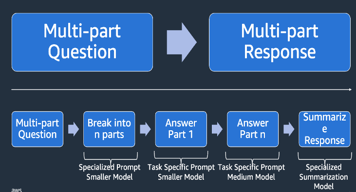
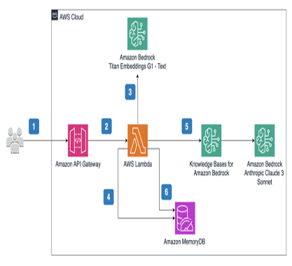
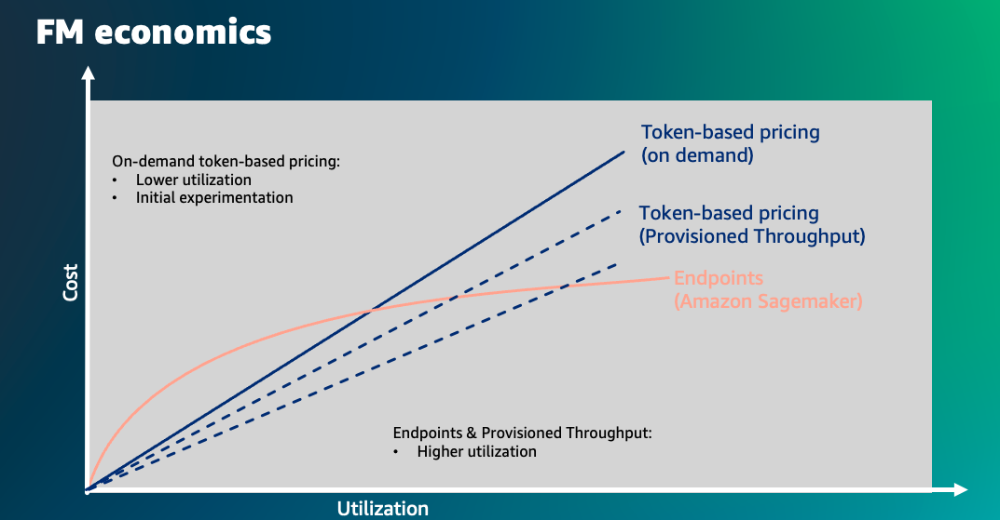

<!-- 
 Copyright Amazon.com, Inc. or its affiliates. All Rights Reserved.
 SPDX-License-Identifier: CC-BY-SA-4.0
 -->

# Cost Optimization Strategy and Techniques

**Content Level: 300**

## Suggested Pre-Reading

* [Enterprise cost optimization strategy for GenAI](https://aws.amazon.com/blogs/enterprise-strategy/generative-ai-cost-optimization-strategies/){:target="_blank" rel="noopener noreferrer"}

* [GenAI cost optimization](https://aws.amazon.com/blogs/machine-learning/optimizing-costs-of-generative-ai-applications-on-aws/){:target="_blank" rel="noopener noreferrer"}

## TL;DR

Organizations can optimize their generative AI costs with prompt decomposition, chaining, and caching, with prompt caching alone potentially reducing costs by up to 90% while improving latency by up to 85%. Additional optimization techniques include semantic caching, chunking strategies, and implementing intelligent prompt routing between different model sizes, which can achieve up to 30% cost reduction without compromising accuracy. For high-volume usage patterns, organizations can further enhance cost efficiency by leveraging AWS services like Sagemaker, EC2, or EKS, and eventually using fine-tuning or model distillation.

### Cost Optimization Strategy and Techniques

### Prompt decomposition and chaining

Prompt decomposition breaks the question into multiple parts and get inference from smaller model and leverage a specialized/intelligence model to summarize the responses. This can help with both the cost and latency as well.

#### Prompt caching
Prompt caching in Bedrock provides lower cost and improves response latency. You can add portions of your conversation to a cache so that the model can reuse the context in the cache instead of fully processing the input and computing responses each time.

Prompt caching can help when you have workloads with long and repeated contexts that are frequently reused for multiple queries. For example, if you have a chatbot where users can upload documents and ask questions about them, it can be time consuming for the model to process the same document every time the user provides input. With prompt caching, you can cache the document in the context of the conversation for faster responses.This capability can reduce costs by up to 90% and latency by up to 85% for supported models by caching frequently used prompts across multiple API calls.

| Feature | Details |
|---------|----------|
| **Service Name** | Prompt Caching on Amazon Bedrock |
| **Cache Duration** | 5 minutes |
| **Cost Benefits** | Up to 90% discount on cached tokens |
| **Performance Benefits** | Up to 85% latency improvement |
| **Common Use Cases** | - Multi-turn conversations - Many-shot examples - Detailed instructions - Repeated context patterns |
| **Security** | Cache isolated to specific AWS account |
| **Implementation** | Uses existing Amazon Bedrock APIs |
| **Variables Affecting Benefits** | - Model type - Prompt length |

### Intelligent prompt routing

Amazon Bedrock offers Intelligent Prompt Routing, which can intelligently route requests between different models within the same family (like Claude 3.5 Sonnet and Claude 3 Haiku) based on prompt complexity, optimizing for both quality and cost. This feature can reduce costs by up to 30% without compromising accuracy, making it particularly useful for applications like customer service assistants where query complexity varies.

### Persistant Semantic Caching

A persistent semantic cache in datastore like Amazon MemoryDB is an effective technique to reduce costs and improve speed for generative AI workloads. Traditional caching struggles with natural language variability, leading to redundant processing and higher expenses. By leveraging vector search capabilities, applications can store and retrieve embeddings of past requests, enabling similarity-based retrieval instead of reprocessing every query. This approach lowers response latency from seconds to milliseconds while minimizing compute costs by reducing redundant model invocations. Implementing this caching technique ensures cost-efficient scaling for AI applications while maintaining high-performance responses.

### Smaller models
Amazon Bedrock Marketplace provides access to over 100 popular emerging and specialized foundation models through Bedrock. There are models from organizations like Arcee AI, which builds context-adapted small language models (SLMs), which can be cost effective option for many customers. Smaller models like Anthropic Claude's Haiku and Nova Lite also provide cost effectiveness along with rich capabilities including multimodality support. This is limited to certain open source architecture including llama, flan and mistral.

### Selecting the right vector store and chunking strategy
Two critical components affecting efficiency and expenses in retrieval-augmented generation (RAG) and semantic search are the vector store and the chunking strategy. Selecting the right approach can drastically reduce infrastructure costs, API expenses, and processing overhead.

#### Choosing the Right Vector Store for Cost Optimization

A vector store is essential for storing and retrieving high-dimensional embeddings efficiently. The choice of a vector database impacts not only latency and scalability but also overall operational costs. Here are key factors to consider:

* Cost-Efficient Storage – Opt for vector databases that offer cost-effective pricing models, such as tiered storage or on-demand pricing. Solutions like Amazon OpenSearch, Pinecone, and FAISS provide flexible options for various budget constraints.

* Efficient Indexing and Retrieval – Fast indexing methods like Hierarchical Navigable Small World (HNSW) graphs or Approximate Nearest Neighbors (ANN) reduce computational overhead, lowering cloud infrastructure costs.

* Compute Optimization – Some vector databases require more compute power for queries. Choosing managed solutions with auto-scaling and optimized retrieval mechanisms helps reduce operational expenses.

* Metadata Filtering to Reduce Unnecessary Processing – By enabling metadata-based filtering, unnecessary LLM calls are minimized, leading to fewer API requests and lower processing costs. For example - leveraging Amazon Bedrock Knowledgebase metadata filtering. 

* Serverless and Pay-as-You-Go Models – Opting for serverless vector stores or those with pay-as-you-go pricing models ensures you only pay for what you use, avoiding unnecessary resource provisioning.

#### Cost-Efficient Chunking Strategies

Chunking is the process of breaking text data into meaningful segments before generating embeddings. A well-defined chunking strategy minimizes redundant API calls and reduces storage and compute costs.

Best Practices for Cost-Optimized Chunking:

Chunking strategies should be applied based on the usecase and  the knowledge corpus. 

* Balanced Chunk Size along Fixed size chunking – Overly large chunks increase retrieval costs, while small chunks lead to excessive API calls. A balance between 200–500 tokens minimizes wasteful queries while preserving context.

* Semantic Chunking for Cost Efficiency – Ensuring chunk coherence reduces irrelevant retrievals, minimizing costly reprocessing.

* Overlapping Chunks Only When Necessary – Excessive overlapping leads to duplicate storage and retrieval costs. Limit overlap to 10-20% to balance relevance and cost.

* Dynamic Chunking Based on Query Patterns – Adaptive chunking strategies that adjust to specific query needs help optimize retrieval efficiency, reducing unnecessary compute usage.

#### Maximizing Cost Savings

A combination of the right vector store and optimized chunking strategy results in:

* Lower API Costs – Reducing unnecessary LLM calls significantly cuts API expenses.

* Minimized Storage Overhead – Efficient chunking strategies prevent excessive storage usage in vector databases.

* Optimized Query Efficiency – Faster, smarter retrieval reduces compute and memory usage, optimizing cloud costs.

* Improved Latency at Lower Cost – Well-structured chunking and retrieval mechanisms ensure low-latency responses without overusing expensive infrastructure.

#### Bedrock knowledgebase specifics

| Feature | Standard Chunking | Hierarchical Chunking | Semantic Chunking |
|---------|------------------|----------------------|-------------------|
| **Cost Level** | Low | Medium | High |
| **Complexity** | Simple | Moderate | Complex |
| **Processing Speed** | Fast | Medium | Slower |
| **Context Preservation** | Basic | Good | Excellent |
| **Configuration Options** | - Fixed size - Default (300 tokens) - No chunking | - Parent chunk size - Child chunk size - Overlap tokens | - Maximum tokens - Buffer size - Breakpoint threshold |
| **Best Use Cases** | - Basic documentation - Manuals - Structured content | - Legal documents - Technical docs - Research papers | - Medical documents - Academic papers - Complex analysis |
| **Main Advantage** | Simple and cost-effective | Balance of context and precision | Highest accuracy in meaning preservation |
| **Main Disadvantage** | Limited context awareness | More complex setup | Higher cost and processing time |
| **Scalability** | Highly scalable | Moderately scalable | Resource intensive |
| **Setup Complexity** | Minimal | Moderate | Complex |

#### Function calling vs Agents

If your usecase is simplistic enough but requires usecase of different tools, you can experiment with function calling as a first step. 

| Aspect | Function Calling | Agents |
|--------|-----------------|---------|
| **Cost Efficiency** | Higher - Less token usage | Lower - More token consumption |
| **Resource Usage** | Single API call typically | Multiple API calls common |
| **Token Consumption** | Lower - Direct execution | Higher - Including reasoning steps |
| **System Overhead** | Minimal - Just schema definition | Higher - Role definitions & system prompts |
| **Best For** | - Simple, defined tasks - Structured data ops - Direct API calls - Known input/output patterns | - Complex reasoning - Multi-step tasks - Dynamic planning - Flexible problem solving |
| **Architecture** | - Predictable patterns - Structured responses - Direct execution path | - Multiple reasoning steps - Context management - Planning sequences |
| **Implementation Complexity** | Lower - Schema definition only | Higher - Role & behavior definition |
| **Maintenance** | Easier - Clear boundaries | Complex - More moving parts |
| **Debug Ability** | Easier - Clear input/output | Harder - Multiple steps to trace |
| **Cost-Benefit Sweet Spot** | Structured, repetitive tasks | Complex, reasoning-heavy tasks |

#### Cross region inference
On-Demand mode also supports cross-region inference for some models. It enables developers to seamlessly manage traffic bursts by utilizing compute across different AWS Regions and get higher throughput limits and enhanced resilience. There's no additional charge for using cross-region inference and the price is calculated basis the region you made the request in source region. 

#### Batch Inference
With Amazon Bedrock Batch Inference mode, you can provide a set of prompts as a single input file and receive responses as a single output file, allowing you to get simultaneous large-scale predictions. The responses are processed and stored in your Amazon S3 bucket so you can access them at a later time. Amazon Bedrock offers select foundation models (FMs) from leading AI providers like Anthropic, Meta, Mistral AI, and Amazon for batch inference at a 50% lower price compared to on-demand inference pricing. If your workload is not latency sensitive or real time and had tolerance for batch processing, batch inference can be a cost effective way. 

#### Amazon models
Considering Amazon models from Nova family is not only cost effective but can also apply towards customer's EDP private pricing cross service discount. Additionally, if this is migration from the hyperscalers, it is possible to leverage inhouse programs like MAP and credits. 

#### Economies of scale

Depending on the volume, usage pattern, etc. you might want to compare paying per tokens vs hosting the model on compute using EKS, EC2 or Sagemaker. If the model is a open source varient, finetuned version of open source varient and has massive volume with traffic throughout the day, it might be most cost effective to host the model on AWS services like Sagemaker, EC2, EKS etc. 

#### Finetuning and model distillation

With Bedrock fine-tuning, you can increase model accuracy by providing your own task-specific labeled training dataset and further specialize your FMs. If your usecase is such that prompt engineering or RAG is not providing the required accuracy and you have a labeled dataset specific to the task, you can experiment with finetuning starting with smaller models. With Amazon Bedrock Model Distillation, you can increase the accuracy of a smaller-sized student model to mimic a higher-performance teacher model with the process of knowledge transfer. You can create distilled models that for a certain use case, are up to five times faster and up to 75 percent less expensive than original large models, with less than two percent accuracy loss for use cases such as Retrieval Augmented Generation (RAG), by transferring knowledge from a teacher model of your choice to a student model in the same family.

## Making it Practical
Customers will often jump to the most complex solution to cost reduction, even when simpler actions like prompt engineering will acheive the goal. Additionally, model evaluation is key so that you know if the changes will degrade the quality of the response. This is especially true when evaluating a smaller model against a largest on. Fine-tuning and distillation are much more complex and often the cost savings do not materialize because the model needs to be run on provisioned capacity, thus only effective for established workloads with steady state use.

### External Resources:
* [Prompt Chaining with Step Function](https://github.com/aws-samples/serverless-genai-examples/tree/main/prompt-chaining-with-stepfunctions){:target="_blank" rel="noopener noreferrer"}

* [Prompt Caching](https://docs.aws.amazon.com/bedrock/latest/userguide/prompt-caching.html){:target="_blank" rel="noopener noreferrer"}

* [Prompt Routing and Caching](https://aws.amazon.com/blogs/aws/reduce-costs-and-latency-with-amazon-bedrock-intelligent-prompt-routing-and-prompt-caching-preview/){:target="_blank" rel="noopener noreferrer"}

* [Semantic caching](https://aws.amazon.com/blogs/database/improve-speed-and-reduce-cost-for-generative-ai-workloads-with-a-persistent-semantic-cache-in-amazon-memorydb/){:target="_blank" rel="noopener noreferrer"}

* [Amazon Science paper on task decomposition and smaller models](https://www.amazon.science/blog/how-task-decomposition-and-smaller-llms-can-make-ai-more-affordable){:target="_blank" rel="noopener noreferrer"}

* [Deep dive into vector stores](https://aws.amazon.com/blogs/machine-learning/dive-deep-into-vector-data-stores-using-amazon-bedrock-knowledge-bases/){:target="_blank" rel="noopener noreferrer"}

## Further Reading
* [Optimizing cost](https://aws.amazon.com/blogs/machine-learning/optimizing-costs-of-generative-ai-applications-on-aws/){:target="_blank" rel="noopener noreferrer"}

* [Cost fin ops blog](https://aws.amazon.com/blogs/aws-cloud-financial-management/optimizing-cost-for-generative-ai-with-aws/){:target="_blank" rel="noopener noreferrer"}

* [Model distillation](https://aws.amazon.com/blogs/aws/build-faster-more-cost-efficient-highly-accurate-models-with-amazon-bedrock-model-distillation-preview/){:target="_blank" rel="noopener noreferrer"}

## Contributors

**Author**: Neelam Koshiya - Principal Applied AI Architect 

**Primary Reviewer**: Randy Defauw - Senior Principal Solutions Architect 

**Additional Reviewer**: Mike Gillespie - Principal Solutions Architect 