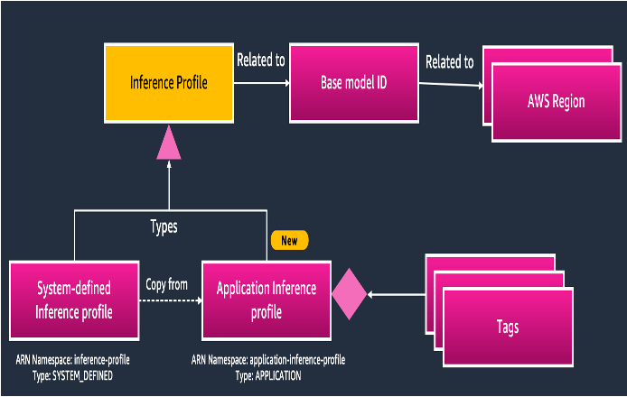
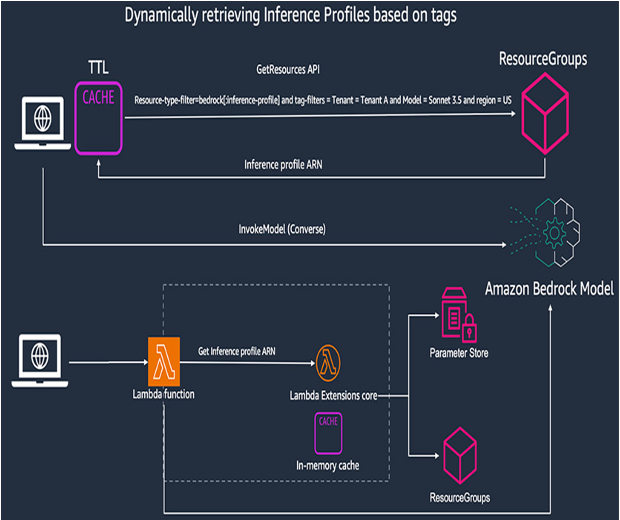
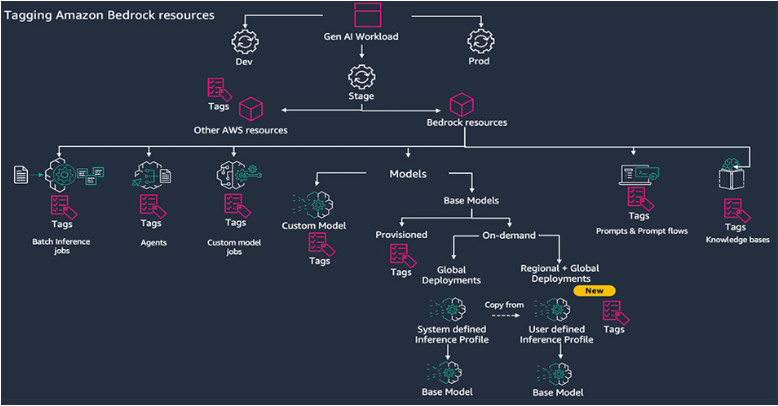
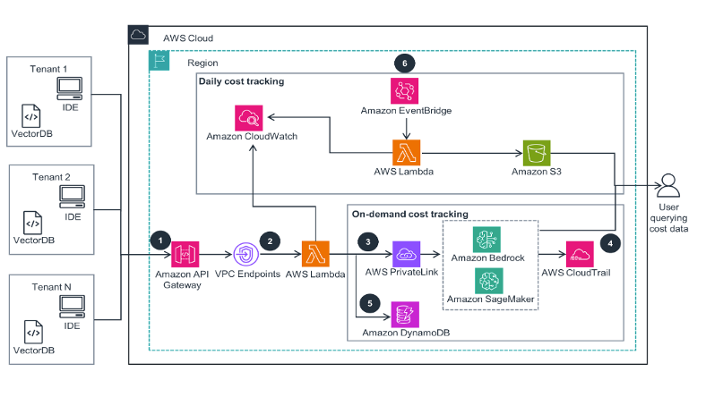
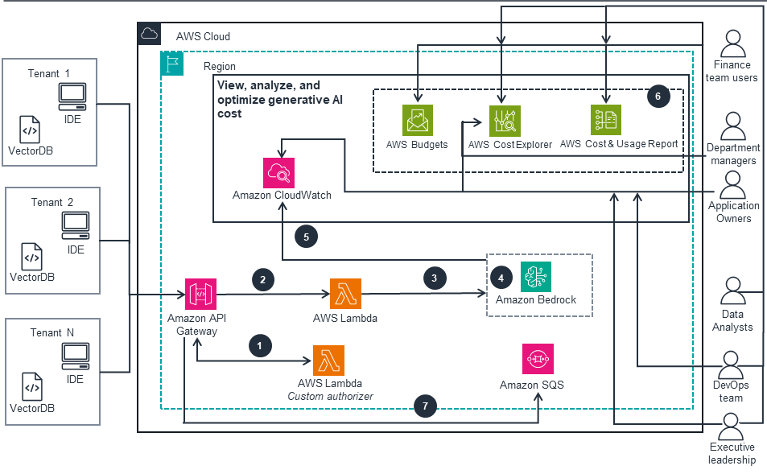
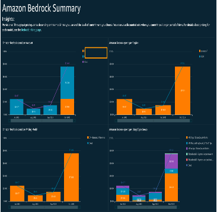

<!-- 
 Copyright Amazon.com, Inc. or its affiliates. All Rights Reserved.
 SPDX-License-Identifier: CC-BY-SA-4.0
 -->

# Cost tracking and monitoring

**Content Level: 300**

## Suggested Pre-Reading

General cost tracking and monitoring in AWS

* [Cost tags](https://docs.aws.amazon.com/awsaccountbilling/latest/aboutv2/cost-alloc-tags.html){:target="_blank" rel="noopener noreferrer"}

* [Manage cost - part 1 ](https://aws.amazon.com/blogs/mt/manage-cost-overruns-part-1/){:target="_blank" rel="noopener noreferrer"}

* [Manage cost - part 2 ](https://aws.amazon.com/blogs/mt/manage-cost-overruns-part-2/){:target="_blank" rel="noopener noreferrer"}

* [Calculate multi-tenant cost in AWS](https://aws.amazon.com/blogs/apn/calculating-tenant-costs-in-saas-environments/){:target="_blank" rel="noopener noreferrer"}

* [Cost visibility](https://aws.amazon.com/blogs/apn/optimizing-cost-per-tenant-visibility-in-saas-solutions/){:target="_blank" rel="noopener noreferrer"}

## TL;DR

A multi-tenant generative AI cost and usage tracking system has been developed using AWS services to address the growing challenges organizations face in monitoring and managing AI spending across departments. The solution provides real-time tracking, analysis, and cost allocation capabilities across different tenants, offering detailed visibility into AI expenditure while maintaining operational flexibility and efficiency..

## Bedrock

### Cost tracking and monitoring

As organizations rapidly adopt generative AI across multiple business units, managing and tracking associated costs becomes increasingly complex. Amazon Bedrock now offers application inference profiles - a powerful capability that enables organizations to tag, monitor, and control their AI spending across different departments and use cases while maintaining operational efficiency.

### SaaS Vs. Internal Business Units
While the fundamental problem is very similar, the main difference between cost allocation in a multi-tenant SaaS environment and across multiple business units in an enterprise is the number of tenants. Whereas a SaaS solution may have thousands of tenant, an enterprise may have tens or hundreds of units. However, cost tracking down to the team or individual would lead to a solution that is essentially the same, so in effect, the architecture is the same across both domains.

### The Challenge: Why Cost tracking, monitoring and management Matters
Organizations struggle with accurately allocating expenses across departments, setting appropriate budgets, and maintaining visibility into usage patterns. Without proper cost controls, companies risk uncontrolled spending and inefficient resource utilization. The complexity increases as AI adoption spreads across multiple projects, teams, and business units, each with unique requirements and budgeting constraints.

### Proposed solution
We propose to leverage familiar AWS constructs like tagging in conjunction with newer features like Bedrock inference profile to track, monitor and manage cost across different deparment and teams. The 

### Application Inference Profiles and Tagging
Amazon Bedrock's new application inference profiles provide a sophisticated solution for cost tracking and management. Organizations can now:

- Create customized inference profiles with specific tags for different departments and use cases
- Track and monitor costs at granular levels using AWS cost allocation tags
- Set budgets and receive alerts through AWS Budgets
- Analyze spending patterns using AWS Cost Explorer and CloudWatch
- Implement automated cost control measures

The solution supports both static configuration and dynamic retrieval approaches for managing inference profiles, allowing organizations to choose the method that best fits their scale and requirements.

The implementation process is streamlined through AWS APIs and SDKs, enabling organizations to:

- Create and manage inference profiles programmatically
- Apply custom tags for precise cost allocation
- Monitor usage in real-time through CloudWatch
- Set up automated alerts and responses to cost anomalies
- Generate detailed cost and usage reports

Amazon Bedrock's application inference profiles provide granular control over resource allocation and spending, organizations can scale their AI initiatives while maintaining fiscal responsibility. 

## SaaS Bedrock Multi-tenant Architecture

### The Solution Approach

This architecture diagram shows how to configure an internal Software-as-a-Service (SaaS) model for access to AI models.

This architecture diagram shows how application inference profiles can be used to track and manage model usage and associated costs for each tenant. Tenants can represent individual users, projects, teams, or departments within an organization. 

Multiple tenants within an enterprise could simply reflect to multiple teams or projects accessing LLMs via REST APIs just like other SaaS services. IT teams can add additional governance and controls over this SaaS layer via an API Gateway. An internal service is responsible to perform usage and cost tracking per tenant and aggregate that cost for reporting.

At its core, the solution provides a secure gateway for AI access, implementing sophisticated authentication and authorization mechanisms while maintaining detailed usage logs and cost allocation data.

The intelligence layer of our solution focuses on real-time tracking and analysis.

#### Key Components of the Solution:

Amazon Bedrock: Provides access to a variety of high-performing foundation models from leading AI companies through a single API, facilitating the development of generative AI applications with security and privacy. 
AWS Organizations: Manages multiple AWS accounts, enabling centralized governance, resource management, and cost allocation across different environments or departments. 
Amazon API Gateway: Serves as a scalable entry point for tenant applications, validating API keys and routing requests securely. 
AWS Lambda: Processes incoming requests and interacts with foundation models, ensuring stateless and scalable compute operations. 
Amazon S3: Stores tenant-specific data and logs, providing durable and secure storage. 
Amazon Athena and Amazon QuickSight: Enable querying and visualization of data stored in Amazon S3, facilitating insights into usage patterns and cost.

#### Benefits of the Solution:

* Tenant and Data Isolation: Ensures that each tenant's data and workloads are isolated, maintaining security and compliance. 

* Access Management: Utilizes AWS Identity and Access Management (IAM) to control permissions and access to resources, enhancing security. 

* Cost Control: Implements tagging and cost allocation strategies to monitor and manage expenses effectively across tenants. 

* Scalability: Leverages AWS's scalable infrastructure to accommodate varying workloads and tenant demands. 

By integrating these AWS services, enterprises can build a multi-tenant generative AI environment that is secure, scalable, and cost-effective, fostering innovation and operational efficiency.

### Implementation Strategy

Initially, the focus is on establishing the core infrastructure and security controls necessary for safe and efficient operation. As the system matures, organizations can implement increasingly advanced analytics and reporting capabilities. Our solution implements hierarchical resource tagging, enabling precise cost attribution across different organizational units. The system provides graduated alert thresholds, allowing organizations to proactively manage their AI spending while maintaining operational flexibility.

Security remains paramount in our design, with comprehensive controls implemented at every level. The system ensures proper encryption of data both at rest and in transit, while maintaining strict access controls across different tenant boundaries. Performance optimization is achieved through careful API request handling and response caching, ensuring that the tracking mechanisms do not impact the overall system performance.

## SageMaker

### Training
To attribute training cost to individual line of business, pass a line of business specific value as a pipeline parameter. Then, in the pipeline steps pass this tag to pre-processing, training, and model-tuning jobs. Any compute resources span up by these jobs will be tagged automatically. Make sure to activate Cost Allocation Tags to see them in Cost Explorer and cost allocation report.

### Inference
In a model per line of business, add cost attribution tags to the SageMaker resources responsible for each line of business. In a shared resources model, some cost allocation will be required based on consumption metrics. There are multiple ways to do this, from a headcount or revenue percentage, which is fairly easy to calculate, but does not reflect consumption. Consumption based metrics require the application track which line of business made the inference call, as well as the number of tokens in and out. This accurately tracks consumption, but does not take utilization into account. An inference server with low utilization will have higher per-token costs that a high utilization endpoint.

## CUDOS dashboard

You can additionally leverage CUDOS dashboard to track, monitor and analyze generative AI application cost.

This architecture represents more than just a technical solution; it embodies a comprehensive approach to managing the complexities of enterprise AI adoption. By providing detailed visibility into AI usage and costs, organizations can make informed decisions about their AI investments while ensuring efficient resource utilization across all tenants.

## Making it Practical
While there isn't an elegant solution for multi-tenancy cost allocation across Bedock and SageMaker, it is still an imporant capability for our customers to implement. It starts with using inference profiles and tagging to use built-in cost allocation in AWS, but in more advanced cases require logging to association the inference with the tenant, line of business, or even individual user.

## Get Hands-On

Refer to sample code [here](https://github.com/aws-samples/amazon-bedrock-samples/tree/main/poc-to-prod/inference-profiles/inference-profile-cost-tracing){:target="_blank" rel="noopener noreferrer"}

## Further Reading
[Forrester study](https://d1.awsstatic.com/isv/en_us__aws_isv_forrester_mining-genai-gold-rush_study.pdf){:target="_blank" rel="noopener noreferrer"}

## Contributors
**Author**: Neelam Koshiya - Principal Applied AI Architect 

**Primary Reviewer**: Randy Defauw - Senior Principal Solutions Architect 

**Additional Reviewer**: Mike Gillespie - Principal Solutions Architect 