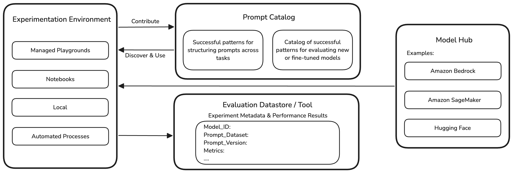

<!-- 
 Copyright Amazon.com, Inc. or its affiliates. All Rights Reserved.
 SPDX-License-Identifier: CC-BY-SA-4.0
 -->

# Building generative AI applications

**Content Level: 200**

## Suggested Pre-Reading

* [Prompt Engineering](../../2_0_technical_foundations_and_patterns/2_3_core_archtectural_concepts/2_3_2_prompt_engineering/2_3_2-3_core_components/core_components.md)
* [Retrieval Augmented Generation (RAG)](../../2_0_technical_foundations_and_patterns/2_3_core_archtectural_concepts/2_3_1_data_engineering/2_3_1-1_data_engineering_foundation/data_engineering_concepts.md)
* [Generative AI Evaluations](../../2_0_technical_foundations_and_patterns/2_6_model_evaluation_and_selection_criteria/introduction_to_generative_AI_evaluations.md)

## TL;DR

AI Ops applies best practices like versioning, testing, automation, and monitoring to building reliable GenAI applications. Teams should manage prompts, track experiments, and run evaluations to assess all of the components within a GenAI application stack to help ensure that they are reliable, secure, and efficient at scale.

---

Development and experimentation with foundation models in GenAI systems require not just model selection and evaluation, but also robust operational practices. AI Ops principles like reproducibility, versioning, automation, testing, and optimization are important for building reliable GenAI applications.

Retrieval-Augmented Generation (RAG) and Agents are two common architectural patterns for building GenAI applications, and they can be used together. RAG enhances model responses by retrieving relevant information from your data sources, while Agents use LLMs as reasoning engines to break down complex tasks and orchestrate tools to accomplish specific goals. 
Both patterns do not necessitate building models from scratch or fine-tuning models, but these patterns still require careful consideration of prompt engineering and system integration to enable reliable performance. As a result you still need experimentation and evaluations.

## Prompt Management
***Applied AI Ops Principles: Versioning, Testing, Automation, Reproducibility, Cost & Resource Optimization,  Reusability***

The typical experimentation cycle starts with prompting using different foundation models. This can happen across various environments depending on the user’s preference. Some may prefer a playground environment while others may prefer notebooks or common software development IDEs. Independent of the chosen experimentation environment, the commonality is prompt engineering. 

A best practice in AI Ops is to establish a reliable and efficient prompt management system that allows team members to contribute and share prompt templates, easily discover and reuse effective patterns, and track important metadata such as performance metrics, and thereby making it easier to optimize and standardize prompt engineering across projects.

  

Prompt versioning helps ensure systematic evolution of prompt templates with full traceability and reproducibility. Effective prompt management involves:

* **A Centralized Source of Truth**: Prompts should be managed in dedicated repositories or purpose-built prompt management applications, separate from application code, to facilitate collaboration and reusability.
* **Version Control & Diffing**: Every prompt iteration is versioned with metadata (author, timestamp, change description) and supports diffing to compare versions, enabling rollback and understanding of impact on outputs.
* **Testing & Evaluation**: Baseline metrics for each prompt version are captured, and outputs are validated against expectations. Many applications provide playgrounds or visual builders for rapid experimentation and in-place testing.
* **Collaboration & Access Control**: Role-based access, approval workflows, and sharing capabilities allow teams to collaborate efficiently while maintaining security and governance.
* **Modularization & Reusability**: Prompts are designed as modular, reusable components with support for variables and parameterization, reducing duplication and ensuring consistency.
* **Integration & Automation**: APIs and SDKs enable applications to retrieve prompt versions dynamically, decoupling prompt logic from core code for seamless updates.
* **Best Practices Enforcement**: Automated prompt optimization and adherence to prompt engineering best practices are supported by advanced management applications.

While many teams use Git for prompt versioning, a holistic prompt management system goes beyond that by offering systematic experimentation, rigorous evaluation, and collaborative & automated prompt improvement, ensuring discoverability and reusability across projects.

### Benefits                                 

* **Reduced cost**: Avoid redundancy in experimentation through shared successful patterns. 
* **Increased reliability and traceability**: Automate versioning and collection of evaluation metrics across experiments.
* **Increased agility & collaboration**: Team members benefit from successful patterns. 

Apart from Amazon Bedrock Prompt Management, there are several open-source applications available like Agenta, an open-source application supporting end-to-end prompt lifecycle management, or PromptHub, which is community-driven application for discovering, versioning, and deploying prompts. 

In addition there are many frameworks and solutions like LangChain, promptfoo, or PromptPanda that cover parts of the above covered best practices as well.

## Evaluations & Experiment Tracking
***Applied AI Ops Principles:  Testing, Automation, Reproducibility, Continuous Improvement***

Developing generative AI applications requires continuous experimentation, even if you are not building or fine-tuning the foundational models. This is due to primarily three factors:

* **Number of involved components and strategies**: Generative AI applications utilize various components (e.g., vector databases, embedding models, reranker models) and strategies (e.g., chunking, retrieval techniques) that can be combined in many ways.
* **LLMs are not deterministic**: Large Language Models (LLMs) can produce varied outputs for the same input, making consistency a challenge.
* **Continuous improvement**: Performance improvements require iterative experimentation.

Therefore, tools for automation, evaluation, and experiment tracking are important.

* **Experiment Tracking**: Solutions like MLflow and Weights & Biases track and compare results across runs, supporting both open-source and managed offerings.
* **Evaluation Tools**: Amazon Bedrock, SageMaker AI, and certain AWS partner solutions  support evaluations and metric tracking.

These tools can largely automate evaluations and simplify tracking metrics over time, across many runs and experiments.

Another way to look at evaluations is through the lens of traditional testing frameworks:

* Unit Testing: Benchmarking individual components (e.g. a embedding model or a re-ranker model individually).
* Integration Testing: Validating system interactions and model output quality.
* Performance Testing: Measuring throughput and system behavior under load.
* Safety Testing: Assessing the application for undesired behaviors using frameworks like Amazon Bedrock Guardrails.

## Observability
***Applied AI Ops Principles: Testing, Monitoring & Observability, Cost & Resource Optimization***

Observability is important for maintaining reliable generative AI applications. Tracing across framework boundaries is important for visibility into system behavior. Tracking token usage, costs, latency, and throughput provides key operational insights. Logging semantic outputs enables ongoing quality analysis and improvement.

During development, observability — and tracing, in particular — is important for getting end-to-end visibility into how requests flow through a GenAI application stack. Each request has a unique trace ID that follows it through every component—from initial prompt processing, through RAG retrievals, to model inference and post-processing steps. This tracing capability helps identify bottlenecks, debug issues, and understand complex interactions between components. For example, in a RAG application, traces can show how long each step takes: document chunking, embedding generation, vector search, context integration, and final model inference. 

Often times frameworks and solutions like LangSmith or Amazon Bedrock Agents provide tracing capabilities out of the box, but you also need these solutions to support standards like OpenTelemetry so that these traces can be collected and visualized consistently across different frameworks, applications, and services.

## Orchestration & Integration
***Applied AI Ops Principles: Versioning, Automation, Testing, Reliability & Resiliency, Security, Cost & Resource Optimization***

Modern orchestration frameworks simplify the development of complex GenAI applications by providing high-level abstractions for working with LLMs. These tools help developers focus on business logic, while handling common challenges such as workflow management, component integration, and error handling.

Since no single framework has emerged as the standard, it is important to design your application for interoperability. Encapsulate orchestration components to minimize vendor lock-in and simplify future upgrades or replacements.

### DevOps Best Practices

Apply traditional DevOps best practices to GenAI orchestration frameworks:

* Use requirements files for dependency management.
* Employ containerization (e.g. Docker) to ensure consistency across environments.
* Automate testing to maintain compatibility.
* Monitor for vulnerabilities, performance improvements, and new framework capabilities to inform upgrade decisions.

### API Integration and Error Handling

When integrating APIs:

* Design for resilience with robust error handling, connection pooling, and intelligent caching.
* Monitor rate limits and costs to avoid service disruptions.
* Implement circuit breakers and fallback mechanisms to handle failures gracefully.
* Actively monitor for hallucinations and output quality issues to maintain reliable responses.

### Context Management

Context management is important in generative AI applications:

* Use standardized schemas for inputs and outputs.
* Handle context window limitations gracefully.
* Maintain conversation state across interactions.
* Implement strong security controls for all data handling to enable reliability and compliance.

### Security

Integrate security throughout your architecture:

* Use robust authentication and authorization.
* Protect sensitive data in prompts and responses.
* Monitor for prompt injection and other attacks.
* Enforce strong data governance for compliance and risk mitigation.

### Performance Optimization

Optimize performance by:

* Designing efficient prompts.
* Implementing effective caching.
* Using batching to increase throughput where possible.
* Continuously monitoring and optimizing resource usage for cost-effectiveness.

Adhering to these AI Ops best practices helps ensure your GenAI applications are robust, secure, and efficient, supporting operational excellence at scale.

## Further Reading

* [Common Tools in LLM App Stack](https://github.com/a16z-infra/llm-app-stack){:target="_blank" rel="noopener noreferrer"}
* [AWS Blog: LLM experimentation at scale using Amazon SageMaker Pipelines and MLflow](https://aws.amazon.com/blogs/machine-learning/llm-experimentation-at-scale-using-amazon-sagemaker-pipelines-and-mlflow/){:target="_blank" rel="noopener noreferrer"}
* [Amazon Bedrock Evaluation documentation](https://docs.aws.amazon.com/bedrock/latest/userguide/evaluation.html){:target="_blank" rel="noopener noreferrer"}
* [Amazon SageMaker AI Evaluation documentation](https://docs.aws.amazon.com/sagemaker/latest/dg/clarify-foundation-model-evaluate-get-started.html){:target="_blank" rel="noopener noreferrer"}

## Contributors
**Authors:** 
- Felix Huthmacher, Senior Applied AI Architect 

**Reviewers:**  
- Dave Thibault, Senior Applied AI Architect  