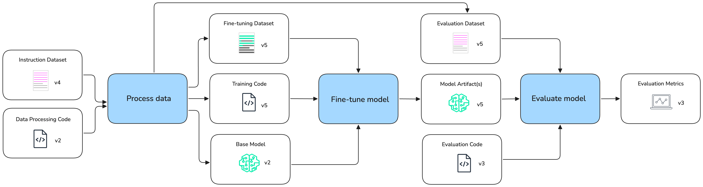

<!-- 
 Copyright Amazon.com, Inc. or its affiliates. All Rights Reserved.
 SPDX-License-Identifier: CC-BY-SA-4.0
 -->

# Creating or fine-tuning foundation models

**Content Level: 200**

## Suggested Pre-Reading

* [Fine-tuning](../../2_0_technical_foundations_and_patterns/2_3_core_archtectural_concepts/2_3_4_fine-tuning/fine_tuning.md)
* [Amazon SageMaker Model Building Pipelines](https://docs.aws.amazon.com/sagemaker/latest/dg/build-and-manage-pipelines.html){:target="_blank" rel="noopener noreferrer"} 

## TL;DR

Model development and customization in AI Ops involves managing model versions, configurations, and pipelines while ensuring secure and scalable deployment. AWS services like Amazon SageMaker and Amazon Bedrock provide the infrastructure for reproducible, secure, and cost-effective GenAI model operations.

---

Model development and customization is the process of preparing, adapting, and deploying foundation models (FMs) and large language models (LLMs) to meet your organization’s unique requirements. This lifecycle includes data preparation, model selection, fine-tuning, experiment tracking, pipeline automation, and secure model hosting.

  

## Dataset Preparation
***Applied AI Ops Principles: Versioning, Automation, Security***

A robust dataset is the foundation for effective GenAI model customization. For most enterprise use cases, this covers:

* Data Collection and Curation: Aggregate and clean domain-specific text, code, or multimodal data. Use data labeling tools for supervised fine-tuning or RLHF (Reinforcement Learning from Human Feedback).
* Data Governance: Ensure compliance with privacy and security requirements. Track data lineage and versioning to support reproducibility.

## GenAI Model Versions & Model Catalog
***Applied AI Ops Principles: Versioning, Security, Ownership & Accountability, Reproducibility, Reusability, Continuous Improvement***

Managing model versions is key for enabling traceability, rollback, and compliance in GenAI applications. As organizations deploy multiple models across teams and projects, maintaining a robust catalog of model versions and metadata becomes important for governance, reproducibility, and operational efficiency. A typical approach involves:

* Model Registry: Use tools such as SageMaker Model Registry or AWS Service Catalog to systematically track approved model versions, associated metadata, and lineage. This enables teams to manage model promotion workflows, automate approvals, and maintain a clear audit trail for every model artifact.
* Model Cataloging in Bedrock: Amazon Bedrock provides a unified catalog of foundation models, including AWS-hosted models, and custom models imported from SageMaker. This centralization simplifies model discovery, access control, and governance, allowing organizations to efficiently manage both native and custom GenAI models in production.
* Versioning Best Practices: Assign unique version identifiers and semantic tags to each model artifact. Store evaluation metrics, training configurations, and data provenance alongside each version. Automate model promotion (for example, from staging to production) based on evaluation results and business requirements.

## AI Registry
***Applied AI Ops Principles: Versioning, Security, Ownership & Accountability, Reproducibility, Reusability, Continuous Improvement***

AI registry solutions are centralized systems designed to manage and track the entire lifecycle of AI models and related assets within an organization. They serve as a single source of truth for all AI initiatives, supporting transparency, accountability, and efficient AI governance. The core functionality offered by an enterprise-grade AI registry are:

* Centralized Repository: AI registries provide a central hub for storing, managing, and tracking models, datasets, code, documentation, and other related artifacts.
* GenAI Asset Tracking: Enable organizations to monitor the development, deployment, and usage of GenAI assets across teams and projects, supporting better resource allocation and risk management.

Other required functionality seen in model registry are still needed in AI registry like version control, metadata management, access control, reporting and analytics

With managed or serverless hosting solutions such as Amazon Bedrock often times that solution becomes the de facto model registry. In that case, the solution provider controls the model lifecycle and versioning.
In heavily regulated industries the support window length of a managed service might not be sufficient (for instance FDA approvals in medical devices can take years). As a result, if your use case requires strict model version control, then this needs to be considered when reviewing model hosting options. 

## AWS GenAI  Model Customization Tools
***Applied AI Ops Principles: Automation, Security, Cost & Resource Optimization***

AWS provides a comprehensive suite of tools and infrastructure options to support the preparation and customization of large language models (LLMs) for enterprise use cases. Fine-tuning open-source foundation models can be efficiently accomplished using Amazon SageMaker, which offers managed distributed training jobs, built-in support for hyperparameter tuning with SageMaker Experiments, and the ability to leverage managed spot instances for cost optimization. For large-scale or highly parallel training workloads, SageMaker HyperPod delivers a purpose-built, automated cluster environment that simplifies the orchestration of distributed GPU resources, network configuration, and storage, making it ideal for training and fine-tuning massive models as demonstrated in the customization workflow example.

Additionally, organizations seeking even greater flexibility can utilize Amazon EKS (Elastic Kubernetes Service) to run containerized, custom training jobs using frameworks such as PyTorch, Hugging Face Transformers, or DeepSpeed. 

For supported models like Amazon Nova and Anthropic Claude, Amazon Bedrock also offers model customization APIs that enable teams to adapt foundation models to their data without managing underlying infrastructure. 

Across all workflows, it is recommended to use stratified data splits for training, validation, and testing, to monitor data drift, and to automate data pipelines for reproducibility and scalability.

## Evaluations & Experiment Tracking
***Applied AI Ops Principles: Testing, Automation, Reproducibility, Continuous Improvement***

In addition to the required experiments and evaluations outlined in the previous chapter, there is an additional/different set of evaluations and experimentation required when building or fine-tuning foundation models. 
Continuous evaluation and systematic experiment tracking are important for maintaining and improving model quality throughout the GenAI lifecycle. These practices help ensure that every model iteration is measurable, reproducible, and aligned with both technical and business objectives. By combining automated evaluation techniques with human-in-the-loop review and robust experiment logging, teams can accelerate innovation while ensuring reliability and compliance.

* Experiment Tracking: Use SageMakerAI MLflow to log training parameters, evaluation metrics, and artifacts for each training run. This enables full reproducibility and supports robust comparison across experiments, making it easier to identify the best-performing models and configurations.
* LLM Evaluation Metrics: Move beyond standard machine learning metrics by tracking semantic similarity, factual accuracy, toxicity, and other business-specific KPIs. Incorporate advanced evaluation strategies such as LLM-as-a-judge and human-in-the-loop assessments to address the open-ended nature of generative model outputs.
* Automated Evaluation Pipelines: Integrate evaluation steps directly into ML pipelines to enable continuous validation of model performance. Set up automated triggers and alerts for performance regressions, bias detection, or other quality issues, ensuring that only high-quality models are promoted to production.

## ML Pipelines
***Applied AI Ops Principles: Versioning, Testing, Automation, Reproducibility, Reusability, Continuous Improvement***

Automated ML pipelines are important for orchestrating the end-to-end workflow in GenAI model development, covering everything from data ingestion and preprocessing to model training, evaluation, and deployment. By leveraging services such as Amazon SageMaker Pipelines, teams can construct modular and reusable pipelines that encapsulate each stage of the machine learning lifecycle. These pipelines allow for the integration of advanced features like step caching, conditional logic, and parameterization, enabling optimization for both cost and speed. Incorporating ML pipelines not only streamlines and standardizes the development process but also enables reproducibility, scalability, and consistency across projects, ultimately accelerating the delivery of high-quality GenAI solutions into production.

Furthermore, by integrating a CI/CD system (e.g. GitHub Actions) with an ML workflow (e.g. SageMaker Pipelines), the system can automatically trigger model retraining and deployment whenever new data or code is introduced.

In addition to the CI/CD integration, these ML pipelines also should integrate with other AI Ops components such as:

* Data Catalogs: For accessing versioned datasets.
* Model Registries: For tracking model versions and artifacts.
* Experiment Tracking Systems: For comparing results across different pipeline runs.
* Prompt Management Systems: For integrating versioned prompts into training and inference workflows.
* Evaluation Frameworks: For measuring model performance consistently.

Common orchestration tools are AWS Step Functions for serverless workflow orchestration with visual monitoring, Amazon SageMaker Pipelines for building, managing, and scaling ML workflows specifically within SageMaker, and Managed Apache Airflow (MWAA) for complex scheduling and dependency management in data and ML pipelines.

## Model Hosting
***Applied AI Ops Principles: Reliability & Resiliency, Cost & Resource Optimization, Security, Monitoring & Observability***

Secure, scalable, and efficient foundation model hosting is a cornerstone of successful GenAI deployments. As foundation models and large language models grow in complexity and size, hosting them for production use introduces unique challenges around performance, cost, security, and operational manageability. Organizations should ensure that their hosting solutions can deliver low-latency inference, scale seamlessly with demand, and maintain robust access controls, all while supporting a variety of deployment patterns from real-time APIs to batch processing. The general solution approach is to leverage managed services that abstract infrastructure complexity, provide built-in monitoring and autoscaling, and support both native and custom models through unified interfaces.

### Model Packaging and Serving Frameworks

When hosting models directly, careful consideration should be given to packaging the model weights, which can be dozens of gigabytes in size. Model compression techniques like quantization help reduce this footprint. Several purpose-built serving frameworks simplify deployment and optimize performance:

* vLLM: Offers the highest performance and throughput
* Ray Serve: Provides comprehensive scaling and distribution capabilities
* Hugging Face Text Generation Inference (TGI): Delivers strong hardware-specific optimizations

While custom Flask/FastAPI implementations are possible, they typically lack advanced optimization techniques like continuous batching and tensor parallelism.

### Serving Strategies

Model hosting and inference can be implemented through various approaches depending on workload requirements:

* Managed Services:
    * Amazon Bedrock: Provides LLM as a Service via API with provider-managed hosting
    * Amazon SageMaker: Offers managed infrastructure with built-in scaling and AWS service integration
* Container Orchestration:
    * Amazon EKS with tools like Kubeflow or KubeRay for deploying LLM containers on Kubernetes

The choice of hosting strategy should consider both inference speed and hosting expenses when assessing overall cost-effectiveness. Managed or serverless solutions often prove more economically advantageous than maintaining custom infrastructure.

### GenAI Gateway

As organizations adopt multiple large language models (LLMs) from different providers including Amazon Bedrock, Amazon SageMaker, and others, managing access, security, observability, and cost across these diverse endpoints becomes increasingly complex. A GenAI Gateway provides a unified, secure, and compliant interface for consuming foundation models from multiple sources, enabling teams to standardize integration, enforce governance, and optimize usage across the enterprise. A robust GenAI Gateway solution offers:

* Unified API Layer: Expose a single API endpoint to client applications, abstracting away the differences between provider-specific APIs and request/response formats. This allows developers to integrate with multiple LLMs-including Bedrock models, imported SageMaker models, and external providers-without having to manage provider-specific logic or authentication.
* Centralized Usage Management and Governance: Track and control LLM usage at the user, team, or API key level. Administrators can set budgets, enforce rate limits, restrict access to specific models, and implement custom routing or fallback policies for reliability and compliance.
* Observability and Cost Optimization: Provide detailed logging, request tracing, and usage analytics for all LLM calls. Features like prompt caching, usage-based cost allocation, and intelligent load balancing help optimize resource utilization and control spending.
* Flexible Deployment: 
    * Deploy the gateway as a containerized application on Amazon ECS or Amazon EKS, leveraging AWS infrastructure for scalability, reliability, and integration with other AWS services. The AWS Solutions Library provides ready-to-deploy reference architectures and automation using AWS CDK or Terraform for rapid implementation.
    * LiteLLM and Portkey are popular solutions, where LiteLLM  is an open-source tool that acts as both a Python SDK and a proxy server (AI gateway). It natively integrates with Amazon Bedrock, supports custom SageMaker models, and allows invocation of models using a consistent format. LiteLLM can be deployed as a proxy server, enabling organizations to route, monitor, and control LLM traffic centrally. It also supports benchmarking and prompt management workflows.

For more information on LLM Gateway, please refer to the [LLM Gateway]("../../3_0_architecture_and_design_patterns/3_1_system_and_application_design_patterns_for_genai/3_1_1_foundation_architecture_components/3_1_1_1_llm_integration_interfaces/3_1_1_1_1_llm_gateway/3_1_1_1_1_llm_gateway.md") section.  

### Amazon SageMaker Model Hosting

Amazon SageMaker provides a fully managed environment for deploying GenAI models as scalable endpoints for inference. SageMaker supports advanced features such as multi-model endpoints, which allow multiple models to be served from a single endpoint for cost efficiency, and automatic scaling to match workload demands. This makes it ideal for organizations seeking operational flexibility, robust monitoring, and integration with broader AWS AI Ops workflows.

### Amazon Bedrock Model Hosting

For supported foundation models, Amazon Bedrock offers fully managed model hosting that abstracts away infrastructure management. Bedrock simplifies deployment, scaling, monitoring, and access control, allowing teams to focus on application logic and business value. Bedrock’s managed hosting is particularly well-suited for organizations looking to leverage state-of-the-art models (such as Amazon Nova or Anthropic Claude) with minimal operational overhead.

## Getting Hands-On
* [Generative AI Fine-tuning with Amazon SageMaker AI and Amazon Bedrock](https://catalog.us-east-1.prod.workshops.aws/workshops/0e6c9190-6f0a-46f4-bb59-d5e8b8d966d9/en-US){:target="_blank" rel="noopener noreferrer"} is a workshop where you'll explore how to do fine-tuning with Amazon SageMaker and Amazon Bedrock.
* [Advanced model customization on Amazon SageMaker AI](https://catalog.us-east-1.prod.workshops.aws/workshops/4cadb467-53c4-4fec-8d59-eb837dc02dc3/en-US){:target="_blank" rel="noopener noreferrer"} further covers Amazon SageMaker Training Jobs and SageMaker Hyperpod options.

## Further Reading
* [AI Ops Data Management](./aiops_datamanagement.md)
* [Core Data Engineering Concepts](../../2_0_technical_foundations_and_patterns/2_3_core_archtectural_concepts/2_3_1_data_engineering/2_3_1-1_data_engineering_foundation/data_engineering_concepts.md)
* [Manage foundation models for generative AI applications with Amazon SageMaker Model Registry](https://aws.amazon.com/blogs/machine-learning/effectively-manage-foundation-models-for-generative-ai-applications-with-amazon-sagemaker-model-registry/){:target="_blank" rel="noopener noreferrer"} 
* [GenIA Gateway on AWS](https://github.com/aws-solutions-library-samples/guidance-for-multi-provider-generative-ai-gateway-on-aws){:target="_blank" rel="noopener noreferrer"} 

## Contributors
**Authors:**  
- Felix Huthmacher, Senior Applied AI Architect  
- Sandeep Raveesh-Babu, Sr GenAI Specialist SA  

**Reviewers:**  
- Dave Thibault, Senior Applied AI Architect  