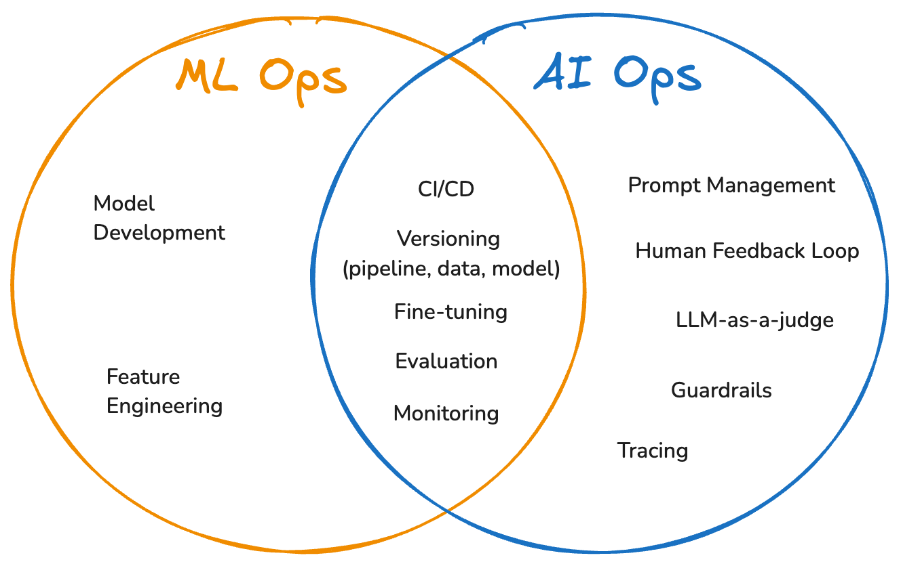
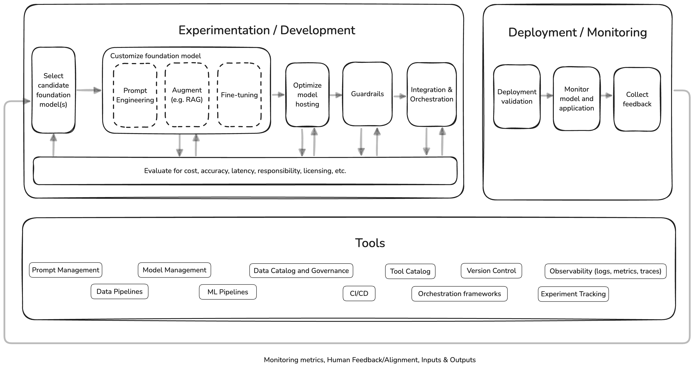

<!-- 
 Copyright Amazon.com, Inc. or its affiliates. All Rights Reserved.
 SPDX-License-Identifier: CC-BY-SA-4.0
 -->

# AI Ops Overview

**Content Level: 200**

## TL;DR

AI Ops extends traditional ML Ops practices to address the unique challenges of Foundation Models. It encompasses specialized tools and practices that cover prompt engineering, fine-tuning, model deployment, monitoring, and continuous improvement.

---

## Introduction

AI Ops (AI Operations) is a framework that helps you develop, test, deploy, and operationalize generative AI solutions in enterprise environments. AI Ops builds on traditional ML Ops frameworks to address challenges specific to generative AI, such as:

* Complex prompt and model management,
* Agent and chain management,
* Evaluations and guardrails,
* Monitoring and tracing of GenAI-specific components, such as the steps taken by a GenAI agent. 

AI Ops helps ensure that generative AI systems are deployed efficiently, maintained consistently, and monitored rigorously to produce reliable, high-quality outputs, ultimately enabling organizations to effectively leverage generative AI that accounts for security, compliance, and responsible use throughout the entire generative AI application lifecycle. 

Terms like AI Ops, GenAI Ops, LLM Ops, or FM Ops evolved from ML Ops and are all trying to describe the tooling and best practices for implementations with Foundation Models and Large Language Models (LLMs). Unfortunately there is no unilaterally accepted definition for these terms (yet), and they are often used synonymously. For the purpose of this chapter we define AI Ops as a practice that encompasses the entire generative AI application lifecycle regardless of whether you fine-tune a model, self-host a model, or consume a model that is made available through APIs. As a result we are not distinguishing between FM Ops, LLM Ops, or AI Ops.

## Goals

The primary goals of AI Ops are to streamline the development, deployment, and management of generative AI applications across their entire lifecycle while maximizing business value and mitigating risks. AI Ops aims to accelerate time-to-market for AI-powered solutions by automating workflows, optimizing resource utilization, and enabling seamless collaboration across teams.

The AI Ops framework’s goals are structured around:

1. Accelerating Innovation Through Scalable Development 
AI Ops aims to reduce the time-to-market for generative AI applications by automating repetitive workflows and enabling rapid experimentation. This involves creating standardized pipelines for prompt engineering, fine-tuning, and model evaluation, allowing teams to iterate efficiently on use cases ranging from content generation to complex agentic systems. By abstracting infrastructure complexities through infrastructure-as-code (IaC) and containerization, AI Ops empowers developers to focus on innovation rather than operational overhead.

2. Enterprise-Grade Reliability and Safety 
The goal is to mitigate risks inherent to generative AI, including hallucinations, biased outputs, and security vulnerabilities. AI Ops implements layered guardrails-such as output validation filters, toxicity classifiers, and context-aware monitoring-to maintain alignment with responsible AI dimensions and applicable regulatory requirements. This extends to securing sensitive data through differential privacy mechanisms in training pipelines and enforcing role-based access controls during model deployment.

3. Optimizing Total Cost of Ownership (TCO) and Performance 
Generative AI’s computational demands necessitate rigorous cost management. In addition to enabling the implementation of quantization techniques for self-hosted models, AI Ops also covers dynamic resource allocation strategies, such as automated model routing based on query complexity and GPU/TPU utilization analytics.

4. Enabling Cross-Functional Collaboration 
The framework bridges silos between data engineers, prompt engineers, model developers, and DevOps teams through unified toolchains. Version-controlled prompt repositories, shared vector databases, and integrated experiment tracking systems help ensure consistency across the AI lifecycle.

## Tenets

AI Ops is governed by interconnected principles that guide technical implementation and organizational governance:

* **Versioning**: Track infrastructure, data, models, code, and configurations for full reproducibility and traceability throughout the AI application lifecycle.

* **Testing**: Validate components holistically, including hallucination detection, security stress tests, and output quality checks.

* **Automation**: Leverage CI/CD pipelines to reduce manual intervention and help ensure consistent application of best practices across environments. 

* **Reproducibility**: Enable identical outputs across environments via containerization and version-controlled releases.

* **Reliability & Resiliency**: Build fault-tolerant systems with automated rollbacks, disaster recovery, and graceful degradation.

* **Monitoring & Observability**: Track metrics (latency, error rates), semantic quality (output relevance, bias) and logs and traces.

* **Security**: Protect model integrity, input/output data, and align with governance policies. 

* **Cost & Resource Optimization**: Balance performance requirements with computational efficiency using model routing, caching, and hardware trade-offs.

* **Performance Efficiency**: Optimize throughput/latency via quantization, distillation, or hardware acceleration. While maintaining output quality. 

* **Sustainability**: Minimize environmental impact with energy-efficient hardware and managed cloud services.

* **Ownership & Accountability**: Define clear roles (e.g., model custodian, data steward) to align skills with responsibilities.

* **Reusability**: Develop shareable templates for data preprocessing, experiment tracking, and deployment.

* **Continuous Improvement**: Regularly audit systems, update models with fresh data, and refine processes based on operational insights.

Sources:
 
* [ML Ops Principles](https://ml-ops.org/content/mlops-principles){:target="_blank" rel="noopener noreferrer"} 
* [ML Ops AWS Well Architected Framework Design Principles](https://docs.aws.amazon.com/wellarchitected/latest/machine-learning-lens/well-architected-machine-learning-design-principles.html){:target="_blank" rel="noopener noreferrer"} 
* [GenAI AWS Well Architected Framework Design Principles](https://docs.aws.amazon.com/wellarchitected/latest/generative-ai-lens/design-principles.html){:target="_blank" rel="noopener noreferrer"} 

## Personas

Successful AI Ops requires specialized roles to effectively manage foundation models. Here's a breakdown of each key role:

### Model Developers (Model Builders & Model Tuners)

**What They Do** 

* Create or select and evaluate foundation models (LLMs, diffusion models)
* Refine models through:
    - Reinforcement learning from human feedback (RLHF)
    - Parameter-efficient fine-tuning methods (like LoRA)
* Enable output quality (safety, accuracy, compliance)
* Monitor model performance
* Make decisions based on performance, cost, and responsible AI
* Work with data engineers on (synthetic) data pipelines

**Required Skills** 

* Deep knowledge of transformer architectures and multimodal models
* Proficiency in PyTorch, Hugging Face, and vector databases
* Advanced knowledge of optimization frameworks (e.g. DeepSpeed, TensorRT)
* Experience with evaluation metrics

### Data Engineers

**What They Do** 

* Create (synthetic) data pipelines for training and testing
* Manage vector databases (e.g. OpenSearch, FAISS, Pinecone)
* Implement data governance for sensitive data
* Handle differential privacy for regulated datasets

**Required Skills** 

* Expertise in ETL tools (e.g. Apache Airflow) & Vector database optimization
* Data labeling

### Prompt Engineers

**What They Do** 

* Design and optimize AI model prompts
* Conduct A/B testing for prompt improvement
* Create reusable prompt templates (e.g. for code generation, customer support, and other use cases)
* Address bias and responsible AI concerns

**Required Skills** 

* Proficiency in orchestration frameworks
* Creative problem-solving abilities

### Operations

**What They Do** 

* Deploy models using: Infrastructure-as-code (e.g. Cloud Formation, Terraform, CDK) and Kubernetes
* Implement safety guardrails

**Required Skills** 

* Proficiency in CI/CD and observability tools

These roles may not always be covered by different people, but they generally represent different “jobs to be done”.

## Key Differences between AI Ops and ML Ops

  

**ML Ops** (Machine Learning Operations) encompasses engineering practices that streamline the entire traditional machine learning lifecycle, from development to deployment and monitoring, by integrating DevOps principles with ML-specific workflows. It emphasizes collaboration between data scientists, DevOps engineers, and IT teams to automate CI/CD pipelines, help ensure model reproducibility, and maintain operational rigor for structured data workflows. ML Ops addresses unique challenges like data drift, model versioning, and performance monitoring across heterogeneous infrastructure.

**AI Ops** (AI Operations) adapts ML Ops principles to the specialized demands of foundation models, focusing on unstructured data, prompt engineering, and responsible and secure deployment. It introduces tools for building foundation models, fine-tuning pre-trained models, managing tokenization of massive datasets, and evaluating outputs through LLM-as-a-Judge and human-in-the-loop feedback and specialized metrics. While ML Ops optimizes structured data pipelines, AI Ops covers unstructured data pipelines, and prioritizes scalability for billion-parameter models, context-aware inference, and mitigating hallucinations.

Both practices put forth reliable mechanisms to track experiments, integrate models as part of a broader application, and aim to continuously provide visibility into performance, quality, and cost for both models and application components, along with automated feedback loops to measure and improve ongoing performance.
However, even though AI Ops builds upon ML Ops principles, several fundamental differences distinguish these operational frameworks:

1. **Computational Resources and Scale** 
    AI Ops deals with models requiring significantly higher computational resources than traditional ML models. While ML Ops handles various model sizes, AI Ops also addresses massive foundation models that require distributed systems and high-performance computing infrastructure. Training and deploying these foundation models demand extensive compute power, often using specialized GPU hardware for faster processing. These resource requirements make model compression and distillation techniques important for managing inference costs.

2. **Data Management** 
    ML Ops focuses primarily on structured datasets with clear feature engineering practices and established preprocessing pipelines.
    In contrast, AI Ops processes vast volumes of unstructured data requiring specialized tokenization, semantic representation, and context management techniques.

3. **Model Development and Training Paradigms** 
    The approach to model development differs significantly. In ML Ops models are typically built from scratch with hyper-parameter tuning focused on accuracy metrics.
    On the other hand, AI Ops primarily employs techniques like prompt engineering, retrieval augmented generation (RAG), or transfer learning through fine-tuning pre-trained foundation models for specific domains and applications.

4. **Performance Evaluation** 
    ML Ops and AI Ops also diverge substantially in how they evaluate models. ML Ops relies on standard metrics like accuracy, precision, recall, and F1 score with clear quantitative benchmarks, whereas AI Ops requires more nuanced evaluation techniques that capture the open-ended nature of generative models. This often includes specialized metrics, along with human feedback mechanisms and LLM-as-Judge evaluations.

AI Ops addresses challenges specific to foundation models:
* Prompt Engineering: Creating effective prompt templates is important in AI Ops but irrelevant in traditional ML Ops.
* Hallucinations: Managing model tendencies to generate plausible-sounding but factually incorrect responses.
* Context Management: Handling limited context windows of models while maintaining coherence and relevance.
* Responsible AI Considerations: Addressing concerns such as fairness, safety, and controllability requires specialized guardrails.

## Generative AI Application Lifecycle

  

AI Ops supports the entire generative AI application lifecycle with specific tools and processes:

* **Development & Experimentation**: covering data and ML pipelines, data catalog, experiment tracking, model management, tool catalog, prompt management, versioning, and orchestration frameworks.
* **Security**: guardrails, providing critical safety mechanisms that help ensure AI systems operate within defined boundaries for security, and responsible AI.
* **Deployment**: CI/CD, model hosting optimizations.
* **Monitoring and Observability**: covering logs, metrics, traces, alerts that cover the entire GenAI application.
* **Continuous Improvement**: creating feedback loops to incorporate production insights into model development.

The exact tools and processes you will need to consider not only depend on whether you are a model builder, model tuner, or just integrate a foundation model via an API, but also on which services and features you are using specifically (e.g. Amazon Bedrock or Amazon SageMaker), and which approaches you use when you customize foundation models (e.g. prompt engineering, RAG, fine-tuning etc).

In the subsequent chapters we cover how AI Ops supports building a GenAI application, model development, and operating a GenAI application.

* [1. Building generative AI applications](aiops_applicationbuilding.md)
* [2. Creating or fine-tuning foundation models](aiops_modeltuning.md)
* [3. Deploying generative AI applications](aiops_deployment.md)
* [4. Data Management](aiops_datamanagement.md)

## Getting Hands-On
* [Operationalize generative AI Applications using AI Ops](https://catalog.us-east-1.prod.workshops.aws/workshops/90992473-01e8-42d6-834f-9baf866a9057/en-US){:target="_blank" rel="noopener noreferrer"}

## Further Reading
* [Well Architected generative AI Lens](https://docs.aws.amazon.com/wellarchitected/latest/generative-ai-lens/generative-ai-lifecycle.html){:target="_blank" rel="noopener noreferrer"}

## Contributors
**Author:**  
- Felix Huthmacher, Senior Applied AI Architect   

**Reviewers:**  
- Dave Thibault, Senior Applied AI Architect  
- Andrea Gallo, Solutions Architect  
- Randy DeFauw, Senior Principal Solutions Architect 
