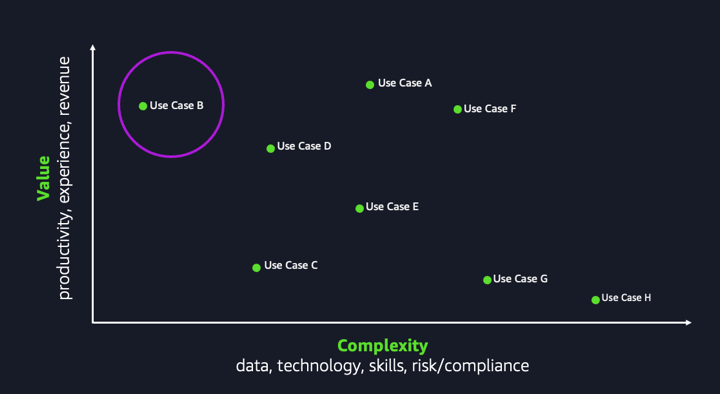
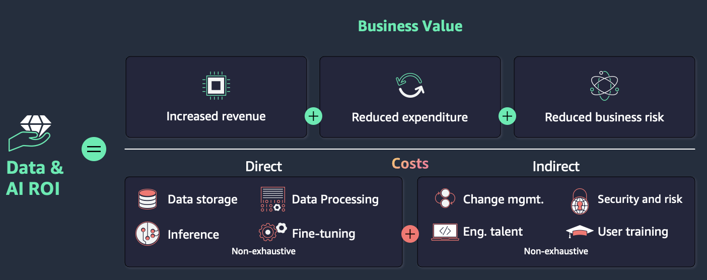

<!-- 
 Copyright Amazon.com, Inc. or its affiliates. All Rights Reserved.
 SPDX-License-Identifier: CC-BY-SA-4.0
 -->

# Business Strategy and Value Creation

## Overview
When you develop a Generative AI (GenAI) strategy, you should establish a clear framework to identify, evaluate, and measure business value. You can use this structured approach to align your GenAI initiatives with organizational goals and achieve sustainable return on investment (ROI). You'll work with a framework that encompasses business case identification, investment planning, key performance indicators (KPIs), and training considerations.

## Business Case Identification
When evaluating potential GenAI applications for your organization, consider the following key factors:

**1. Business Impact**
You should assess how GenAI can drive tangible outcomes:
- You can create new revenue streams
- You can reduce operational costs
- You can streamline processes for increased efficiency
- You can elevate customer experiences
- You can boost employee productivity

**2. Technical Feasibility**
You should evaluate your technical readiness:
- You should assess data availability, quality, and accessibility
- You should review existing infrastructure and identify any gaps
- You should analyze integration requirements with current systems
- You should address security and compliance needs

**3. Organizational Readiness**
You should gauge your organization's capacity to adopt GenAI:
- You should identify required skills and capabilities
- You should plan for change management
- You should evaluate resource availability
- You should secure stakeholder support

**Prioritizing Use Cases**
1. You should start with high-feasibility projects:
- You should choose use cases that are technically straightforward and align with your existing capabilities.
- You can use this approach to learn by doing and build confidence in the technology.
- You'll find that early successes help you garner support from executives and other stakeholders.
2. You should progress to high-value opportunities:
- Once you've established a foundation, you should focus on use cases that offer substantial business value.
- You should prioritize projects with reasonable feasibility but maximum potential impact.
- This strategy can generate significant ROI, justifying your continued investment in GenAI initiatives.

**Best Practices**
- You should create a balanced portfolio of quick wins and transformative projects
- You should regularly reassess and reprioritize use cases based on your learnings and changing business needs
- You should foster cross-functional collaboration to identify and validate use cases
- You should establish clear success metrics for each use case to track progress and demonstrate value

When you follow this approach, you can systematically identify, prioritize, and implement GenAI use cases that drive meaningful business outcomes while you build organizational capabilities and support.

## Return on Investment (ROI)
You need to understand the return on investment (ROI) for your GenAI projects to justify and scale your AI initiatives. While you can use various methods for calculating ROI, you'll find that the fundamental components remain consistent across most approaches.

**Business Value Components**
As illustrated in the image, you can capture the business value of GenAI through three primary channels:
1. You can increase revenue through:
   * New income streams
   * Expanded customer opportunities
   * Enhanced product offerings

2. You can reduce expenditure through:
   * Operational cost savings
   * Efficiency gains
   * Resource optimization

3. You can reduce business risk through:
   * Enhanced decision-making
   * Improved compliance
   * Better risk mitigation

**Cost Considerations**
You'll find that the investment side of your ROI equation comprises two main categories:
Direct Costs:
* Data storage
* Data processing
* Inference
* Model fine-tuning

Indirect Costs:
* Change management
* Security and risk management
* Engineering talent
* User training

Note: This list is not exhaustive, and your specific GenAI project may involve additional cost factors.

**Practical Approach to ROI Optimization**
While you'll find understanding all inputs valuable, you may find accurately estimating costs and returns before implementation challenging. You can optimize your ROI effectively by doing the following:

1. You should focus on strategies with the broadest impact across multiple use cases
2. You should prioritize projects that align with your existing data and AI infrastructure
3. You should start with use cases that offer quick wins to build momentum
4. You should regularly reassess and adjust your ROI calculations based on real-world data

## KPIs
To effectively measure the impact of your GenAI implementations, you need a comprehensive KPI framework that spans multiple dimensions of your organization. Start with business metrics that directly tie to your bottom line: track revenue impacts through new or enhanced offerings, measure cost savings from automated processes, and monitor changes in the number of customers by industry and/or geography. These metrics demonstrate tangible business value to stakeholders.

Next, focus on operational efficiency metrics. Track how GenAI improves your process efficiency by measuring completion times before and after implementation. Monitor error rates to ensure quality remains high or improves, and measure response times to validate service level improvements. These operational indicators help you quantify day-to-day improvements and identify areas for optimization.

For technical validation, you should implement metrics that ensure your GenAI models perform as intended. Track model accuracy against your baseline requirements, monitor system performance to maintain optimal service levels, and regularly assess data quality to ensure your models receive reliable inputs. Remember to establish thresholds for each metric and create automated alerts for any deviations.

Sample key metrics by category

Business:
- Revenue growth (%)
- Cost reduction ($)
- Change in number of customers by industry and/or geography (%)

Operational:
- Process completion time (hours/minutes)
- Error rate (%)
- Response time (seconds)

Technical:
- Model accuracy (%)
- System uptime (%)
- Data quality score

**Best Practice**: You should review your KPIs quarterly to ensure they align with your evolving business objectives and technological capabilities.

# Contributors

Author/s:

- Roger Wang - Sr. Solutions Architect 

Content contributor/s for the P2P Framework and Guidance:

 - Raj Bagwe - Senior Solutions Architect 
 - Samantha Wylatowska - Solutions Architect 
 - Ruskin Dantra - Snr. Solutions Architect 
 - Kiran Lakkireddy - Principal Solutions Architect 
 - Jiwon Yeom - Senior Solutions Architect 
 - Vasile Balan - US SA Leader, T&H 
 - Nitin Eusebius - Principal Solutions Architect 
 - Nipun Chagari - Sr Mgr, Solutions Architecture 
 - Akash Bhatia - Principal Solutions Architect 
 - Joshua Smith - Senior Solutions Architect 

