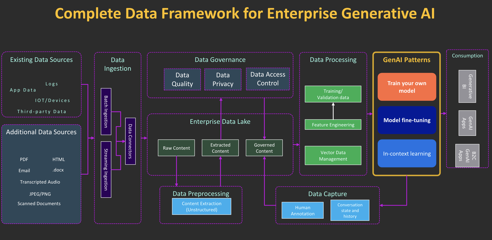

<!-- 
 Copyright Amazon.com, Inc. or its affiliates. All Rights Reserved.
 SPDX-License-Identifier: CC-BY-SA-4.0
 -->

# Data and Model Foundation

**Content Level: 300**

## TL;DR
Your interest in driving business value through generative AI drives your need to align your data and AI strategy to your business goals. Moving your generative AI workloads from ideation to production requires a solid understanding of current data and AI maturity. You can use a robust data strategy to help ensure your data is clean, accessible, governed, and performant, which is important for successful Generative AI systems. Similarly, you should seek strong AI maturity to unleash the potential AI holds to drive growth and new opportunities for your business. According to [Accenture](https://www.accenture.com/content/dam/system-files/acom/custom-code/ai-maturity/Accenture-Art-of-AI-Maturity-Report-Global-Revised.pdf){:target="_blank" rel="noopener noreferrer"}, only 12% of firms have advanced their AI maturity enough to achieve superior performance and growth. Pre-pandemic (2019), these “AI Achievers” enjoyed 50% greater revenue growth on average, versus their peers. And today, they’re 3.5 times more likely than Experimenters to see their AI-influenced revenue surpass 30% of their total revenues.

Whether you're building your own AI model, fine-tuning a Foundation Model, or augmenting a Foundation Model with RAG, you'll find that the process of data collection, curation, and preprocessing forms the bedrock upon which you build powerful AI applications.

  

**Business Driver:** When you invest in high-quality, diverse, and well-governed data, you enable your GenAI systems to deliver accurate and relevant results that adhere to responsible AI dimensions, driving business value through improved model performance and user trust.

  

## Building Your Data & AI Foundation
You can categorize your organization into one of 2 categories based on your GenAI journey:

1. **Adopter:** You're evaluating GenAI industry use cases but lack a solid data foundation, which impedes your path to production
2. **Data-Driven:** You have a solid data foundation and are ready for the path to production

You should assess where you are in your data journey to understand your current data landscape and data maturity, enabling data readiness for your generative AI applications. There are several programs within AWS that can enable you to understand your current data maturity, your existing investments in your data landscape, and provides you with prescriptive guidance to build a strong data foundation.

**Specific actions you can take as an Adopter, Data-driven organization, or somewhere "in between":**
* You should consider running a Data Strategy Diagnostic workshop: The AWS Data Strategy Diagnostic (a.k.a Data Maturity Assessment) is a rapid test for measuring your data, analytics, and AI/ML maturity. Speak to your AWS team to help you get this started.
* You should ascertain what Data Foundation is required for your use case using Data Strategy which is suited towards generative AI workloads
* You should tackle Data Security and Governance up front when you architect your solution
* You should ensure you understand the [role(s) of the Data Lake](https://community.aws/content/2adteWX3mF2yJBxHQXSO82PN0Zi/genai-and-the-data-lake){:target="_blank" rel="noopener noreferrer"} and Vector Databases with respect to GenAI
* You can get help from AWS Data & AI Specialist Solutions Architects or the Data Strategy team

Once you become Data-Driven, you should understand the technical and organizational capabilities that impact your ability to adopt AI at scale. You should assess your maturity to provide guidance and a mental model to think through creating an AI strategy in alignment with your business goals.

## Data Strategy Foundation Checklist
You need high-quality and diverse training data, which involves important steps such as data collection, curation, and preprocessing to help improve your model. You should carefully consider data privacy and responsible AI considerations when you handle sensitive information. Poor data pipelines and a lack of data quality at scale can hinder the effectiveness of your GenAI models, so you should implement robust data pipelines to help ensure data integrity and consistency. You should perform regular maintenance and updates of knowledge sources for accurate and relevant workloads. You can leverage playbooks to capture your current data landscape, effectively identify gaps, address key challenges, and develop a clear roadmap to build a strong data foundation.

| Category | Details |
|----------|----------|
| Data Collection & Preparation | • High-quality and diverse training data collected. • Data curation and preprocessing implemented. • Data cleaning techniques applied for missing values, outliers, and inconsistencies. • Data augmentation methods used to expand the training set |
| Data Quality & Integrity | • Robust data pipelines established for handling large volumes of data. • Data validation and governance practices in place to help ensure integrity and consistency. • Regular maintenance and updates performed on knowledge sources for relevance and accuracy. |
| Security | • Data privacy protocols followed, especially with sensitive information. |
| Challenges & Solutions | • Identified potential pitfalls in data pipelines and quality management. • Solutions and strategies to overcome pitfalls. |

## AI Maturity Checklist
| Category | Details |
|----------|----------|
| Business Alignment | • You have a process in place to identify business use cases that can benefit from using Generative AI capabilities • You have perspective on how to identify and prioritize high-value AI/ML/GenAI products |
| People | • You have in-house skill sets on Generative AI • You have AI/ML/GenAI skills development programs for different personas such as business leaders, developers, data scientists |
| Platform | • You have defined the AI/ML/GenAI lifecycle management process • You have a strong AI/ML/GenAI platform that supports all aspects of the AI/ML lifecycle |
| Security | • You have well established security policies, standards and guidelines along with roles and responsibilities related to AI/ML/GenAI |
| AI Governance & Operations | • You have a governance structure for the implementation of Responsible AI • You have Cloud Financial Management in place |

## Additional Resources- Expand Your Knowledge
* [GenAI and the Data Lake](https://community.aws/content/2adteWX3mF2yJBxHQXSO82PN0Zi/genai-and-the-data-lake){:target="_blank" rel="noopener noreferrer"}

## Contributors

Author/s:

 - Ruskin Dantra - Snr. Solutions Architect

Content contributor/s for the P2P Framework and Guidance:

 - Raj Bagwe - Senior Solutions Architect
 - Samantha Wylatowska - Solutions Architect
 - Ruskin Dantra - Snr. Solutions Architect
 - Kiran Lakkireddy - Principal Solutions Architect
 - Jiwon Yeom - Senior Solutions Architect
 - Vasile Balan - US SA Leader, T&H
 - Nitin Eusebius - Principal Solutions Architect
 - Nipun Chagari - Sr Mgr, Solutions Architecture
 - Akash Bhatia - Principal Solutions Architect
 - Joshua Smith - Senior Solutions Architect 