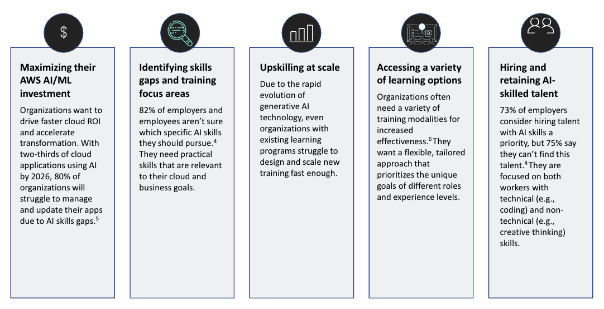
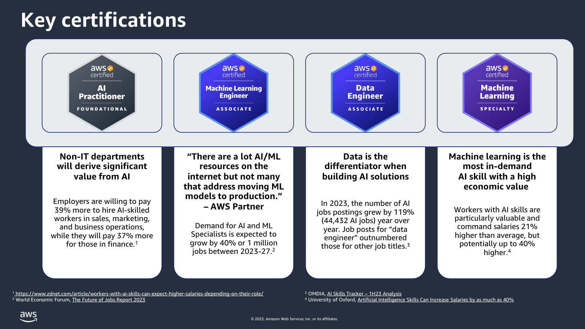

<!-- 
 Copyright Amazon.com, Inc. or its affiliates. All Rights Reserved.
 SPDX-License-Identifier: CC-BY-SA-4.0
 -->

# Training and Upskilling

**Content Level: 300**

## TL;DR
You should take a structured, persona-based approach to training and upskilling for successful Generative AI implementation. You should address the unique learning needs of different stakeholder groups while maintaining a balanced investment of your resources.

You should follow the AWS recommended training strategy using a 70-20-10 distribution model, reflecting your organizational composition and impact levels:

- You should focus 70% on Consumers (End Users)
- You should focus 20% on Business Leaders / LoB Owners / Decisions Makers  
- You should focus 10% on Central IT / Product / Development Teams

You can use this distribution to enable efficient resource allocation while maximizing adoption and impact across your organization.

## Your Challenges

You face significant workforce challenges in your journey to adopt AI/ML technologies. Your primary concern centers around maximizing your AI investments while dealing with widespread skills gaps across your workforce. Many of your employees remain uncertain about which Generative AI skills are most relevant for their roles, while you struggle to scale up training programs rapidly enough to keep pace with fast-evolving technology. You'll find this further complicated by your need for flexible learning approaches that accommodate diverse roles and experience levels. The talent landscape adds another layer of complexity, as you find it challenging to both hire and retain professionals with the right mix of technical and non-technical AI skills.

These challenges highlight your pressing need for strategic upskilling initiatives that can support successful AI transformation across your entire organization - from business leaders to technical teams to everyday end-users. When you address these skills-related obstacles, you can unlock the full potential of your AI investments and empower your workforce to innovate with emerging technologies like generative AI.

<!-- 

  

 -->

## Key Personas

Your AI/ML and GenAI training landscape encompasses diverse roles with distinct learning needs. Your Business Decision Makers seek strategic understanding of AI technologies to enhance customer service and operations. Your Data Scientists bring technical expertise in statistical analysis and model building, with proficiency in tools like Python and R, while focusing on leveraging large language models. Your MLOps Engineers bridge the gap between development and operations, specializing in productionizing models using services like Amazon SageMaker. Your Developers focus on integrating ML capabilities into applications, primarily using Python for implementation. Your Statistical Analysts apply their analytical skills to solve business problems through data services, while your Business Analysts leverage domain expertise to translate data insights into actionable business recommendations. You need tailored training approaches for each persona that align with their specific roles and technical proficiency levels.

You can use this segmentation to develop targeted training programs that address the unique needs and skill gaps of each role, enabling effective AI/ML adoption across your enterprise.

  

## Persona-Based Learning Paths

### Consumers (70%)

For the majority of your workforce - the day-to-day end-users of AI-powered tools and applications - you should offer practical, hands-on training in areas like:

- Responsible AI dimensions and related considerations
- Fundamentals of prompt engineering  
- Strategies for adapting to AI-driven changes
- Integrating generative AI tools into everyday workflows

### Business Leaders / Decision Makers (20%)

Your executives, managers, and other business decision-makers need a more strategic understanding of AI. You should cover topics such as:

- Collaborating with your organization's AI steering committee
- Building compelling business cases for investing in AI
- Leading the implementation and change management process  
- Assessing and mitigating AI-related risks

### IT / Product / Developers (10%)

Your developers, data scientists, and MLOps engineers require deep, technical training to bring AI and machine learning capabilities to life. You should cover the following topics for this group:

- Generative AI architecture and implementation
- Data strategy and management
- AI environment development and maintenance
- Integrating AI into application development pipelines
- Governing AI systems and data security

## Where to go Next?

Regardless of where your organization is in its cloud and AI journey, you can start with AWS Training and Certification to gain practical knowledge and skills needed to maximize your investment in AI and machine learning technologies, including the rapidly evolving field of generative AI.

For Your Technical Teams: You can use the AWS Skill Builder [training programs](https://skillbuilder.aws/search?searchText=generative+AI&page=1){:target="_blank" rel="noopener noreferrer"} to provide your developers, data scientists, and MLOps engineers with comprehensive, hands-on instruction in areas like AI/ML architecture, model deployment, and data management. This empowers your technical staff to effectively build, deploy, and maintain AI-powered applications and services.

For Your Business Leaders: You can use the AWS Skill Builder [training programs](https://skillbuilder.aws/search?searchText=digital-classroom-generative-ai-for-executives-amazon&showRedirectNotFoundBanner=true){:target="_blank" rel="noopener noreferrer"} to offer specialized training tailored to the needs of your executives, business analysts, and other decision-makers. This training focuses on topics like building business cases for AI initiatives, understanding AI capabilities and limitations, and leading strategic implementation and change management efforts.

Your path to successful AI and generative AI adoption starts with investing in your people. When you provide your organization with the necessary knowledge, skills, and support, you create confidence in your innovation journey using the latest AI and machine learning technologies.

  

## Resources:

1. [Machine Learning](https://skillbuilder.aws/products#machine-learning){:target="_blank" rel="noopener noreferrer"}
2. [Skillsbuilder courses on Generative AI](https://skillbuilder.aws/search?searchText=generative+ai&page=1){:target="_blank" rel="noopener noreferrer"}
3. Executives:
    1. [Generative AI for Executives](https://explore.skillbuilder.aws/learn/course/internal/view/elearning/20467/digital-classroom-generative-ai-for-executives-amazon){:target="_blank" rel="noopener noreferrer"}
    2. [Building a generative AI ready Organization](https://explore.skillbuilder.aws/learn/course/internal/view/elearning/17541/building-a-generative-ai-ready-organization){:target="_blank" rel="noopener noreferrer"}
    3. [Generative AI for Executive courses](https://explore.skillbuilder.aws/learn/course/16666/Generative%2520AI%2520for%2520Executives){:target="_blank" rel="noopener noreferrer"}
4. [Builder Foundations on GenAI](https://explore.skillbuilder.aws/learn/learning_plan/view/2205/plan){:target="_blank" rel="noopener noreferrer"}

## Contributors

Author/s:

 - Ruskin Dantra - Snr. Solutions Architect 
 - Roger Wang - Snr. Solutions Architect 

Content contributor/s for the P2P Framework and Guidance:

 - Raj Bagwe - Senior Solutions Architect 
 - Samantha Wylatowska - Solutions Architect 
 - Ruskin Dantra - Snr. Solutions Architect 
 - Kiran Lakkireddy - Principal Solutions Architect 
 - Jiwon Yeom - Senior Solutions Architect 
 - Vasile Balan - US SA Leader, T&H 
 - Nitin Eusebius - Principal Solutions Architect 
 - Nipun Chagari - Sr Mgr, Solutions Architecture 
 - Akash Bhatia - Principal Solutions Architect
 - Joshua Smith - Senior Solutions Architect 