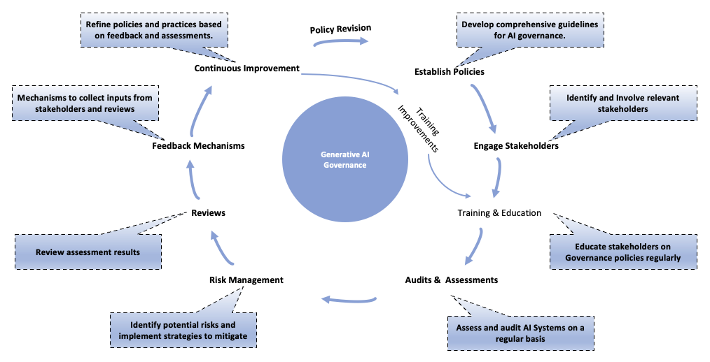

<!-- 
 Copyright Amazon.com, Inc. or its affiliates. All Rights Reserved.
 SPDX-License-Identifier: CC-BY-SA-4.0
 -->

# Governance

**Content Level: 300**

## TL;DR
You should strive for robust governance as the foundation for your Generative AI initiatives. You should establish the right cloud governance as key for your Generative AI governance, setting the foundation to experiment with new technologies while addressing traditional issues.

Your Generative AI governance refers to the rules, processes, and reports that align your organization's use of Generative AI with your business objectives. You can use robust governance to enable compliance with policies, regulations, and legislation, while managing risks from these complex technologies. You should cover the entire development process, including procedures for designing, training, testing, and deploying models, as well as selection and filtering of training and test data. You should also establish cross-functional oversight teams to evaluate new models before production deployment and implement logging and monitoring processes for continuous auditing.

In this section, we will discuss key components of Generative AI governance, including Change Management.

## Your Generative AI Governance Mechanisms

You should establish Generative AI Governance Mechanisms to provide oversight and enable the responsible deployment of Generative AI systems within your organization. Your Governance Mechanisms responsibilities include:

- **Policy and Guideline Development**: You should establish policies, guidelines, and standards for the ethical and secure use of Generative AI, aligning with applicable laws, regulations, industry best practices, and your organizational standards.
- **Identify Stakeholders**: You need stakeholder engagement in Generative AI governance to ensure diverse perspectives and ethical practices. You should recognize all relevant stakeholders, including Security, Legal, ethics, and regulatory teams, to incorporate their input and diverse perspectives.
- **Alignment with Overall Strategy**: You should ensure that your generative AI governance mechanisms align their objectives with your organization's overall strategy and governance structure.
- **Change Management**: You should drive Organizational Change Management and provide continuous training for your staff and stakeholders on best practices, ethical considerations, and compliance requirements.
- **Audits and Assessments**: You need audits and assessments to ensure the responsible use of Generative AI. You should evaluate compliance, performance, and ethical considerations to ensure adherence to your organization requirements.
- **Risk Management and Mitigation**: You should identify and address risks, including bias, privacy concerns, and operational failures, enhancing your system robustness.
- **Review**: You should regularly review audit outputs, stakeholder inputs, new regulatory laws and compliance frameworks.
- **Feedback Mechanisms**: You should implement structured feedback processes that allow your stakeholders to provide input on AI systems and governance practices.
- **Continuous Improvement**: You should implement a mechanism to use insights from audits, stakeholder feedback, and performance assessments to refine your policies, enhance your systems, and address emerging challenges.

## Flywheel

  

## Change Management

Your Generative AI governance strategy plays a key role in your organizational change management process when it comes to the adoption and deployment of generative AI technologies. Here are some of the key governance responsibilities in this context:

### Assess Change Readiness

- You should evaluate your organization's readiness to embrace generative AI technologies.
- You should assess your organization's culture, processes, and existing capabilities to identify gaps and potential resistance points.
- You should use this assessment to inform your change management strategy and prepare your organization for upcoming transformations.

### Manage Stakeholders

- You should leverage the cross-functional perspectives on Generative AI governance strategy to engage with key stakeholders across your organization.
- You should identify and address the concerns, needs, and expectations of various stakeholder groups, such as your employees, customers, and regulatory bodies.
- You can use effective stakeholder management to help build buy-in and reduce resistance to the changes.

### Develop Communication and Training

- You should oversee the development and execution of comprehensive communication and training plans.
- You should ensure that all affected stakeholders are informed about the changes, the rationale behind them, and the expected impact.
- You should design tailored training programs to equip your employees with the necessary skills and knowledge to adapt to the new generative AI-powered processes and tools.

### Pilot and Deploy Iteratively

- You should coordinate the piloting of generative AI solutions in controlled environments.
- You should monitor the outcomes, gather feedback, and make necessary adjustments before scaling the solutions across your organization.
- You can use this iterative approach to help mitigate risks and enable a smoother transition.

### Track and Reinforce Change

- You should establish metrics and key performance indicators to track the progress and impact of your organizational changes.
- You should continuously monitor the adoption, usage, and outcomes of your generative AI technologies and make timely interventions to reinforce the changes.
- You should sustain the desired behavioral and operational changes over the long term.

## Your Generative AI Governance Mechanisms Structure

**Goal**: You should establish a comprehensive, cross-functional Generative AI governance framework that is adaptable to your organization's structure and needs

Below is the recommended structure and roles for your Generative AI Governance Mechanism:

- **Executive Sponsor**: You should have an executive sponsor who provides high-level oversight and support for your Governance Mechanisms and ensures alignment with your organizational priorities and strategies.
- **AI Governance Lead**: You should designate an AI Governance Lead who oversees the day-to-day operations of your Governance Mechanisms and facilitates collaboration across your cross-functional teams.
- **Cross-Functional Teams**: You should include cross-functional teams that bring expertise from various domains to identify and address Generative AI risks and opportunities. You should ensure holistic consideration of legal, security, ethics, business, and technical aspects
  - Legal and Compliance
  - Security
  - Ethics/Responsible AI
  - Business Owners
  - Technical Experts
  - Data Science

**Focused Subcommittees for Each Business Unit**: You should create focused subcommittees that dive deep into the unique needs and challenges of each business unit. You can tailor governance practices to your specific use cases and requirements.

You should align this structure to your organizational needs. You'll find that cross-functional representation from key stakeholder groups is key to effective Generative AI governance.

For guidance on evaluating your Generative AI workloads, you can refer to the [Security and Privacy Section](../..//3_0_architecture_and_design_patterns/3_5_security_privacy/3_5_3_compliance_data_protection/compliance_data_protection.md) 

## References

- [Governance perspective: Managing an AI-driven organization](https://docs.aws.amazon.com/whitepapers/latest/aws-caf-for-ai/governance-perspective-managing-an-aiml-driven-organization.html){:target="_blank" rel="noopener noreferrer"}
- [Data governance in the age of generative AI](https://aws.amazon.com/blogs/big-data/data-governance-in-the-age-of-generative-ai/){:target="_blank" rel="noopener noreferrer"}
- [How AWS helps agencies meet OMB AI governance requirements](https://aws.amazon.com/blogs/publicsector/how-aws-helps-agencies-meet-omb-ai-governance-requirements/){:target="_blank" rel="noopener noreferrer"}
- [Centralizing or Decentralizing Generative AI](https://aws.amazon.com/blogs/enterprise-strategy/centralizing-or-decentralizing-generative-ai-the-answer-both/){:target="_blank" rel="noopener noreferrer"}
- [ML Governance from Amazon SageMaker](https://aws.amazon.com/sagemaker/ml-governance/){:target="_blank" rel="noopener noreferrer"}
- [AWS Cloud Adoption Framework for Artificial Intelligence, Machine Learning, and Generative AI](https://docs.aws.amazon.com/whitepapers/latest/aws-caf-for-ai/foundational-ai-capabilities.html){:target="_blank" rel="noopener noreferrer"}

## Contributors

Author/s:

 - Ruskin Dantra - Snr. Solutions Architect
 - Roger Wang - Snr. Solutions Architect

Content contributor/s for the P2P Framework and Guidance:

 - Raj Bagwe - Senior Solutions Architect
 - Samantha Wylatowska - Solutions Architect
 - Ruskin Dantra - Snr. Solutions Architect
 - Kiran Lakkireddy - Principal Solutions Architect
 - Jiwon Yeom - Senior Solutions Architect
 - Vasile Balan - US SA Leader, T&H
 - Nitin Eusebius - Principal Solutions Architect
 - Nipun Chagari - Sr Mgr, Solutions Architecture
 - Akash Bhatia - Principal Solutions Architect
 - Joshua Smith - Senior Solutions Architect 