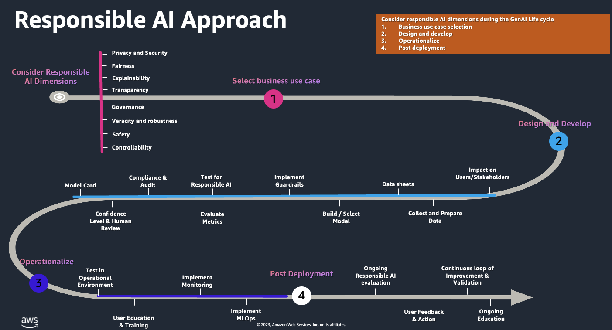

<!-- 
 Copyright Amazon.com, Inc. or its affiliates. All Rights Reserved.
 SPDX-License-Identifier: CC-BY-SA-4.0
 -->

# Responsible AI

**Content Level: 300**

## TL;DR
The rapid growth of GenAI presents both promising innovations as well as new challenges for you. When you prioritize Responsible AI practices in your Generative AI model development and deployment, you can build trust, mitigate risks, and promote alignment with societal values and expectations as well as existing and upcoming regulations, ultimately fostering long-term adoption and success.

This guidance helps you put AWS Responsible AI Dimensions into practice, addressing these complexities.

## AWS Responsible AI Dimensions

* **Fairness** - Considering impacts on different groups of stakeholders
* **Safety** - Preventing harmful system output and misuse
* **Privacy and Security** - Appropriately obtaining, using, and protecting data and models
* **Governance** - Incorporating best practices into the AI supply chain, including providers and deployers
* **Transparency** - Enabling stakeholders to make informed choices about their engagement with an AI system
* **Explainability** - Understanding and evaluating system outputs
* **Controllability** - Having mechanisms to monitor and steer AI system behavior
* **Veracity and Robustness** - Achieving correct system outputs, even with unexpected or adversarial inputs

**Reference**: [AWS Responsible AI](https://aws.amazon.com/ai/responsible-ai/){:target="_blank" rel="noopener noreferrer"}

## Implementing Your Responsible AI Practices

With AWS' comprehensive approach to Responsible AI development and governance, you can use Amazon Bedrock to build trustworthy GenAI systems in line with your responsible AI principles.

### Fairness

You should evaluate Foundation models using services like [Model Evaluation on Amazon Bedrock](https://docs.aws.amazon.com/bedrock/latest/userguide/model-evaluation.html){:target="_blank" rel="noopener noreferrer"} or [Amazon SageMaker Clarify](https://aws.amazon.com/sagemaker/clarify/){:target="_blank" rel="noopener noreferrer"}. Amazon SageMaker Clarify is based on FmEval, developed by the AWS team. You can find the open-source library for FmEval at the [Foundation Model Evaluations Library](https://github.com/aws/fmeval){:target="_blank" rel="noopener noreferrer"}. You can use FmEval to enable your data scientists and ML engineers to assess Large Language Models (LLMs) for quality and responsibility.

References:

* [Evaluate large language models for quality and responsibility](https://aws.amazon.com/blogs/machine-learning/evaluate-large-language-models-for-quality-and-responsibility/){:target="_blank" rel="noopener noreferrer"}
* [Model Evaluation on Amazon Bedrock](https://aws.amazon.com/blogs/aws/amazon-bedrock-model-evaluation-is-now-generally-available/#:~~:text=The%20Amazon%20Bedrock%20model%20evaluation,for%20your%20particular%20use%20case.){:target="_blank" rel="noopener noreferrer"}
* [AWS releases code to help reduce bias in machine learning models](https://www.amazon.science/blog/aws-releases-code-to-help-reduce-bias-in-machine-learning-models){:target="_blank" rel="noopener noreferrer"}

### Safety

You can use [Amazon Bedrock Guardrails](https://aws.amazon.com/bedrock/guardrails/){:target="_blank" rel="noopener noreferrer"} to implement safeguards tailored to your your GenAI applications and aligned with your responsible AI policies. You can define content filters with configurable thresholds to help filter harmful content across hate speech, insults, sexual language, violence, misconduct (including criminal activity), and prompt attacks (prompt injection and jailbreak). You can use Amazon Bedrock Guardrails to detect sensitive content such as personally identifiable information (PII) in user inputs and FM responses.

References:

* [Amazon Bedrock Guardrails](https://aws.amazon.com/bedrock/guardrails/){:target="_blank" rel="noopener noreferrer"}
* [Safeguard a GenAI travel agent with prompt engineering and Amazon Bedrock Guardrails](https://aws.amazon.com/blogs/machine-learning/safeguard-a-generative-ai-travel-agent-with-prompt-engineering-and-amazon-bedrock-guardrails/){:target="_blank" rel="noopener noreferrer"}
* [Guardrails for Amazon Bedrock now available with new safety filters and privacy controls](https://aws.amazon.com/blogs/aws/guardrails-for-amazon-bedrock-now-available-with-new-safety-filters-and-privacy-controls/){:target="_blank" rel="noopener noreferrer"}
* [Build GenAI applications on Amazon Bedrock — the secure, compliant, and responsible foundation](https://aws.amazon.com/blogs/machine-learning/build-generative-ai-applications-on-amazon-bedrock-the-secure-compliant-and-responsible-foundation/){:target="_blank" rel="noopener noreferrer"}

### Privacy and Security

Your GenAI systems should handle data responsibly, including user privacy protection, data anonymization, and preventing unauthorized access. You should consider these key areas:

* Regulatory & Privacy: You should address industry-specific regulatory and privacy requirements for using or creating your GenAI solutions.
* Security Controls: You should implement required controls.
* Threat Identification: You should identify potential threats and implement recommended mitigations.
* Resilience: You should architect your GenAI solutions to maintain availability and meet your business SLAs.

References:
* [Remove PII from conversations by using sensitive information filters](https://docs.aws.amazon.com/bedrock/latest/userguide/guardrails-sensitive-filters.html){:target="_blank" rel="noopener noreferrer"}

### Governance

You need robust governance as the foundation for your responsible AI initiatives. Your responsible AI innovation requires a holistic approach integrating security and compliance into your development and deployment. You can refer to the guidance in the following articles to implement governance for your GenAI systems:

* [Data governance in the age of GenAI](https://aws.amazon.com/blogs/big-data/data-governance-in-the-age-of-generative-ai/){:target="_blank" rel="noopener noreferrer"}
* [How AWS helps agencies meet OMB AI governance requirements](https://aws.amazon.com/blogs/publicsector/how-aws-helps-agencies-meet-omb-ai-governance-requirements/){:target="_blank" rel="noopener noreferrer"}
* [Centralizing or Decentralizing GenAI](https://aws.amazon.com/blogs/enterprise-strategy/centralizing-or-decentralizing-generative-ai-the-answer-both/){:target="_blank" rel="noopener noreferrer"}
* [AWS GenAI best practices framework v2](https://docs.aws.amazon.com/audit-manager/latest/userguide/aws-generative-ai-best-practices.html){:target="_blank" rel="noopener noreferrer"}
* [ML Governance from Amazon SageMaker](https://aws.amazon.com/sagemaker/ml-governance/){:target="_blank" rel="noopener noreferrer"}

### Transparency

To provide the transparency you need, AWS launched AWS AI Service Cards in 2022. Each Service Card contains four sections covering:

* Basic concepts to help you better understand the service or service features
* Intended use cases and limitations
* Responsible AI design considerations
* Guidance on deployment and performance optimization

You can use [AI Service Cards](https://aws.amazon.com/machine-learning/responsible-ai/resources/){:target="_blank" rel="noopener noreferrer"} to provide transparency and document the intended use cases and fairness considerations for AWS AI services.

You can take these steps to enhance your model transparency and explainability:
* You should provide model cards on the model’s intended use, performance, capabilities, and potential biases.
* You can ask your model to //self-explain//, meaning provide explanations for their own decisions. You can also set this in a complex system—for example, your agents could perform multi-step planning and improve through self-explanation.

References:

* [Responsible use of Machine Learning guide](https://d1.awsstatic.com/responsible-machine-learning/AWS_Responsible_Use_of_ML_Whitepaper_1.2.pdf){:target="_blank" rel="noopener noreferrer"}
* [AWS AI Service Cards](https://aws.amazon.com/ai/responsible-ai/resources/){:target="_blank" rel="noopener noreferrer"}
* [A secure approach to GenAI with AWS](https://aws.amazon.com/blogs/machine-learning/a-secure-approach-to-generative-ai-with-aws/){:target="_blank" rel="noopener noreferrer"}
* [Amazon SageMaker Model Explainability](https://docs.aws.amazon.com/sagemaker/latest/dg/clarify-model-explainability.html){:target="_blank" rel="noopener noreferrer"}
* [Building GenAI prompt chaining workflows with human in the loop](https://aws.amazon.com/blogs/machine-learning/building-generative-ai-prompt-chaining-workflows-with-human-in-the-loop/){:target="_blank" rel="noopener noreferrer"}
* [Incorporate offline and online human – machine workflows into your GenAI applications on AWS](https://aws.amazon.com/blogs/machine-learning/incorporate-offline-and-online-human-machine-workflows-into-your-generative-ai-applications-on-aws/){:target="_blank" rel="noopener noreferrer"}

### Controllability

You can refer to the guidance in the following articles to implement controllability for your GenAI systems:

* [Amazon Bedrock Agens - Get user confirmation before invoking action group function](https://docs.aws.amazon.com/bedrock/latest/userguide/agents-userconfirmation.html#:~~:text=If%20user%20confirmation%20is%20enabled,provide%20context%20to%20the%20agent.){:target="_blank" rel="noopener noreferrer"}
* [Improve Amazon Bedrock Observability with Amazon CloudWatch AppSignals](https://aws.amazon.com/blogs/mt/improve-amazon-bedrock-observability-with-amazon-cloudwatch-appsignals/){:target="_blank" rel="noopener noreferrer"}
* [Building automations to accelerate remediation of AWS Security Hub control findings using Amazon Bedrock and AWS Systems Manager](https://aws.amazon.com/blogs/machine-learning/building-automations-to-accelerate-remediation-of-aws-security-hub-control-findings-using-amazon-bedrock-and-aws-systems-manager/){:target="_blank" rel="noopener noreferrer"}
* [Hardening the RAG chatbot architecture powered by Amazon Bedrock: Blueprint for secure design and anti-pattern mitigation](https://aws.amazon.com/blogs/security/hardening-the-rag-chatbot-architecture-powered-by-amazon-bedrock-blueprint-for-secure-design-and-anti-pattern-migration/){:target="_blank" rel="noopener noreferrer"}
* [Achieve operational excellence with well-architected GenAI solutions using Amazon Bedrock](https://aws.amazon.com/blogs/machine-learning/achieve-operational-excellence-with-well-architected-generative-ai-solutions-using-amazon-bedrock/){:target="_blank" rel="noopener noreferrer"}

## Your GenAI Lifecycle - Responsible AI Approach
You'll find that developing responsible AI is an iterative process that starts with identifying your business use case. It is an important component of your larger GenAI governance. You should consider responsible AI dimensions during each phase of your lifecycle. You should monitor for responsible AI continuously throughout your process, including post-deployment. The diagram below outlines your approach across the GenAI Lifecycle.

  

## Responsible AI - AWS Services and Features

You can use many of the familiar AWS services that you already use, and additional services and features highlighted in this section to help implement responsible AI for your GenAI and ML use cases.

### Pricing and Security
#### Data Protection:
* Amazon Bedrock Guardrails
* AWS Key Management Service
* ACM Certificates
* PrivateLink
* Identity & Access Management

### Explainability
* Amazon SageMaker Clarify
* Amazon Bedrock Agent Trace

### Veracity & Robustness
* Amazon Bedrock Guardrails
* RAG Bedrock Knowledge Bases
* CloudWatch
* SageMaker
    * Model Monitor
    * Ground Truth

### Controllability
* Amazon Bedrock Agents
* Identity and Access Management
* CloudWatch
* CloudTrail

### Safety
* Amazon Bedrock Guardrails
* Amazon Q Guardrails
* Model Evaluations

### Fairness
* Amazon SageMaker
    * Data Wrangler
    * Clarify
* Amazon Bedrock
    * Model Evaluation
* AWS Glue

### Transparency
* AI Service cards
* AWS CloudTrail
* Amazon Titan Image
* Generator Watermarking
* Image Generator content credentials.

### Governance
* Identity and Access Management
* Amazon SageMaker
    * Role Manager
    * Model Cards
    * Model Dashboard
* AWS Audit Manager

## Contributors

Author/s:

 - Ruskin Dantra - Snr. Solutions Architect

Content contributor/s for the P2P Framework and Guidance:

 - Raj Bagwe - Senior Solutions Architect
 - Samantha Wylatowska - Solutions Architect
 - Ruskin Dantra - Snr. Solutions Architect
 - Kiran Lakkireddy - Principal Solutions Architect
 - Jiwon Yeom - Senior Solutions Architect
 - Vasile Balan - US SA Leader, T&H
 - Nitin Eusebius - Principal Solutions Architect
 - Nipun Chagari - Sr Mgr, Solutions Architecture
 - Akash Bhatia - Principal Solutions Architect
 - Joshua Smith - Senior Solutions Architect 