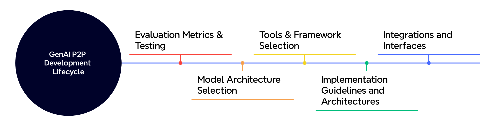
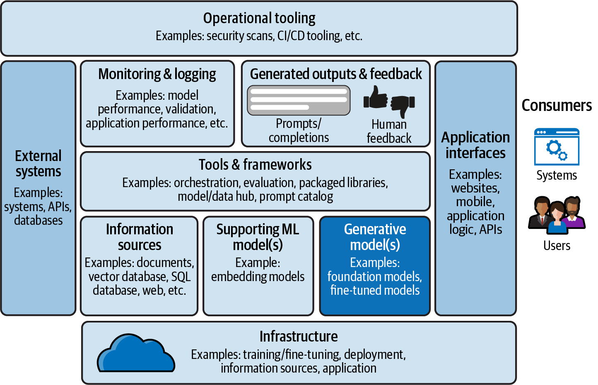

<!-- 
 Copyright Amazon.com, Inc. or its affiliates. All Rights Reserved.
 SPDX-License-Identifier: CC-BY-SA-4.0
 -->

# Software Development Lifecycle

**Content Level: 300**

## TL;DR
You should create a comprehensive development and deployment approach that enables scalability, reliability, efficiency, and security that enables you to successfully transition from the POC stage and deploy generative AI models in production, driving business value through improved performance, reduced costs, and enhanced user experience.

## Development Lifecycle

  

### Evaluation Metrics and Testing
* Evaluation Process and Frameworks
* Online and Offline Evaluation
* LLM assisted Evaluation
* Application Specific Metrics

### Model Architecture Selection
* Task and Output Modality
* Pre-Training
* Domain-Specific Considerations

### Tools and Framework Selection
* Model Suitability
* Model Training and Experimentation
* Customizations - Prompt Engineering, RAG, Fine-Tuning, Hyper-Parameter Tuning
* Pipeline Orchestration

### Implementation Guidelines and Architectures
* Latency Optimization
* Iterative Prototyping
* Agent AI
* Cognitive Architectures
* Experiment Tracking

### Integrations and Interfaces
* API Design and Development
* Workflow Orchestration
* Automation
* Versioning and Maintenance

## Deployment Lifecycle

  

### Infrastructure Management
* Resource Allocation and Optimization
* Orchestration and Environment Management
* Caching

### Scalable Serving
* Model Optimization
* Serving Framework
* End-Point management

### Load Distribution and Elasticity
* Load Balancing
* Auto-Scaling
* Geo-Distribution

### Automated CI/CD
* Automated Testing and Validation
* Continuous Deployment Pipelines
* Rollback and Checks

### Observability
* Monitoring and Logging
* Performance Management
* Alerting and Dashboards

## End to End Generative AI Application Logical Architecture

  

## Deep Dive: Implementing Your Production Ready Development and Deployment Practices

### Evaluation Metrics and Testing

Your successful GenAI applications should have comprehensive evaluation frameworks to enable model quality and performance. You should implement both online and offline evaluation methodologies to assess your model performance. You can use online evaluation to enable real-time monitoring of performance metrics and user feedback, while you can use offline evaluation with benchmark datasets for consistent testing against established baselines.

You should define application-specific metrics aligned with your business objectives to track response quality, relevance, and resource utilization effectively.

References:
* [Choose the best performing model using Amazon Bedrock evaluations](https://docs.aws.amazon.com/bedrock/latest/userguide/model-evaluation.html){:target="_blank" rel="noopener noreferrer"}
* [Ground truth curation and metric interpretation best practices](https://aws.amazon.com/blogs/machine-learning/ground-truth-curation-and-metric-interpretation-best-practices-for-evaluating-generative-ai-question-answering-using-fmeval/){:target="_blank" rel="noopener noreferrer"}

### Model Architecture Selection

When you select the appropriate model architecture, you should carefully consider your use case requirements, resource constraints, and domain-specific needs. You should consider task complexity, required response latency, and output format requirements when choosing your model architectures. You should evaluate your available compute resources, cost constraints, and scaling requirements to enable sustainable deployment.

References:

* [Evaluate, compare, and select the best foundation models for your use case in Amazon Bedrock](https://aws.amazon.com/blogs/aws/evaluate-compare-and-select-the-best-foundation-models-for-your-use-case-in-amazon-bedrock-preview/){:target="_blank" rel="noopener noreferrer"}

### Scalable Serving

You should implement efficient serving strategies to handle your production workloads effectively. You should optimize for concurrent processing with appropriate request queuing and timeout configurations. You can use efficient prompt engineering and strategic caching to optimize your resource utilization. You should consider multi-region deployment with proper load balancing for improved geographical distribution and availability.

References:

* [Getting started with cross-region inference in Amazon Bedrock](https://aws.amazon.com/blogs/machine-learning/getting-started-with-cross-region-inference-in-amazon-bedrock/){:target="_blank" rel="noopener noreferrer"}
* [Generative AI Infrastructure at AWS](https://aws.amazon.com/blogs/compute/generative-ai-infrastructure-at-aws/){:target="_blank" rel="noopener noreferrer"}

### Load Distribution and Elasticity

You should enable efficient scaling and request handling through proper load distribution strategies. You can use managed serverless solutions like Amazon Bedrock for increased elasticity and automated scaling. You should implement cross-region inference for larger use cases to improve geographical distribution and response times. You should consider request prioritization and queueing mechanisms for handling traffic spikes and ensuring consistent performance.

For traditional model serving on instances, you should distribute incoming requests evenly across multiple instances and dynamically adjust instance counts based on your workload patterns. You should monitor service quotas and implement appropriate scaling policies to maintain optimal performance.

References:

* [Getting started with cross-region inference in Amazon Bedrock](https://aws.amazon.com/blogs/machine-learning/getting-started-with-cross-region-inference-in-amazon-bedrock/){:target="_blank" rel="noopener noreferrer"}
* [Achieve operational excellence with well-architected GenAI solutions](https://aws.amazon.com/blogs/machine-learning/achieve-operational-excellence-with-well-architected-generative-ai-solutions-using-amazon-bedrock/){:target="_blank" rel="noopener noreferrer"}

### Latency Optimization

You should optimize response times through careful attention to both your system design and implementation choices. You should consider key factors that influence latency including input/output token counts, model size, and caching strategies. You should implement latency-aware design patterns that balance response quality with your performance requirements. You should monitor and optimize Time to First Token (TTFT) and token generation speeds to enable consistent user experiences.

### Monitoring and Observability

You should establish comprehensive monitoring for your GenAI systems. You should focus on key performance metrics including response latency, throughput, and token usage efficiency. You should implement application health monitoring to track error rates, service availability, and integration points status. You should monitor cost management through token consumption trends and resource utilization patterns.

References:

* [Monitoring Generative AI applications using Amazon Bedrock and Amazon CloudWatch integration](https://aws.amazon.com/blogs/mt/monitoring-generative-ai-applications-using-amazon-bedrock-and-amazon-cloudwatch-integration/){:target="_blank" rel="noopener noreferrer"}
* [Observability Made Easy: Logging and Tracking for GenAI](https://github.com/aws-samples/amazon-bedrock-samples/tree/main/evaluation-observe/Custom-Observability-Solution){:target="_blank" rel="noopener noreferrer"}

### Resilience and Recovery

You should build robust recovery mechanisms into your GenAI applications. You should implement high availability through multi-AZ deployment and cross-region failover capabilities. You should design graceful degradation patterns with model fallback options and cached responses for critical functionality. You should establish automated health checks and self-healing procedures to maintain your system reliability.

References:

* [Achieve operational excellence with well-architected GenAI solutions](https://aws.amazon.com/blogs/machine-learning/achieve-operational-excellence-with-well-architected-generative-ai-solutions-using-amazon-bedrock/){:target="_blank" rel="noopener noreferrer"}
* [Hardening the RAG chatbot architecture](https://aws.amazon.com/blogs/security/hardening-the-rag-chatbot-architecture-powered-by-amazon-bedrock-blueprint-for-secure-design-and-anti-pattern-migration/){:target="_blank" rel="noopener noreferrer"}

### Automated Deployment

You should streamline your deployment processes through robust CI/CD pipelines with automated testing and staged rollouts. You should manage your infrastructure through Infrastructure as Code to enable environment consistency and proper configuration management. You should implement comprehensive deployment validation including automated testing, performance verification, and security compliance checks.

References:

* [FMOps/LLMOps: Operationalize generative AI](https://aws.amazon.com/blogs/machine-learning/fmops-llmops-operationalize-generative-ai-and-differences-with-mlops/){:target="_blank" rel="noopener noreferrer"}

### Continuous Optimization

You should maintain and improve your system performance through regular metric analysis and resource optimization. You should implement systematic model updates including fine-tuning iterations and training data updates. You should incorporate user feedback through response quality assessment and usage pattern analysis to drive your feature prioritization and improvements.

References:

* [Fine-tune Anthropic's Claude 3 Haiku in Amazon Bedrock](https://aws.amazon.com/blogs/machine-learning/fine-tune-anthropics-claude-3-haiku-in-amazon-bedrock-to-boost-model-accuracy-and-quality/){:target="_blank" rel="noopener noreferrer"}

## Contributors

Author/s:

 - Ruskin Dantra - Snr. Solutions Architect

Content contributor/s for the P2P Framework and Guidance:

 - Raj Bagwe - Senior Solutions Architect
 - Samantha Wylatowska - Solutions Architect
 - Ruskin Dantra - Snr. Solutions Architect
 - Kiran Lakkireddy - Principal Solutions Architect
 - Jiwon Yeom - Senior Solutions Architect
 - Vasile Balan - US SA Leader, T&H
 - Nitin Eusebius - Principal Solutions Architect
 - Nipun Chagari - Sr Mgr, Solutions Architecture
 - Akash Bhatia - Principal Solutions Architect
 - Joshua Smith - Senior Solutions Architect
 