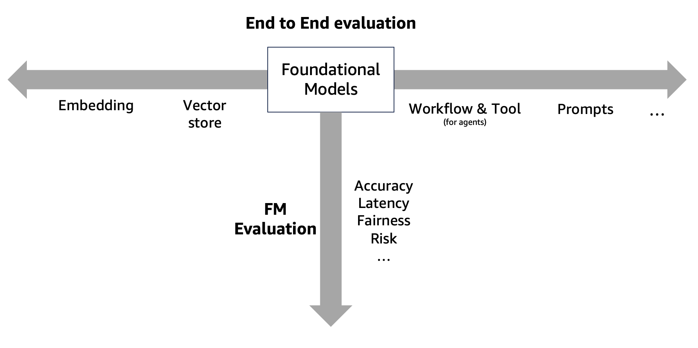
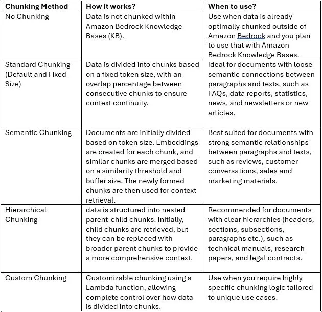
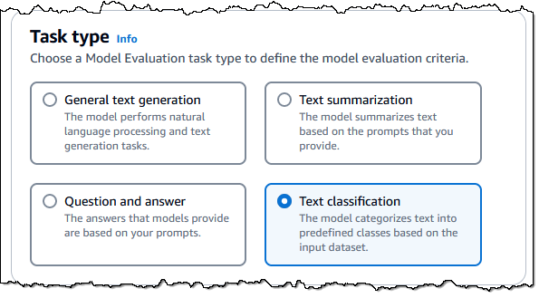
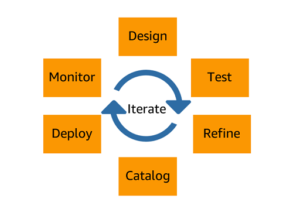
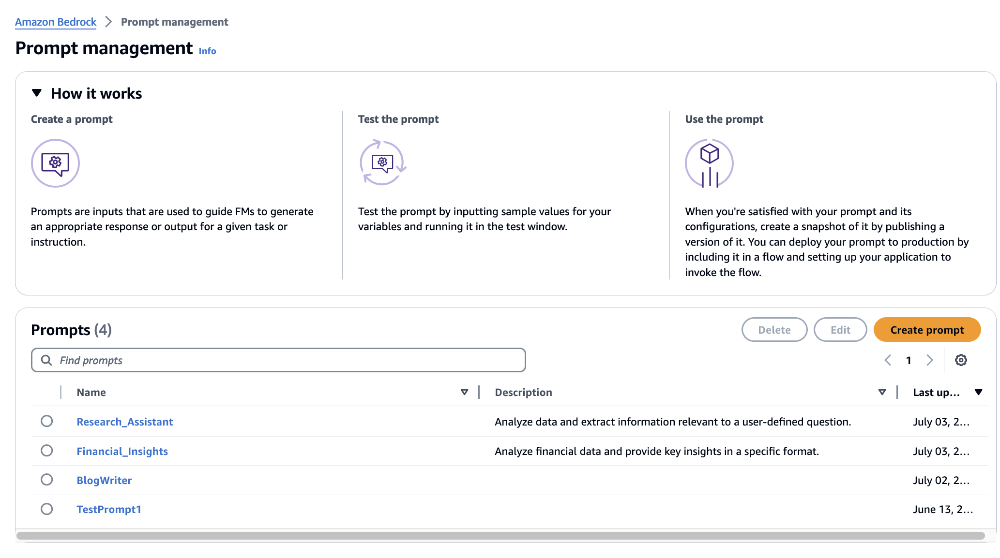
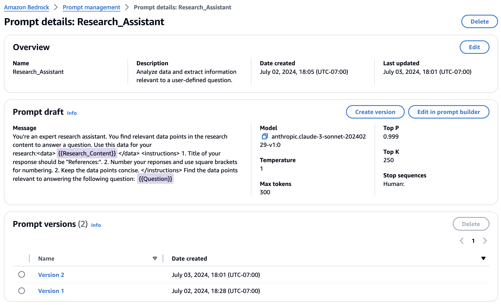
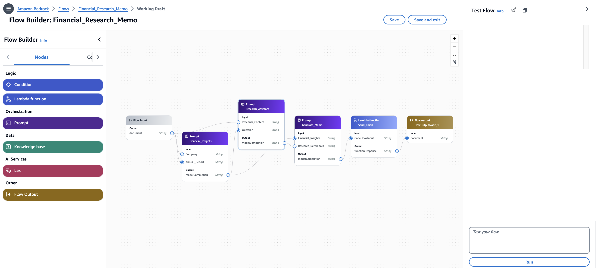

<!-- 
 Copyright Amazon.com, Inc. or its affiliates. All Rights Reserved.
 SPDX-License-Identifier: CC-BY-SA-4.0
 -->

# Operations

**Content Level: 300**

## TL;DR
Your generative AI team should initially focus on key areas as you transition your generative solutions from a MVP or prototype phase to a production-ready solution. You should aim for operational excellence in your generative AI applications to enable the smooth, efficient, and reliable deployment and management of your generative AI models in production environments. You should focus on implementing robust observability practices to gain actionable insights into your model performance and behavior, safely automating processes to reduce human error and operational toil, and making frequent, small, reversible changes to facilitate rapid iteration and risk mitigation. When you refine your operational procedures regularly, learn from all operational events and metrics, and leverage managed services, you can create a foundation for scaling your generative AI solutions effectively. You can use this approach to help your teams maintain high-quality outputs, adapt quickly to changing requirements, and ultimately drive better business outcomes through your generative AI applications.

## Recap: Design principles of Operational Excellence
* Organize teams around business outcomes
* Implement observability for actionable insights
* Safely automate where possible
* Make frequent, small, reversible changes
* Refine operations procedures frequently
* Anticipate failure
* Learn from all operational events and metrics
* Use managed services

  

Reference: [Source](https://aws.amazon.com/blogs/machine-learning/achieve-operational-excellence-with-well-architected-generative-ai-solutions-using-amazon-bedrock/){:target="_blank" rel="noopener noreferrer"}

## Your Operational Excellence in Generative AI

With the design principles of Operational Excellence in AWS Well Architected Framework in mind, you'll face the following challenges when you operationalize your Generative AI workloads.

* **Build a continuous evaluation framework**
    * Foundational Model evaluation
        * Types of evaluations
        * Evaluation mechanisms
        * Tools
    * End to end evaluation for the built Generative AI application
        * RAG based architecture
        * Agentic workflow architecture
    * Continuously feed the right validation data 
* **Testing for Generative AI application**
    * Unit testing
    * Regression testing
* **Embedding strategy**
    * Choose the right vector store
    * Chunking strategy
    * How to run benchmark testing for vector store x chunking strategy combo
* **Prompt management**
    * Cataloging / versioning
    * Prompt conversion for different providers
* **Observability**
    * Prompt metrics like token usage, and model IDs for individual transactions and operations
    * Output quality factors including potential toxicity, harm, truncation due to length limits, and failures from exceeding token allowances.
    * Performance visibility to compare LLMs to choose the best model based on price, performance and tuning.
* **Cost management and optimization (FinOps)**

## Build Your Continuous Evaluation Framework
Without evaluation, your generative AI is just taking shots in the dark and hoping for the best. No portion of your system matters unless you can measure it and decide how well it is working. This is especially true for your Generative AI, where outputs can be non-deterministic and therefore difficult to measure using traditional techniques. Furthermore, you'll find that a lack of evaluation metrics is often a key component missing between your PoC and production. At the PoC level you may take a look at a few prompts and feel that your system is working well, but without metrics you have no way to build stakeholder trust and support for your production deployment.

### Dimensions of Your GenAI Evaluation

  

1. **FM Evaluation:** You should determine whether one model performs better than the other for performance including accuracy and latency, or for risks.
    1. <u>Performance evaluation</u>: You should focus your performance evaluation of Foundation Models (FMs) primarily on two key metrics: accuracy and latency. You'll find that accuracy measures how well your model performs on a task, leading to reliable predictions or outputs, while latency refers to the time it takes for your model to generate a response. You should aim to achieve high accuracy, but you'll often need to test on diverse datasets to ensure generalization. At the same time, low latency is important for real-time applications.
    1. <u>Risk evaluation</u>: [Research](https://aclanthology.org/2022.acl-long.247/){:target="_blank" rel="noopener noreferrer"} shows that not only do risks for bias and toxicity transfer from pre-trained foundation models (FM) to task-specific generative AI services, but that when you tune an FM for specific tasks, on incremental datasets, you introduce new and possibly greater risks. You'll find that detecting and managing these risks, as prescribed by evolving guidelines and regulations, such as ISO 42001 and EU AI Act, is challenging.
1. **End to end architecture evaluation**: Your Generative AI application consists of multiple technical components including but not limited to embedding models, vector stores, and agentic tool architecture.

## Testing Your Generative AI Applications
You should test your LLM applications to help ensure consistent performance, given their non-deterministic nature and the variety of user inputs they process. To equip your LLM app to deliver high-quality responses, you should implement a structured testing approach across three stages: design, pre-production, and post-production.

1. In your design phase, you should incorporate tests directly within your application logic to catch and correct errors before they reach your users. This includes assertion tests.
1. Your pre-production testing should focus on validating key scenarios and detecting any regressions to verify that your app is ready for deployment.
1. Once in production, you should use continuous monitoring to help identify issues in real-world usage, feeding back insights for further improvements.

### More resources
* Unit tests
    * https://dev.to/shannonlal/unit-testing-llms-with-deepeval-4ljl
    * https://machine-learning-made-simple.medium.com/how-to-build-unit-tests-for-llms-using-prompt-testing-f59c3826ed0e
* Regression testing
    * https://docs.smith.langchain.com/old/evaluation/faq/regression-testing

## Your Embedding Strategy
Your embedding strategy is an important aspect of operational excellence for your generative AI applications in production environments. Your strategy encompasses three key components: choosing the right vector store, developing an effective chunking strategy, and conducting benchmark testing for various vector store and chunking strategy combinations. You should develop a well-designed embedding strategy to enable efficient storage, retrieval, and utilization of high-dimensional vector representations of your data, which is fundamental to many of your generative AI tasks. When you optimize these elements, you can significantly enhance the performance, scalability, and cost-effectiveness of your generative AI workloads, ultimately leading to more responsive and accurate generative AI applications.

* **Choosing the right vector store:** Your selection of an appropriate vector store is important for efficient storage and retrieval of your embeddings. You should consider factors including:
    * Scalability,
    * Query performance,
    * Support for different similarity metrics, and
    * Integration capabilities with your existing infrastructure.

  

* **Chunking strategy:** Your effective chunking strategy involves breaking down large texts or datasets into smaller, manageable pieces for embedding. Your strategy impacts the granularity of information retrieval and the overall performance of your system.

  

* **Benchmark testing for vector store and chunking strategy combinations:** You should conduct thorough benchmark tests to help evaluate the performance of different combinations of vector stores and chunking strategies. Your process involves measuring metrics such as _Query latency_, _Throughput_ and _Accuracy_ under various load conditions to identify the optimal configuration for your specific use case.

  

### More Resources
* [Amazon OpenSearch Service](https://aws.amazon.com/opensearch-service/||tabindex="0"){:target="_blank" rel="noopener noreferrer"} -  For vector databases, you can [read about k-Nearest Neighbor (k-NN) search in OpenSearch Service](https://docs.aws.amazon.com/opensearch-service/latest/developerguide/knn.html||tabindex="0"){:target="_blank" rel="noopener noreferrer"}.
* [Amazon Aurora PostgreSQL-Compatible Edition](https://aws.amazon.com/rds/aurora/||tabindex="0"){:target="_blank" rel="noopener noreferrer"} and [Amazon Relational Database Service (Amazon RDS) for PostgreSQL](https://aws.amazon.com/rds/postgresql/||tabindex="0"){:target="_blank" rel="noopener noreferrer"} support the pgvector extension to store embeddings from machine learning (ML) models in your database and to perform efficient similarity searches.
* [Amazon Neptune ML](https://aws.amazon.com/neptune/machine-learning/||tabindex="0"){:target="_blank" rel="noopener noreferrer"} is a new capability of Neptune that uses Graph Neural Networks (GNNs), an ML technique purpose-built for graphs, to make easy, fast, and more accurate predictions using graph data.
* [Vector search for Amazon MemoryDB](https://aws.amazon.com/memorydb/features/#Vector_search){:target="_blank" rel="noopener noreferrer"} supports storing millions of vectors, with single-digit millisecond query and update response times, and tens of thousands queries per second (QPS) at greater than 99% recall.
* [Amazon DocumentDB](https://aws.amazon.com/documentdb/){:target="_blank" rel="noopener noreferrer"} (with MongoDB compatibility) supports vector search, a new capability that enables you to store, index, and search millions of vectors with millisecond response times. With [vector search for Amazon DocumentDB](https://aws.amazon.com/documentdb/features/#Generative_AI_and_machine_learning){:target="_blank" rel="noopener noreferrer"}, you can simply set up, operate, and scale databases for your ML applications.
* [Accelerate performance using a custom chunking mechanism with Amazon Bedrock](https://aws.amazon.com/blogs/machine-learning/accelerate-performance-using-a-custom-chunking-mechanism-with-amazon-bedrock/){:target="_blank" rel="noopener noreferrer"}
* [Amazon Bedrock Knowledge Bases now supports advanced parsing, chunking, and query reformulation giving greater control of accuracy in RAG based applications](https://aws.amazon.com/blogs/machine-learning/amazon-bedrock-knowledge-bases-now-supports-advanced-parsing-chunking-and-query-reformulation-giving-greater-control-of-accuracy-in-rag-based-applications/){:target="_blank" rel="noopener noreferrer"}
* [Choose the best performing model using Amazon Bedrock evaluations](https://docs.aws.amazon.com/bedrock/latest/userguide/model-evaluation.html){:target="_blank" rel="noopener noreferrer"}
* [LLM experimentation at scale using Amazon SageMaker Pipelines and MLflow](https://aws.amazon.com/blogs/machine-learning/llm-experimentation-at-scale-using-amazon-sagemaker-pipelines-and-mlflow/){:target="_blank" rel="noopener noreferrer"}

## Prompt Management
Prompt management is a key component of operational excellence for your generative AI applications, particularly as you scale your implementations across different use cases and environments. This aspect of your operations focuses on systematically organizing, versioning, and adapting prompts to enable consistency, efficiency, and adaptability.
Your effective prompt management encompasses two key areas: cataloging and versioning of prompts, and prompt conversion for different providers. You can use this approach to not only enhance the reliability and performance of your generative AI applications but also support the agility you need to stay competitive in the rapidly evolving AI landscape.

  

* **Cataloging/versioning:** This involves you creating a systematic approach to organizing and tracking different versions of prompts used across your various applications. You can use a well-structured catalog to help your teams manage prompt iterations, track changes, and maintain a history of your prompt performance.

  

  

  

* **Prompt conversion for different providers:** A key area of your prompt management is prompt conversion from different providers. This process involves you adapting your existing prompts from other providers to work seamlessly with AWS services like Amazon Bedrock and Amazon SageMaker. When you implement effective prompt conversion practices, you can smoothly migrate your applications to AWS, leveraging its advanced capabilities while maintaining the integrity and functionality of your existing prompts. You can use this approach to not only facilitate a seamless transition to AWS but also enable you to take full advantage of AWS machine learning services, enhancing the overall operational excellence of your generative AI applications.

  

1. **Analyze existing prompts:** You should review and document the structure, parameters, and specific features of prompts used in other providers.
1. **Map to Bedrock models:** You should identify which Bedrock foundation models (e.g., Anthropic Claude, AI21 Labs Jurassic, Cohere Command) best match your current use cases.
1. **Adjust token limits:** You should modify your prompts to adhere to the token limits of your chosen Bedrock models, which may differ from other providers.
1. **Update API calls:** You should refactor API calls in your code to use the Amazon Bedrock API and AWS SDK instead of your previous provider's.
1. **Adapt to Bedrock parameters:** You should modify your prompts to include Bedrock-specific parameters like temperature, top_p, or max_tokens_to_sample as required by your chosen foundation model.
1. **Test and fine-tune:** You should conduct thorough testing of your converted prompts on Bedrock, comparing outputs with your original provider to enable consistency and quality.
1. **Use Bedrock model versioning:** You should leverage Bedrock's model versioning capabilities to manage different versions of your converted prompts and associated models.
1. **Develop conversion scripts:** You should create automated scripts or tools to streamline your process of converting prompts from other providers to Bedrock format.
1. **Document Bedrock best practices:** You should maintain a knowledge base of Bedrock-specific conversion patterns and best practices for your future reference and team alignment.

### More Resources

1. [Bedrock Prompt Management](https://aws.amazon.com/bedrock/prompt-management/){:target="_blank" rel="noopener noreferrer"}

2. [Streamline generative AI development in Amazon Bedrock with Prompt Management and Prompt Flows](https://aws.amazon.com/blogs/machine-learning/streamline-generative-ai-development-in-amazon-bedrock-with-prompt-management-and-prompt-flows-preview/){:target="_blank" rel="noopener noreferrer"}

3. [Evaluating prompts at scale with Prompt Management and Prompt Flows for Amazon Bedrock](https://aws.amazon.com/blogs/machine-learning/evaluating-prompts-at-scale-with-prompt-management-and-prompt-flows-for-amazon-bedrock/){:target="_blank" rel="noopener noreferrer"}

4. [Workshop](https://catalog.workshops.aws/openai-to-bedrock-migration/en-US){:target="_blank" rel="noopener noreferrer"}

## Your Observability
In one sense, your observability for GenAI is no different from any other workload. You need enough information to understand if your workload is behaving as intended, and to respond to problems. Your GenAI does introduce some novel characteristics though. 

In your GenAI there are multiple layers of metrics.
* Layer 1 - component-level metrics. Your basic level of observability focuses on visibility into the state of each of your components. This may include you capturing metrics such as latency, number of invocation errors, and resource utilization.
* Layer 2 - agent and chain traces. This level captures details on the interaction between your models and other tightly coupled components, like your agents and knowledge bases.
* Layer 3 - end-user feedback. This level captures human evaluation of your model output, which is important during all phases of your solution lifecycle.
* Layer 4 - advanced metrics. This level includes your higher-level KPIs like topic drift and model faithfulness (or other task-specific KPIs).

### More resources
* [Blog on observability](https://community.aws/content/2i7BzRVM4ppZSGaZKoEHdpNwick/observability-monitoring-and-layered-guardrails-for-genai){:target="_blank" rel="noopener noreferrer"}

## Your Cost Management and Optimization (FinOps)
Your cost optimization for generative AI depends on which phase your project is currently in. In early stages, it comes down to you getting a rough estimate of the cost of your solution to validate your solution is economically viable. As your product becomes more mature, cost tracking and optimization will be your priorities.

1. **Business case:** Your goal should be to develop a model of value derived from your product, which will inform the maximum cost that your solution can bear and still be financially viable.
1. **Planning phase:** You should choose the right model either on Bedrock or SageMaker, and estimate three input variables including average input tokens per request, average output tokens per request, and requests per minute.
1. **Cost optimization phase:** Following your deployment of a GenAI application, you should have a cadence of cost optimization activities that evaluate your existing model and look for ways to run more efficiently. The following is a list of techniques you can use, from the lowest effort to the highest effort:
    1. Prompt Management
    1. Summarization
    1. Caching
    1. Retrieval Augmented Generation
    1. Model Selection / Fine Tuning / Continued Training

## Contributors

Author/s:

 - Ruskin Dantra - Snr. Solutions Architect

Content contributor/s for the P2P Framework and Guidance:

 - Raj Bagwe - Senior Solutions Architect
 - Samantha Wylatowska - Solutions Architect
 - Ruskin Dantra - Snr. Solutions Architect
 - Kiran Lakkireddy - Principal Solutions Architect
 - Jiwon Yeom - Senior Solutions Architect
 - Vasile Balan - US SA Leader, T&H
 - Nitin Eusebius - Principal Solutions Architect
 - Nipun Chagari - Sr Mgr, Solutions Architecture
 - Akash Bhatia - Principal Solutions Architect
 - Joshua Smith - Senior Solutions Architect