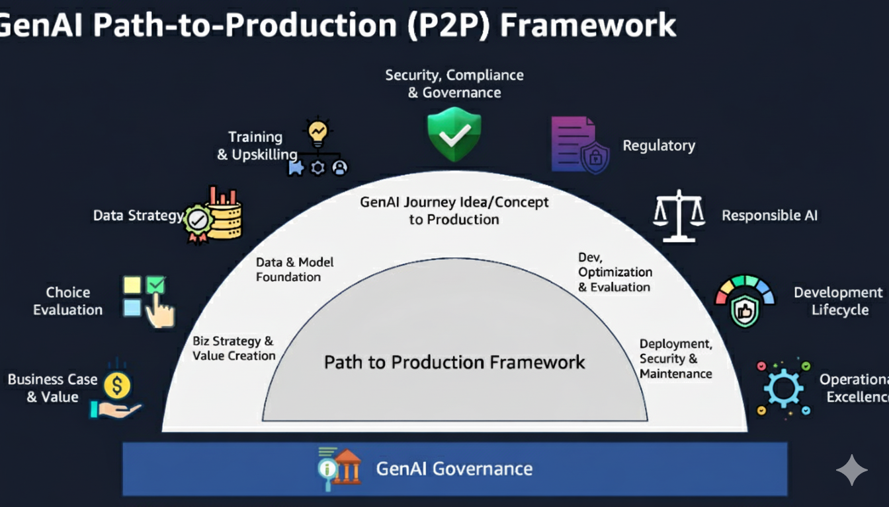
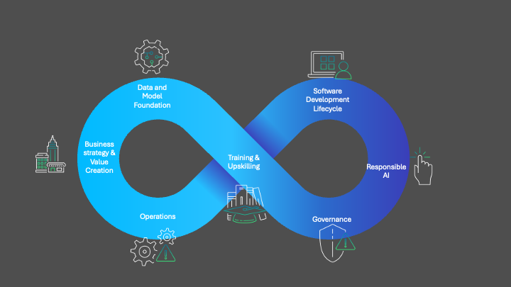

# Systematic path to production (P2P) framework

**Content Level: 100**

## Suggested Pre-Reading
 - [Core Concepts and Terminology](../1_0_generative_ai_fundamentals/1_1_core_concepts_and_terminology/core_concepts_and_terminology.md) 

## Tenets

1. **Index into complex areas:** We have designed the (P2P) framework as an index into complex areas and challenges you will face on your way to deploy generative AI applications to production. It is not designed as a L400 guide on implementation details. It is designed to be a compass to guide you to the right material.

2. **Reduce net new material**: The P2P framework should not introduce new material and concepts, but guide readers on how to apply those to quickly drive towards production. If new material is added, we should strive to move it into its rightful home.

3. **Stay cutting edge**: Prioritize newer technology. Newer technology will have the biggest hurdles, as concepts get used widely, the path to production becomes clearer and more well known. Newer technology is where we should focus.

4. **Embrace feedback and iteration**: P2P will look different for every use case. We accept feedback and strive to change the material where appropriate. Seek disconfirming views across all pillars of the P2P framework. 

## TL;DR
You can use the generative AI Path to Production (P2P) Framework as a comprehensive guide to take your proof of concepts to a production ready product that delivers on your key objectives. You will find that the definition of "production" varies depending on the industry you work in, your geography, your end users location, regulatory requirements, security and compliance standards, nature of domain/data you have, etc, amongst other things. You can use the framework described in this section to systematically understand each area and pick and choose which part applies to your use case the best way. You can choose to apply the entire framework or parts of it.

The framework has 7 key pillars:

  

1. Business case and value creation
2. Data strategy
3. Training and upskilling
4. Security, responsible AI and governance
5. Responsible AI
6. Development lifecycle
7. Operational excellence

Even though you will see the steps described as a sequence, you should approach the P2P framework iteratively and visit each aspect at least once in your path towards production.

  

Where you start in the framework depends on your team's persona and the particular generative AI workload you're managing. Let's break this down.

Theoretically you should start with a clear _business and value strategy_ that you can deliver using generative AI. Often in practice you won't start there. Due to the ease of experimentation and adoption, you'll likely start at the software development lifecycle phase. You'll quickly experiment through a GUI, code and/or web applications. You'll see use cases start taking shape and you'll want to productionize these use cases quickly, but addressing the _governance_ pillar will add time to your process. Once you establish _governance_, you'll face the challenge of _operationalizing_ your generative AI workload. You'll soon realize that deploying your workload at scale often requires access to _data_ beyond what you originally had. As you might have already noticed by now, you won't follow the Path to Production framework linearly, so you should understand that no matter where you start, you must consider all pillars equally and carefully.

You can use this section of the Atlas to focus on each pillar in detail, helping you move quickly from ideation to production and create a flywheel where you generate new ideas and value streams from your existing production workloads.

## Contributors

Author/s:

 - Ruskin Dantra - Snr. Solutions Architect

Content contributor/s for the P2P Framework and Guidance:

 - Raj Bagwe - Senior Solutions Architect
 - Samantha Wylatowska - Solutions Architect
 - Ruskin Dantra - Snr. Solutions Architect 
 - Kiran Lakkireddy - Principal Solutions Architect
 - Jiwon Yeom - Senior Solutions Architect 
 - Vasile Balan - US SA Leader, T&H 
 - Nitin Eusebius - Principal Solutions Architect 
 - Nipun Chagari - Sr Mgr, Solutions Architecture
 - Akash Bhatia - Principal Solutions Architect
 - Joshua Smith - Senior Solutions Architect 
