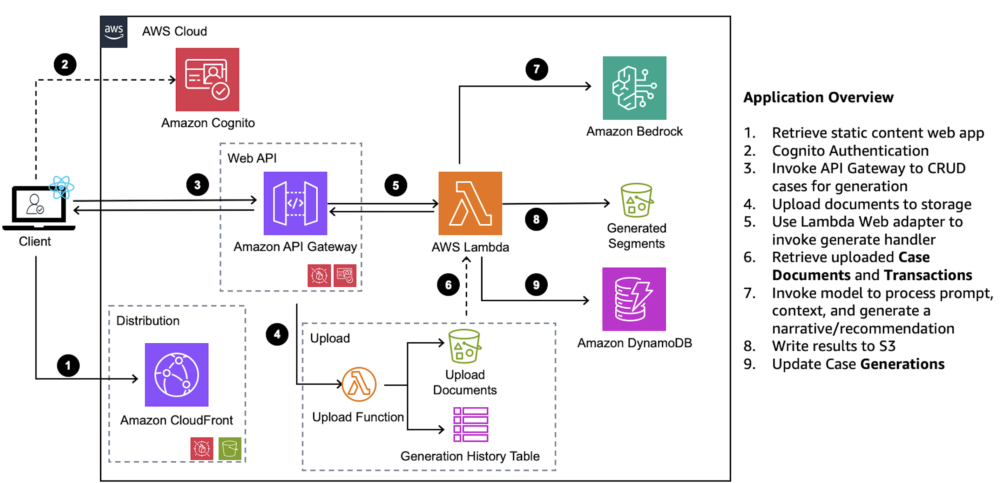

<!-- 
 Copyright Amazon.com, Inc. or its affiliates. All Rights Reserved.
 SPDX-License-Identifier: CC-BY-SA-4.0
 -->

# Anti-Money Laundering (AML) Investigation

**Content Level: 300**

## Suggested Pre-Reading

* [Retrieval Augmented Generation (RAG)](../../../2_0_technical_foundations_and_patterns/2_1_key_primitives/2_1_7_rag/2_1_7_rag.md)
* [Prompt Engineering](../../../2_0_technical_foundations_and_patterns/2_3_core_archtectural_concepts/2_3_2_prompt_engineering/index.md)
* [Streaming response optimization](../../../3_0_architecture_and_design_patterns/3_4_scalability_performance/3_4_3_other_optimizations/3_4_3_1_other_optimizations.md)

## TL;DR
The Anti-Money Laundering (AML) investigation solution automates the generation of standardized investigation narratives and Suspicious Activity Report (SAR) documentation. This solution processes large volumes of information from multiple data sources, such as customer data, transaction data, and case documents. It analyzes financial transactions, identifies suspicious activity patterns, and generates regulatory documentation in seconds. This solution allows investigators to focus their expertise on complex decision-making rather than routine documentation tasks.

## Industry
**Financial Services**: The solution serves financial institutions that need to comply with anti-money laundering regulations and reporting requirements. These institutions include banks and credit unions, stock and mutual fund brokers, and various money service businesses (check cashing companies, money order providers, etc.). For these institutions, transaction monitoring and suspicious activity reporting (SAR) are important compliance functions. Risk management departments within these institutions benefit from automated narrative generation for regulatory reporting. Financial crime compliance teams can use this solution to streamline their investigation documentation processes.

## Business situation
Financial institutions face challenges creating AML case narratives and Suspicious Activity Reports (SARs). Investigators spend considerable time on routine documentation rather than complex analysis. The current process to correlate data and generate documentation is manual, which is time-consuming and inconsistent. In some organizations, the manual process takes an average of 45 minutes per narrative, creating operational bottlenecks. Financial institutions need to modernize this process while maintaining accuracy and compliance with regulatory requirements.

## When to use
Financial institutions can use this solution to automatically correlate data from multiple sources, including customer data, transaction data, and case notes, and summarize it into coherent narratives.

## Benefits
This solution transforms AML investigation documentation through AI-powered automation while maintaining regulatory compliance and accuracy standards.

**Business Benefits**

* Generates standardized narratives that adhere to specific regulatory requirements across different case types and AML typologies.
* Reduces processing time from minutes to seconds per case, improving investigator productivity and decreasing operational costs associated with manual documentation.
* Provides recommendations that assist investigators in making informed decisions about SAR filing requirements and escalation paths.
* Provides clear audit trails of narrative generation, enhancing compliance documentation.

**Technology Benefits**

* Aggregates thousands of records (transaction data, case notes, and customer data) into unified narratives, removing manual data compilation steps.
* Scales AML investigation capabilities without proportionally increasing their investigator headcount.
* Leverages section-based generation architecture to overcome context window limitations by chunking case documentation, enabling processing of cases regardless of size.

## Architecture
This solution leverages generative AI to analyze transaction data and case documentation, producing first-draft recommendations and narratives that align with investigator decisions while maintaining regulatory compliance. It produces three key outputs:

* **SAR recommendations**: AI-powered analysis of case data to determine whether a Suspicious Activity Report is warranted, with supporting rationale.
* **SAR narratives**: Structured, compliant narrative documents ready for regulatory filing when suspicious activity is confirmed.
* **Escalations and referrals**: Automated recommendations for case escalation to appropriate departments based on identified risk factors.

The solution processes case documents stored in S3, extracting transaction data from Excel files and case notes from text documents. This data is then processed through a multi-stage AI pipeline that identifies patterns matching known AML typologies (e.g., money laundering, tax evasion) and generates structured narratives following regulatory requirements.

AML investigators interact with a web application that communicates with the backend services that manages the lifecycle of cases and manages narrative generation. The solution provides a comprehensive case management interface where investigators can view all cases in a sortable, filterable table. Each case displays key information including status, disposition, and referral types using visual indicators like badges and status indicators. Investigators can update case details, change disposition status, and manage the workflow of cases. They can track case states, including whether escalations or closures are recommended.

The core processing logic resides in AWS Lambda functions, which handle various aspects of the workflow:

* **Document Upload Function**: This function is triggered when new documents are uploaded. It stores the documents securely in Amazon S3 and initiates the document processing workflow.
* **Pre-summarization Function**: This function processes transaction data and case notes to identify activities that deviate from the customer's normal transaction patterns. It generates a condensed summary of transaction types, amounts, and counter-parties, reducing the context size for the narrative generation step.
* **Narrative Generation Handler**: This is the core function that orchestrates the narrative recommendation and generation processes with streaming response capabilities. It retrieves the pre-summarized data, case documents, and relevant context information. It then constructs prompts for Amazon Bedrock, manages the chunked generation process, and assembles the final narrative.
* **Post-processing Function**: This function applies standard regulatory formatting according to SAR guidelines, performs final compliance checks, and prepares the generated narrative for review.

**AWS Services Used:**

The solution implements a serverless architecture leveraging multiple AWS services to provide secure, scalable narrative generation capabilities. 

* Amazon Bedrock provides the foundation model capabilities for narrative generation.
* Amazon S3 stores uploaded case documents, generated narratives, and web application files.
* AWS Lambda executes the core business logic, including document processing and narrative generation.
* Amazon DynamoDB stores case generation history and metadata.
* Amazon API Gateway provides secure API endpoints for the solution.
* Amazon CloudFront distributes web application content.
* Amazon Cognito handles user authentication and authorization.
* Amazon CloudWatch for monitoring and logging capabilities to track generation requests and system performance.

## Gen AI patterns used
The solution implements several key generative AI patterns:

* [**Retrieval Augmented Generation (RAG)**](../../../2_0_technical_foundations_and_patterns/2_1_key_primitives/2_1_7_rag/2_1_7_rag.md) to process case documents stored in S3, extracting transaction data and case notes to provide context for the foundation model. 
* [**Prompt Engineering**](../../../2_0_technical_foundations_and_patterns/2_3_core_archtectural_concepts/2_3_2_prompt_engineering/index.md) helps the model generate structured outputs that conform to regulatory requirements.
* [**Streaming response optimization**](../../../3_0_architecture_and_design_patterns/3_4_scalability_performance/3_4_3_other_optimizations/3_4_3_1_other_optimizations.md) to display generated content in real-time to provide immediate feedback during narrative generation.

## AWS Well-Architected Best Practices

### Operational Excellence

#### [GENOPS02-BP01: Monitor all application layers](https://docs.aws.amazon.com/wellarchitected/latest/generative-ai-lens/genops02-bp01.html){:target="_blank" rel="noopener noreferrer"}
Amazon CloudWatch provides monitoring and logging capabilities to track generation requests and system performance.

#### [GENOPS02-BP02: Monitor foundation model metrics](https://docs.aws.amazon.com/wellarchitected/latest/generative-ai-lens/genops02-bp02.html){:target="_blank" rel="noopener noreferrer"}
The solution implements comprehensive monitoring across all foundation model interactions in Amazon Bedrock. CloudWatch metrics track key performance indicators including invocation counts, latency, token usage, and error rates. 

#### [GENOPS04-BP01: Automate generative AI application lifecycle with infrastructure as code (IaC)](https://docs.aws.amazon.com/wellarchitected/latest/generative-ai-lens/genops04-bp01.html){:target="_blank" rel="noopener noreferrer"}
All infrastructure is defined using AWS CDK with TypeScript, creating a cohesive stack including S3 buckets for case documents, DynamoDB tables for case data, Cognito for authentication, and Lambda functions for API hosting. The infrastructure follows AWS security best practices with proper IAM permissions.

### Security

#### [GENSEC01-BP01: Grant least privilege access to foundation model endpoints](https://docs.aws.amazon.com/wellarchitected/latest/generative-ai-lens/gensec01-bp01.html){:target="_blank" rel="noopener noreferrer"}
The solution implements strict security and access controls for highly sensitive financial investigation data throughout the processing pipeline.

### Reliability

#### [GENREL03-BP01: Use logic to manage prompt flows and gracefully recover from failure](https://docs.aws.amazon.com/wellarchitected/latest/generative-ai-lens/genrel03-bp01.html){:target="_blank" rel="noopener noreferrer"}
The architecture implements robust error handling and recovery mechanisms in the generation process, with pre-summarization and chunking to manage large datasets reliably.

### Performance Efficiency

#### [GENPERF02-BP03: Select and customize the appropriate model for your use case](https://docs.aws.amazon.com/wellarchitected/latest/generative-ai-lens/genperf02-bp03.html){:target="_blank" rel="noopener noreferrer"}
This solution can use any foundation model that provides consistent performance, reviews large complex contexts, and conducts complex analysis of the data.

#### Cost Optimization

#### [GENCOST03-BP01: Reduce prompt token length](https://docs.aws.amazon.com/wellarchitected/latest/generative-ai-lens/gencost03-bp01.html){:target="_blank" rel="noopener noreferrer"}
Pre-summarization and efficient context management reduce token usage while maintaining narrative quality.

### Sustainability

#### [GENSUS01-BP01: Implement auto scaling and serverless architectures to optimize resource utilization](https://docs.aws.amazon.com/wellarchitected/latest/generative-ai-lens/gensus01-bp01.html){:target="_blank" rel="noopener noreferrer"}
The solution implements a serverless architecture, such as Amazon DynamoDB, Amazon Bedrock, and AWS Lambda, to provide secure, scalable AML investigation capabilities. 

## Design tradeoffs
The architecture involves several key design tradeoffs:

* Choose a foundation model that provides consistent performance, reviews large complex contexts, and conducts complex analysis of the data.
* Implements real-time streaming for immediate feedback and enhanced user experience. 
* Employs pre-summarization of transaction data to reduce context size at the cost of an additional processing step.
* Balances automated processing against accuracy requirements. While full automation enables faster processing, documents containing confidential financial data require human validation. 

## Common customizations

* **Investigation-Specific Narrative and Prompt**: Organizations can create custom narrative templates for different types of investigations and specialized prompt engineering for specific financial crime typologies, allowing for tailored content generation across various AML scenarios.
* **Regulatory compliance**: Organizations can modify prompt templates for different regulatory jurisdictions, adjusting validation rules for specific compliance requirements, and configuring custom guardrails for organization policies.
* **Intelligent document processing**: Depending on the type of documents your organization manages, you can integrate this solution with the [**Intelligent document processing**](../../../6_0_example_application_and_reference_code/6_1_reference_applications_by_industry/6_1_5_cross_industry/idp_with_genai.md) solution.
* **Enterprise integration**: Organizations can connect to existing case management systems, if applicable. They can also integrate with additional data sources for additional context such as watchlists and public records.

## Further Reading

* [Suspicious Activity Reports (SAR) - Office of the Comptroller of the Currency](https://www.occ.treas.gov/topics/supervision-and-examination/bank-operations/financial-crime/suspicious-activity-reports/index-suspicious-activity-reports.html){:target="_blank" rel="noopener noreferrer"}

## Contributors

**Author:** Guillermo Tantachuco - Principal AI Technologist 

**Reviewer** Adam Best - Sr. Prototyping Architect, PACE 

**Reviewer** Arnab Chakraborty - Solutions Architect 
