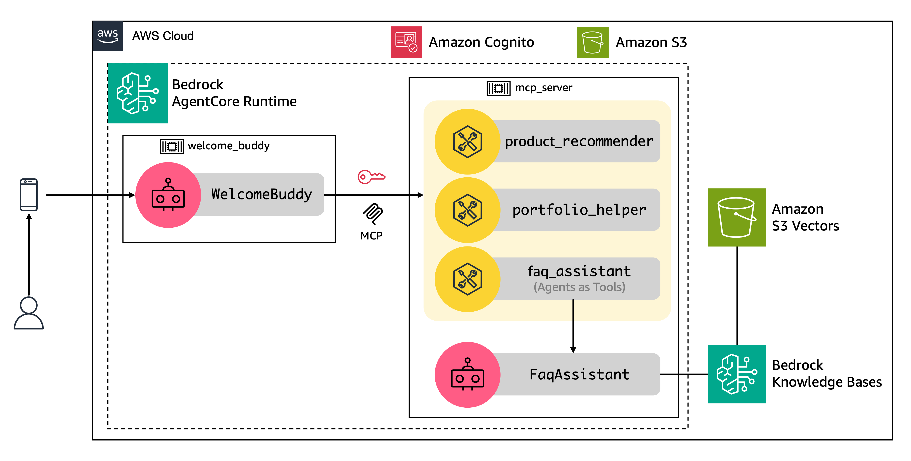

<!-- 
 Copyright Amazon.com, Inc. or its affiliates. All Rights Reserved.
 SPDX-License-Identifier: CC-BY-SA-4.0
 -->

# Personalized Customer Onboarding

**Content Level: 300**

## Suggested Pre-Reading

* [Amazon Bedrock AgentCore](https://aws.amazon.com/bedrock/agentcore/){:target="_blank" rel="noopener noreferrer"}
* [Amazon Bedrock Knowledge Bases](https://aws.amazon.com/bedrock/knowledge-bases/){:target="_blank" rel="noopener noreferrer"}
* [Amazon Bedrock Guardrails](https://docs.aws.amazon.com/bedrock/latest/userguide/guardrails.html){:target="_blank" rel="noopener noreferrer"}
* [Amazon S3 Vectors](https://aws.amazon.com/s3/features/vectors/){:target="_blank" rel="noopener noreferrer"}

## TL;DR
Traditional customer onboarding in Financial Services applications relies on static click-through tutorials, which does not answer questions in real-time. The AI Concierge solution enables financial institutions to provide personalized product recommendations and assistance with frequently asked questions (FAQ). It delivers a consistent onboarding experience for customers, across all touchpoints, through a natural and personalized conversation. 
This solution is beneficial for financial institutions looking to compete with digital-first challengers while maintaining their personalized service advantage.

## Industry
Financial institutions: This solution is particularly valuable for financial services organizations seeking to modernize their customer onboarding experience.

## Business situation
Financial institutions need to effectively onboard new customers by understanding their needs and recommending relevant products. Traditional onboarding processes can be impersonal and overwhelming for customers who need to navigate multiple product offerings. This solution addresses these challenges by providing an AI-powered concierge that engages customers in natural conversation, learns their preferences, and makes tailored product recommendations while answering questions throughout the process.

## When to use
This solution is suitable when Financial institutions need to transform traditional, transaction-focused onboarding into personalized digital journeys that build stronger customer relationships from the start. 

## Benefits
This solution enables organizations to create engaging, personalized onboarding experiences while efficiently scaling customer service operations.

**Business Benefits**

* Improved customer experience through personalized interactions and recommendations.
* Increased conversion rates by matching customers with relevant products.
* Reduced customer service costs through automated assistance.
* Consistent product information delivery across all customer interactions.
* Faster customer onboarding through streamlined processes.

**Technology Benefits**

* Answer customer questions using a knowledge base during the onboarding process.
* Maintain conversation context and user preferences across multiple interactions.
* Serverless architecture allows organizations to scale customer service capabilities while maintaining personalization.
* Built-in guardrails for responsible AI implementation.

## Architecture
The architecture of AI Concierge is powered by two AI agents that rely on specialized tools. The backend uses the the open source Strands Agents framework and is hosted on Amazon Bedrock AgentCore Runtime. Tools are exposed through a Model Context Protocol (MCP) server and frequently asked questions (FAQ) powered by Amazon Bedrock Knowledge Bases with Amazon S3 Vectors.

### Agents

* **Welcome Buddy agent**: This agent serves as the primary interface for customer interactions. It guides users through a personalized conversation flow that adapts based on user interests and needs. The agent asks users about their interests and provides a comprehensive overview of product offerings to helps users navigate their first steps within the application. The agent then recommends tailored products that match user’s needs. This agent maintains context across multiple interactions, processes user inputs, and coordinates with various tools to deliver personalized responses.
* **FAQ Assistant agent**: It processes customer questions and returns relevant answers from the knowledge base using Amazon Nova Lite model. This agent integrates with Amazon Bedrock Knowledge Bases and S3 Vectors to enable efficient semantic search across the organization's knowledge base. The implementation includes sophisticated vector embedding and retrieval mechanisms to generate accurate and relevant responses to customer queries.

### Tools

The Welcome Buddy agent integrates with specialized tools to deliver accurate product information, address user questions, and prioritize recommendations throughout the onboarding experience. The architecture includes three specialized tools that enhance the agents' capabilities:

* **Product Recommender**: This tool receives user information such as interests, credit approval status, and occupation, to recommend a list of products using predefined rules. The tool recommends up to five products: card, account, investment, loan, among others. It then returns a prioritized list of products based on the user's information and interests.
* **Portfolio Helper**: It maintains a product database that supports both summarized and detailed product descriptions. Given a product identifier, the tool returns a description of that product. 
* **FAQ Assistant**: It answers user questions by wrapping the FAQ Assistant agent using the Agents as Tools pattern, which simplifies integration between agents. For more details, see GenAI patterns section below.

**AWS Services Used:**

* Amazon Bedrock for foundation models.
* Amazon Bedrock AgentCore Runtime to run enterprise-grade agents at scale.
* Amazon S3 for native storage and querying of vector embeddings directly within S3 buckets.
* Amazon Cognito for authentication.
* Amazon CloudWatch for monitoring and observability.

## Gen AI patterns used

The solution implements the following generative AI patterns:

* [**Retrieval Augmented Generation (RAG)**](../../../2_0_technical_foundations_and_patterns/2_1_key_primitives/2_1_7_rag/2_1_7_rag.md): It is used by the FAQ Assistant agent to combine knowledge base information with model responses, providing accurate and contextual answers to customer queries. This is implemented through Amazon Bedrock Knowledge Bases and S3 Vectors.
* [**Multi-Model Orchestration**](../../../3_0_architecture_and_design_patterns/3_1_system_and_application_design_patterns_for_genai/3_1_1_foundation_architecture_components/3_1_1_2_application_engine/index.md): To optimize performance for different tasks within the workflow, the architecture leverages a foundation model for the supervisor and Amazon Nova Lite for FAQs.
* [**Prompt Caching**](../../../3_0_architecture_and_design_patterns/3_6_cost_optimization/3_6_3_cost_optimization_strategy/readme.md#prompt-caching): The architecture employs prompt caching to improve performance and reduce costs by reusing static portions of prompts across multiple requests.
* [**Agents as Tools with Strands Agents**](https://strandsagents.com/latest/documentation/docs/user-guide/concepts/multi-agent/agents-as-tools/){:target="_blank" rel="noopener noreferrer"}: This pattern enables seamless integration between different agents without handing off to them. A specialized, domain-specific AI agent (FAQ Assistant) is treated as a callable tool for another agent, often a supervisor or orchestrator agent (Welcome Buddy). 

## AWS Well-Architected Best Practices

### Security Pillar

#### [GENSEC01-BP01: Grant least privilege access to foundation model endpoints](https://docs.aws.amazon.com/wellarchitected/latest/generative-ai-lens/gensec01-bp01.html){:target="_blank" rel="noopener noreferrer"}
The Welcome Buddy agent accesses the tools by connecting to the MCP server and authentication is handled through a Cognito user pool.

#### [GENSEC02-BP01: Implement guardrails to mitigate harmful or incorrect model responses](https://docs.aws.amazon.com/wellarchitected/latest/generative-ai-lens/gensec02-bp01.html){:target="_blank" rel="noopener noreferrer"}
Amazon Bedrock Guardrails are configured to filter harmful content across six predefined categories and incorporate responsible AI practices. These content filters help ensure that user inputs are appropriate and safe for processing by the agent. 

### Reliability Pillar

#### [GENREL03-BP01: Use logic to manage prompt flows and gracefully recover from failure](https://docs.aws.amazon.com/wellarchitected/latest/generative-ai-lens/genrel03-bp01.html){:target="_blank" rel="noopener noreferrer"}
The solution implements error handling in tools (e.g. FAQ Assistant) that return fallback messages to the Welcome Buddy agent when services are unavailable. The agent can then incorporate these responses into user-friendly messages, resulting in graceful degradation rather than complete failure.

### Performance Efficiency Pillar

#### [GENPERF02-BP03: Select and customize the appropriate model for your use case](https://docs.aws.amazon.com/wellarchitected/latest/generative-ai-lens/genperf02-bp03.html){:target="_blank" rel="noopener noreferrer"}
The solution balances model capability against processing efficiency. It uses a foundation model for product recommendations and Amazon Nova Lite for FAQs. This tiered approach optimizes both performance and cost while maintaining accuracy.

### Operational Excellence Pillar

#### [GENOPS02-BP01: Monitor all application layers](https://docs.aws.amazon.com/wellarchitected/latest/generative-ai-lens/genops02-bp01.html){:target="_blank" rel="noopener noreferrer"}
The solution tracks model performance metrics, agent performance, and resource utilization patterns. This monitoring enables rapid identification and resolution of processing bottlenecks while maintaining optimal performance.

#### [GENOPS02-BP02: Monitor foundation model metrics](https://docs.aws.amazon.com/wellarchitected/latest/generative-ai-lens/genops02-bp02.html){:target="_blank" rel="noopener noreferrer"}
The solution implements comprehensive monitoring across all foundation model interactions in Amazon Bedrock. CloudWatch metrics track key performance indicators including invocation counts, latency, token usage, and error rates. 

#### [GENOPS04-BP01: Automate generative AI application lifecycle with infrastructure as code (IaC)](https://docs.aws.amazon.com/wellarchitected/latest/generative-ai-lens/genops04-bp01.html){:target="_blank" rel="noopener noreferrer"}
The solution uses infrastructure as code deployment patterns for generative AI applications through AWS CloudFormation.

### Cost Optimization Pillar

#### [GENCOST02-BP01: Balance cost and performance when selecting inference paradigms](https://docs.aws.amazon.com/wellarchitected/latest/generative-ai-lens/gencost02-bp01.html){:target="_blank" rel="noopener noreferrer"}
With this solution, your organization can select foundation models, such as Amazon Nova, based on workload requirements and cost considerations.

#### [GENCOST03-BP01: Reduce prompt token length](https://docs.aws.amazon.com/wellarchitected/latest/generative-ai-lens/gencost03-bp01.html){:target="_blank" rel="noopener noreferrer"}
The solution leverages Amazon Bedrock's prompt caching feature to improve performance and reduce costs by caching system prompts and tools. 

### Sustainability Pillar

#### [GENSUS01-BP01: Implement auto scaling and serverless architectures to optimize resource utilization](https://docs.aws.amazon.com/wellarchitected/latest/generative-ai-lens/gensus01-bp01.html){:target="_blank" rel="noopener noreferrer"}
The solution leverages Amazon Bedrock, which is a serverless and fully-managed service designed to consume resources only when needed.

#### [GENSUS03-BP01: Leverage smaller models to reduce carbon footprint](https://docs.aws.amazon.com/wellarchitected/latest/generative-ai-lens/gensus03-bp01.html){:target="_blank" rel="noopener noreferrer"}
The solution demonstrates thoughtful model selection by using smaller, more efficient models, such as Amazon Nova, when appropriate for specific tasks.

## Design tradeoffs
The solution involves several key design tradeoffs:

* **Model selection**: When selecting models for production, consider the tradeoffs between capability, speed, and cost. More capable models typically provide better reasoning and complex task handling but are slower and more expensive. Lighter models like Amazon Nova Lite offer faster response times and lower costs but may have reduced capabilities for complex reasoning tasks.
* **Prompt caching**: It is an optional feature for supported models on Amazon Bedrock to reduce inference response latency and input token costs. If your organization opts to use prompt caching, Amazon Bedrock creates a cache composed of cache checkpoints. The cache has a five minute Time To Live (TTL), which resets with each successful cache hit. During this period, the context in the cache is preserved. If no cache hits occur within the TTL window, your cache expires.
* **Session Management**: S3-based session management offers simplicity but introduces latency. DynamoDB is recommended for production deployments to improve performance.  Alternatively, Amazon Bedrock AgentCore isolated sessions provide a different approach that maintains context for up to 15 minutes without requiring external storage, eliminating session management overhead entirely.
* **Chunking strategy**: Your organization can use the default chunking strategy of the Knowledge Bases or consider choosing another strategy to properly handle larger content.

## Common customizations
Customers are encouraged to customize this solution to meet their specific requirements and production needs. Common customizations include:

* **Industry-specific guardrails and content filters**: Before deploying to production, explore the full range of guardrail features and policies available to tailor the safety controls to responsible AI requirements for your organization and industry.
* **Prompt and content**: For production deployment, experiment with condensing some instructions while maintaining effectiveness. This optimization can reduce token usage, improve response times, and lower costs without sacrificing quality. Consider implementing a systematic approach to prompt testing, including A/B testing different prompt variations, measuring response quality metrics, and gathering user feedback.
* **Product recommendations**: Consider customizing rules for product recommendation and improving product descriptions returned by the Portfolio Helper tool. The agent's responses are primarily based on these components, so modifying them has a significant impact on how the agent discusses and recommends products with users. 

## Further Reading

* [Enabling customers to deliver production-ready AI agents at scale](https://aws.amazon.com/blogs/machine-learning/enabling-customers-to-deliver-production-ready-ai-agents-at-scale/){:target="_blank" rel="noopener noreferrer"}
* [Introducing Amazon Bedrock AgentCore: Securely deploy and operate AI agents at any scale (preview)](https://aws.amazon.com/blogs/aws/introducing-amazon-bedrock-agentcore-securely-deploy-and-operate-ai-agents-at-any-scale/){:target="_blank" rel="noopener noreferrer"}
* [Strands Agents framework](https://strandsagents.com/latest/){:target="_blank" rel="noopener noreferrer"}

## Contributors
**Author:** Guillermo Tantachuco - Principal AI Technologist 

**Reviewer** Rafael Werneck - Sr. Prototyping Architect, PACE 