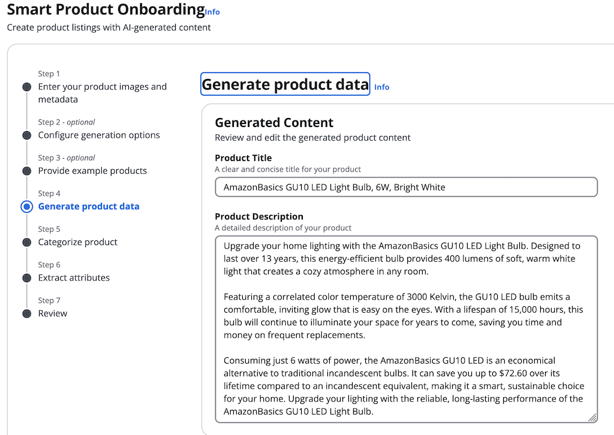
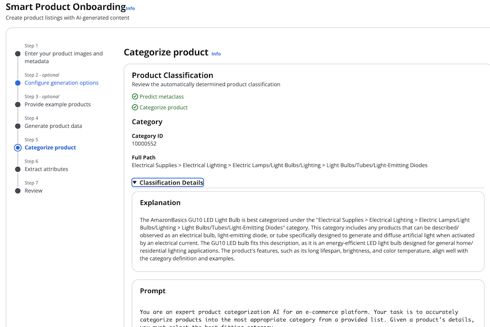
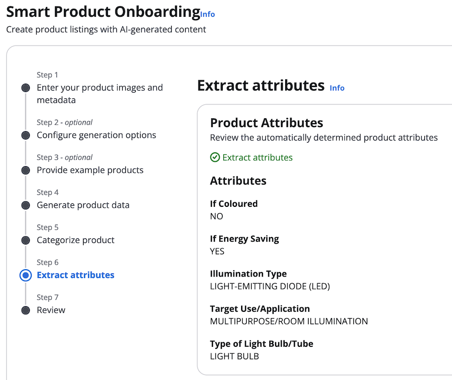
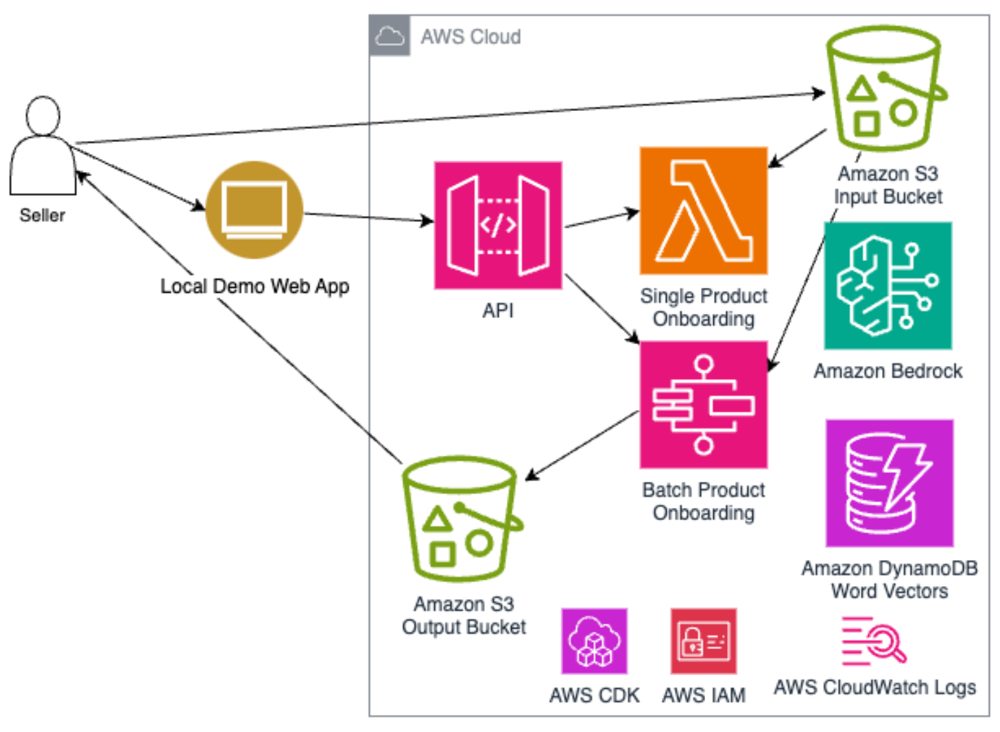
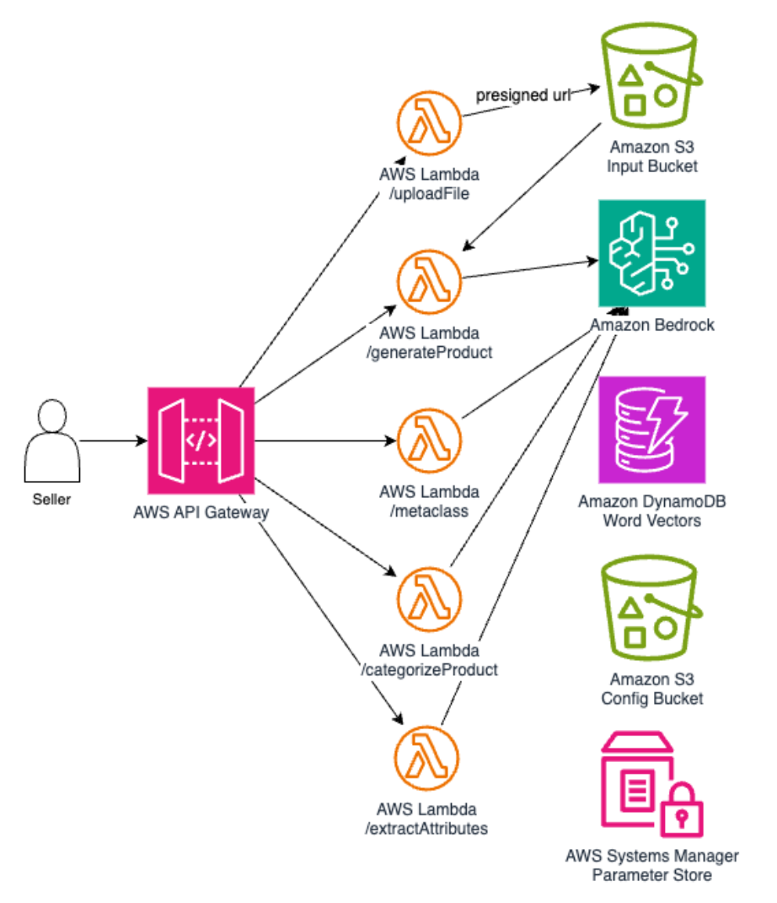
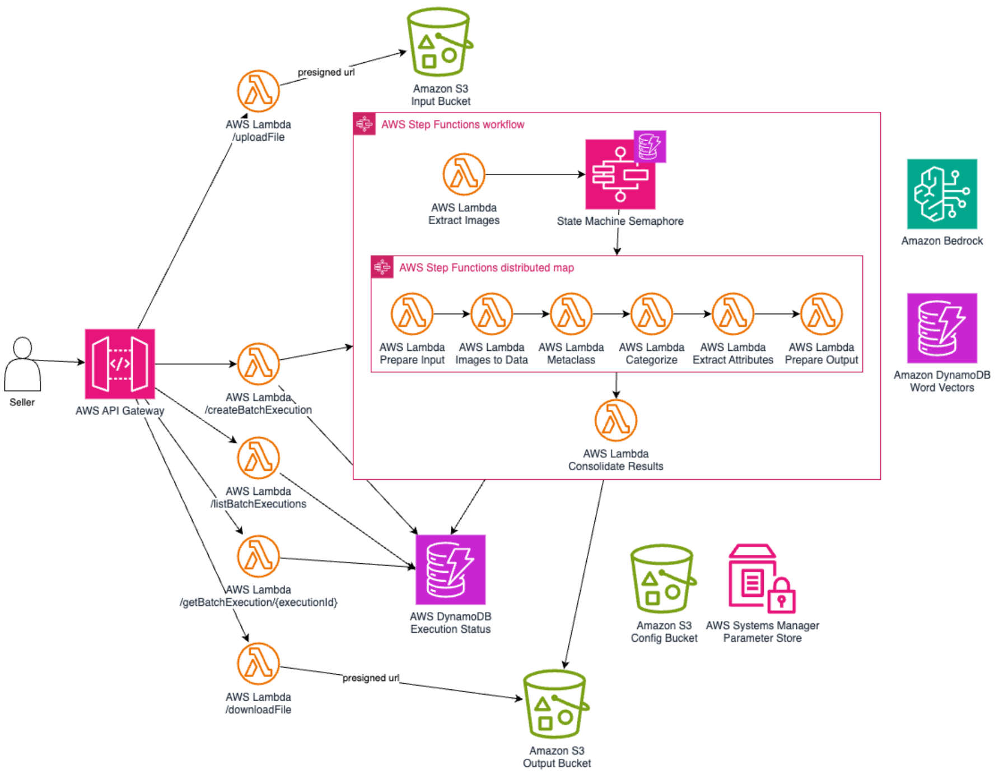

<!-- 
 Copyright Amazon.com, Inc. or its affiliates. All Rights Reserved.
 SPDX-License-Identifier: CC-BY-SA-4.0
 -->

# Smart Product Onboarding

**Content Level: 300**

## Suggested Pre-Reading

* [Prompt Engineering](../../../2_0_technical_foundations_and_patterns/2_3_core_archtectural_concepts/2_3_2_prompt_engineering/index.md)
* [Image Generation Architecture Patterns](../../../3_0_architecture_and_design_patterns/3_1_system_and_application_design_patterns_for_genai/3_1_2_architecture_patterns_by_application_type/3_1_2_3_multimodal_ai_system/3_1_2_3_2_image_generation/image_generation_doc.md)

## TL;DR
The Smart Product Onboarding solution demonstrates an innovative approach to streamline e-commerce product onboarding using generative AI. It automates product categorization, generates product descriptions from images, and extracts attributes using foundation models through Amazon Bedrock. Built on serverless AWS services, such as Amazon DynamoDB, AWS Step Functions, and AWS Lambda, it provides a scalable solution that reduces manual effort while improving catalog consistency and quality. 

## Industry
**Retail**: This cost-effective solution is for Retail customers of all sizes that need efficient product onboarding and standardization for their e-commerce platforms. 

## Business situation
Organizations managing large product catalogs face challenges in maintaining consistent, high-quality product information. Manual product onboarding is time-consuming and error-prone. This process results in inconsistent categorization and incomplete attribute data. Previous attempts to automate this process using traditional rule-based systems or classical machine learning approaches required extensive training data and constant maintenance as product categories evolved. The cost and effort of manual categorization and content creation have become unsustainable as product catalogs grow larger and more complex.

## When to use
Organizations can use this solution when they need to:

* Process large volumes of products efficiently while maintaining consistent categorization and attribute extraction. 
* Adapt to evolving category structures without requiring model retraining. 
* Generate high-quality product content from images and minimal metadata, reducing the manual effort required in content creation while maintaining consistent quality standards.
* Support multiple languages and regional variations in product descriptions through integrated translation and normalization capabilities.

## Benefits
By leveraging the Smart Product Onboarding solution, retail organizations can get the following benefits:

**Business Benefits**

* Reduce manual effort and time required for product onboarding by automating categorization and content generation.
* Improve catalog consistency and quality through standardized categorization and attribute extraction.
* Increase operational efficiency by processing multiple products simultaneously through batch operations.
* Enhance customer experience through better product discoverability and richer product information.
* Enable rapid scaling of product catalogs without proportional increase in operational costs.

**Technology Benefits**

* Provide a serverless, scalable architecture that automatically adjusts to workload demands.
* Offer flexible integration options through API-driven design and support for both single and batch processing.
* Implements efficient bottom-up categorization that adapts to category tree changes without retraining.
* Leverages state-of-the-art AI models without requiring expertise in model training or maintenance.
* Supports multiple languages through integrated translation capabilities.

## Architecture
The Smart Product Onboarding solution consists of three capabilities that work together to provide a comprehensive product onboarding solution. Each capability is designed to work independently or as part of an integrated solution, providing retailers with the flexibility to adopt and customize the elements that best suit their needs. 

### Product Data Generation
The Product Data Generation component automatically generates high-quality product titles and descriptions using product images and optional metadata. By leveraging AI, we aim to streamline the product onboarding process, reduce manual effort, and improve catalog consistency. This approach allows sellers to focus on other important aspects of their business while enabling engaging and informative product listings. This component takes one or more product images as input, along with optional metadata, and produces a concise, engaging product title (up to 60 characters) and an informative product description highlighting key features, benefits, and use cases. The generated content is tailored to the specific product shown in the images, taking into account any provided metadata or styling examples. The output can be customized in terms of language, description length, and tone to suit various e-commerce platforms and product categories.
The process begins with input processing, where the solution receives product images (stored in Amazon S3) and optional metadata. Configuration parameters such as language, description length, and styling examples are also accepted at
this stage. Next, a carefully crafted prompt is constructed, incorporating the product images, metadata, and any provided examples. This prompt includes specific instructions for the AI model on how to generate the title and description.
Once the prompt is prepared, it is sent to Amazon Bedrock. The model processes the input and generates the product title and description. After the AI model completes its task, the response, formatted in XML, is parsed to extract the generated title and description. Finally, the solution returns the generated product data, ready for further processing or storage in the product catalog.

### Bottom-Up Product Categorization
The Bottom-Up Product Categorization component automatically assigns products to the most appropriate category in a large, hierarchical category tree. It leverages artificial intelligence to mimic the way a human expert would categorize products, first identifying the concept of the product and then determining its specific category. By doing so, it reduces the time and effort required in the product onboarding process, improves catalog consistency, and enhances the overall shopping experience for customers.
This component takes a product’s title and description as input and produces a predicted category ID from the existing
category tree, the full path of the predicted category (e.g., “Electronics > Computers > Laptops”), and an explanation for why this category was chosen. The categorization process is designed to work with complex, multi-level category trees containing thousands of possible categories. It can handle a wide range of products, from common items with straightforward descriptions to niche products that require more nuanced understanding.

The categorization process occurs in three main stages. 

* It rephrases the product title using a large language model (LLM) and analyzes it to identify keywords or concepts (called “metaclasses”) that give a broad indication of what the product is. This step narrows down the possible categories from thousands to a more manageable number. 
* Using the identified metaclasses, along with the full product title and description, it employs an LLM to predict the most appropriate specific category. The LLM is given a carefully crafted prompt that includes the possible categories and instructions on how to make the selection. 
* It confirms that the LLM’s prediction is a valid category, and then outputs the result along with an explanation.

### Attribute Extraction
The Attribute Extraction is an important component of the Smart Product Onboarding solution, building on the bottom-up product categorization process. It automatically extracts relevant attributes from product information based on category-specific attribute schemas, enhancing the richness and consistency of product data. This process improves searchability and the overall customer experience in e-commerce platforms.
Given a product’s title, description, predicted category from the categorization task, and optional metadata, the attribute extraction component produces a list of extracted attributes and their values. These attributes are based on the specific schema for the predicted category, enabling relevance and accuracy.
The process begins with schema retrieval, where the component fetches the corresponding attribute schema for the predicted category. This schema defines the expected attributes for products in that specific category. Next, it constructs a carefully crafted prompt for the AI model. This prompt includes the product information, category details, and the attribute schema. The prompt is then sent to Amazon Bedrock. After receiving the model’s response in XML format, the component parses it to extract the identified attributes and their values. Finally, a basic validation is performed to confirm the extracted attributes conform to the expected schema.

### End-to-end process
To onboard products, organizations can use this solution in two ways: 

#### Single Product Onboarding
The solution provides an API that allows users to onboard individual products using a step-by-step wizard interface.
The user starts by uploading product images and entering metadata about the product. Users can select the language, description length, and AI model. To help ensure brand consistency, users can input example products that direct the solution to match their established tone and style. The solution then generates a product title and description for user review and editing. It analyzes the product, assigns it to the correct catalog classification, and identifies search attributes that connect customers to the product. The user verifies the complete product profile before launching it in their catalog. 

#### Batch Product Onboarding
The solution allows users to onboard multiple products at once using CSV files and an optional ZIP archive of product images. The solution first validates the CSV structure and required fields, confirming each record contains title and description, or images. The batch process supports parallel processing to onboard multiple products simultaneously using AWS Step Functions. AWS Lambda functions handle each stage of the workflow. The solution allows users to monitor progress through the frontend interface. Upon completion, the solution aggregates all processed records into a downloadable CSV that contains the AI-generated content, classifications, and extracted attributes. 

**AWS Services Used:**

* Amazon Bedrock provides foundation models for content generation, categorization, and attribute extraction.
* AWS Step Functions to orchestrate batch processing workflows, enabling parallel processing of multiple products. 
* AWS Lambda handles serverless compute for all processing components.
* Amazon API Gateway provides RESTful APIs for both single-product and batch operations. 
* Security is implemented through Amazon Cognito for user authentication and AWS WAF for API endpoints protection.
* Data persistence is handled through Amazon S3 for product images and data files.
* Amazon DynamoDB stores the state of workflow executions.
* Amazon CloudWatch provides comprehensive monitoring and logging capabilities.

## Gen AI patterns used
The solution implements the following generative AI patterns:

* The prompt for the AI model uses [**Prompt Engineering**](../../../2_0_technical_foundations_and_patterns/2_3_core_archtectural_concepts/2_3_2_prompt_engineering/2_3_2-7_composition/composition.md#design-patterns) techniques like chain-of-thought and few-shot prompting to guide the model to make decisions similar to how a human expert would, considering various aspects of the product and the potential categories.
* [**Multi-modal processing**](../../../3_0_architecture_and_design_patterns/3_1_system_and_application_design_patterns_for_genai/3_1_2_architecture_patterns_by_application_type/3_1_2_3_multimodal_ai_system/3_1_2_3_2_image_generation/image_generation_doc.md) combines image analysis with text generation in the product data generation component.

## AWS Well-Architected Best Practices

### Operational Excellence

#### [GENOPS02-BP01: Monitor all application layers](https://docs.aws.amazon.com/wellarchitected/latest/generative-ai-lens/genops02-bp01.html){:target="_blank" rel="noopener noreferrer"}
The solution tracks model performance metrics, workflow execution statistics, and resource utilization patterns. This monitoring enables rapid identification and resolution of processing bottlenecks while maintaining optimal performance.

#### [GENOPS02-BP02: Monitor foundation model metrics](https://docs.aws.amazon.com/wellarchitected/latest/generative-ai-lens/genops02-bp02.html){:target="_blank" rel="noopener noreferrer"}
The solution implements comprehensive monitoring across all foundation model interactions in Amazon Bedrock. CloudWatch metrics track key performance indicators including invocation counts, latency, token usage, and error rates. 

#### [GENOPS04-BP01: Automate generative AI application lifecycle with infrastructure as code (IaC)](https://docs.aws.amazon.com/wellarchitected/latest/generative-ai-lens/genops04-bp01.html){:target="_blank" rel="noopener noreferrer"}
The solution uses infrastructure as code deployment patterns for generative AI applications through AWS CDK.

### Security

#### [GENSEC01-BP03: Implement least privilege access permissions for foundation models accessing data stores](https://docs.aws.amazon.com/wellarchitected/latest/generative-ai-lens/gensec01-bp03.html){:target="_blank" rel="noopener noreferrer"}
The solution implements strict access controls for data stores and foundation model access through IAM policies and roles.

### Reliability

#### [GENREL03-BP01: Use logic to manage prompt flows and gracefully recover from failure](https://docs.aws.amazon.com/wellarchitected/latest/generative-ai-lens/genrel03-bp01.html){:target="_blank" rel="noopener noreferrer"}
The solution implements custom exceptions to manage retries in the Step Functions state machine. This approach helps handle potential issues and improves the overall reliability of the process.

### Performance Efficiency

#### [GENPERF02-BP03: Select and customize the appropriate model for your use case](https://docs.aws.amazon.com/wellarchitected/latest/generative-ai-lens/genperf02-bp03.html){:target="_blank" rel="noopener noreferrer"}
The solution demonstrates careful model selection for different tasks, choosing specific models based on their capabilities and performance requirements.

### Cost Optimization

#### [GENCOST02-BP01: Balance cost and performance when selecting inference paradigms](https://docs.aws.amazon.com/wellarchitected/latest/generative-ai-lens/gencost02-bp01.html){:target="_blank" rel="noopener noreferrer"}
With this solution, your organization can select foundation models and hosting options based on workload requirements and cost considerations.

### Sustainability

#### [GENSUS01-BP01: Implement auto scaling and serverless architectures to optimize resource utilization](https://docs.aws.amazon.com/wellarchitected/latest/generative-ai-lens/gensus01-bp01.html){:target="_blank" rel="noopener noreferrer"}
Serverless AWS services, such as Amazon DynamoDB, Amazon Bedrock, AWS Step Functions, and AWS Lambda, automatically scale resources based on demand, optimizing resource utilization.

#### [GENSUS03-BP01: Leverage smaller models to reduce carbon footprint](https://docs.aws.amazon.com/wellarchitected/latest/generative-ai-lens/gensus03-bp01.html){:target="_blank" rel="noopener noreferrer"}
The solution demonstrates thoughtful model selection by using smaller, more efficient models when appropriate for specific tasks.

## Design tradeoffs
The architecture involves several key design considerations:

* This solution leverages bottom-up product categorization powered. It starts with specific concepts (metaclasses) and moves to broader categories, to mimic how human experts often categorize products. This approach helps avoid the cascading errors that can occur in top-down methods where a mistake at a high level leads to the wrong categorization. 
* The extraction of multiple attributes simultaneously requires an understanding of context and relationships within the product information. While a smaller model was initially considered, it would have required multiple API calls: one for each attribute. By leveraging the capabilities of an advanced model, the solution can extract all attributes in a single call, reducing API usage and improving latency.
* While the attribute extraction component is implemented as an AWS Lambda function, allowing it to handle large volumes of products, it is important to note that the overall scalability is constrained by the rate limits of the model you select. This means there is an upper limit to the number of products that can be processed within a given time frame.

## Common customizations
Customers are encouraged to customize this solution to meet their specific requirements and production needs. Common customizations include:

* **AI Models**: This solution can be adapted to use other models available through Amazon Bedrock. 
* **Generated content**: The output can be customized in terms of language, description length, and tone to suit various e-commerce platforms and product categories.
* **Categorization**: Prompts can be modified to include domain-specific instructions or to emphasize certain aspects of categorization. Including examples of correct categorizations and detailed category descriptions in the prompt can help guide the AI model, especially for complex or ambiguous product types.
* **Category descriptions**: It is important to have clear and concise category descriptions. The solution uses the GS1 Global Product Categorization (GPC) as an example where descriptions are provided. For custom category trees, it is worth investing time in writing good descriptions as they improve the AI model’s understanding and categorization accuracy.
* **Language support**: Leveraging Amazon Nova Micro’s translation capabilities, the solution can process products in any supported language while maintaining its categorization accuracy and efficiency.

## Further Reading

* [Smart Product Onboarding - Github repository](https://github.com/aws-samples/aws-smart-product-onboarding){:target="_blank" rel="noopener noreferrer"}

## Contributors
**Author:** Guillermo Tantachuco - Principal AI Technologist 

**Reviewer** Jeff Strunk - Prototyping Architect, PACE 
