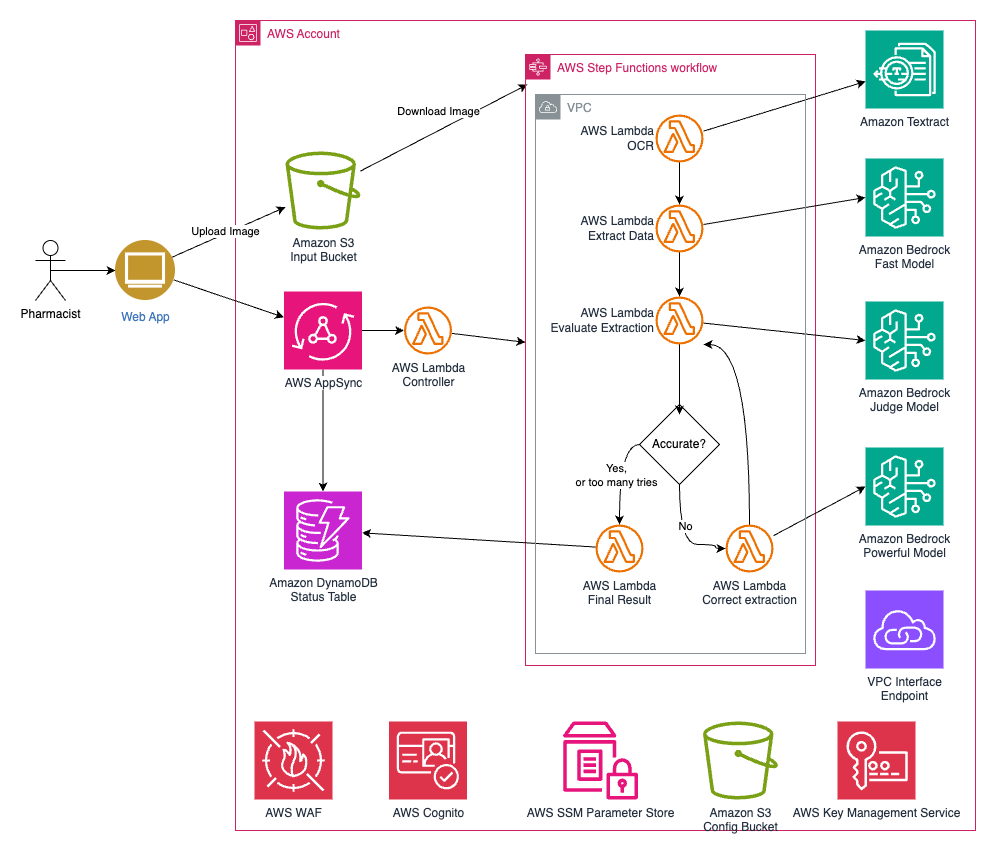
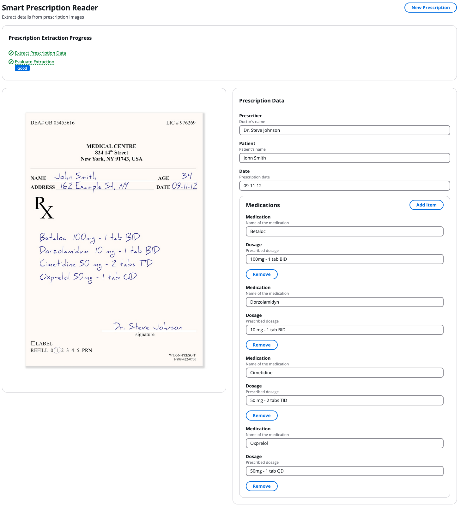

<!-- 
 Copyright Amazon.com, Inc. or its affiliates. All Rights Reserved.
 SPDX-License-Identifier: CC-BY-SA-4.0
 -->
# Smart Prescription Reader

**Content Level: 300**

## Suggested Pre-Reading

## TL:DR
The Smart Prescription Reader solution leverages generative AI to extract structured data from prescription images using AWS Bedrock foundation models. The solution employs a multi-stage AI approach with specialized models for extraction, evaluation, and correction, ensuring high accuracy while optimizing for cost and performance. Built on serverless AWS services including Step Functions, Lambda, and AppSync, it provides a scalable architecture with built-in security controls for handling sensitive medical information

## Industry
**Healthcare**: This solution showcases how healthcare organizations can streamline the process of extracting and standardizing medical information, such as converting handwritten or scanned notes into structured data.

## Business situation
Healthcare organizations face significant challenges in managing and processing unstructured data efficiently and accurately. Manual data entry is time-consuming, error-prone, and requires substantial human resources. Previous attempts to automate this process using traditional OCR solutions often struggled with varying handwriting styles, complex medical terminology, and the need for high accuracy when dealing with healthcare data. Traditional solutions could not understand context and correct errors intelligently, leading to high rejection rates requiring manual review. The Smart Prescription Reader addresses these challenges through an innovative multi-stage pipeline that combines OCR with generative AI for intelligent extraction, validation, and correction of prescription data.

## When to use
The smart prescription reader is ideal for organizations that need to 

* Automate and streamline the process of converting handwritten or scanned notes into structured data.
* Prepare unstructured healthcare data for integration with electronic health record systems.

## Benefits
Digital data plays a crucial role in advancing health research and care; however, most digital data in healthcare is typically in an unstructured format and not readily accessible in a unified and structured format, such as a table. 
This solution tackles the challenge of extracting structured data from prescription images through a systematic approach that mirrors how a human would process the same information

**Business benefits**

The solution reduces manual data entry requirements, enabling staff to focus on higher-value tasks without replacing humans in the loop, such as reviewing the output

**Technology benefits**

The serverless architecture automatically scales to handle varying workload demands without manual intervention. The multi-stage AI approach optimizes cost and performance by using appropriate models for each processing stage. Built-in prompt caching reduces response times and API costs for frequently processed content. The solution's event-driven design enables easy integration with existing systems through GraphQL APIs. Comprehensive security controls protect sensitive medical data throughout the processing pipeline.

## Architecture

The Smart Prescription Reader implements a multi-stage processing pipeline leveraging several AWS managed services to ensure reliable and secure prescription data extraction. The architecture is designed around serverless principles to provide automatic scaling and cost optimization.

**Component Architecture**: The solution uses AWS AppSync to provide a GraphQL API interface, secured by Amazon Cognito for user authentication. AWS Step Functions orchestrates the multi-step processing workflow, coordinating between various Lambda functions that handle image upload, data extraction, quality evaluation, and correction tasks.

**Integration Architecture**: The system integrates with Amazon Textract for initial OCR processing and Amazon Bedrock for accessing foundation models used in extraction, evaluation, and correction stages. Data storage utilizes S3 buckets for prescription images and configuration files, while DynamoDB manages job status and results.

**Data Flow Architecture**: When a prescription image is uploaded, it triggers a workflow that begins with OCR processing through Textract. The extracted text is then processed by a Bedrock model for initial data extraction. A separate evaluation model assesses the quality of extracted data, triggering additional processing by a more powerful model if corrections are needed.

**Deployment Architecture**:  For enhanced security, VPC endpoints provide private access to AWS services, eliminating the need for internet connectivity. All components use KMS encryption for data protection, and the entire stack is deployed using AWS CDK for infrastructure as code.

#

## End user experience

## AWS Services Used:

- Amazon Bedrock provides foundation models for text extraction, evaluation, and correction tasks. Models are selected based on task complexity and performance requirements.
- AWS Step Functions orchestrates the multi-stage processing workflow, managing state transitions and error handling across the pipeline.
- Amazon AppSync delivers a scalable GraphQL API interface for frontend integration, with built-in security and real-time capabilities.
- AWS Lambda executes serverless functions for various processing tasks, automatically scaling to meet demand.
- Amazon DynamoDB stores job status and results with automatic scaling and consistent performance.
- Amazon S3 securely stores prescription images and configuration files with encryption at rest.
- Amazon Cognito handles user authentication and access control across the application.
- AWS CloudWatch provides comprehensive monitoring and logging capabilities.
- AWS KMS manages encryption keys for sensitive data protection.

## Gen AI patterns used
The solution implements the following generative AI patterns:

* The prompt for the AI model uses [**Prompt Engineering**](../../../2_0_technical_foundations_and_patterns/2_3_core_archtectural_concepts/2_3_2_prompt_engineering/2_3_2-7_composition/composition.md#design-patterns) techniques like chain-of-thought and few-shot prompting to guide the model to make decisions similar to how a human expert would, considering various aspects of the product and the potential categories.
* [**Multi-modal processing**](../../../3_0_architecture_and_design_patterns/3_1_system_and_application_design_patterns_for_genai/3_1_2_architecture_patterns_by_application_type/3_1_2_3_multimodal_ai_system/3_1_2_3_2_image_generation/image_generation_doc.md) combines image analysis with text generation in the product data generation component.

## AWS Well-Architected Best Practices

### Operational Excellence

#### [GENOPS02-BP01: Monitor all application layers](https://docs.aws.amazon.com/wellarchitected/latest/generative-ai-lens/genops02-bp01.html){:target="_blank" rel="noopener noreferrer"}
The solution tracks model performance metrics, workflow execution statistics, and resource utilization patterns. This monitoring enables rapid identification and resolution of processing bottlenecks while maintaining optimal performance.

#### [GENOPS02-BP02: Monitor foundation model metrics](https://docs.aws.amazon.com/wellarchitected/latest/generative-ai-lens/genops02-bp02.html){:target="_blank" rel="noopener noreferrer"}
The solution implements comprehensive monitoring across all foundation model interactions in Amazon Bedrock. CloudWatch metrics track key performance indicators including invocation counts, latency, token usage, and error rates. 

#### [GENOPS04-BP01: Automate generative AI application lifecycle with infrastructure as code (IaC)](https://docs.aws.amazon.com/wellarchitected/latest/generative-ai-lens/genops04-bp01.html){:target="_blank" rel="noopener noreferrer"}
The solution uses infrastructure as code deployment patterns for generative AI applications through AWS CDK.

### Security

#### [GENSEC01-BP03: Implement least privilege access permissions for foundation models accessing data stores](https://docs.aws.amazon.com/wellarchitected/latest/generative-ai-lens/gensec01-bp03.html){:target="_blank" rel="noopener noreferrer"}
The solution implements strict access controls for data stores and foundation model access through IAM policies and roles.

### Reliability

#### [GENREL03-BP01: Use logic to manage prompt flows and gracefully recover from failure](https://docs.aws.amazon.com/wellarchitected/latest/generative-ai-lens/genrel03-bp01.html){:target="_blank" rel="noopener noreferrer"}
The solution implements custom exceptions to manage retries in the Step Functions state machine. This approach helps handle potential issues and improves the overall reliability of the process.

### Performance Efficiency

#### [GENPERF02-BP03: Select and customize the appropriate model for your use case](https://docs.aws.amazon.com/wellarchitected/latest/generative-ai-lens/genperf02-bp03.html){:target="_blank" rel="noopener noreferrer"}
The solution demonstrates careful model selection for different tasks, choosing specific models based on their capabilities and performance requirements.

### Cost Optimization

#### [GENCOST02-BP01: Balance cost and performance when selecting inference paradigms](https://docs.aws.amazon.com/wellarchitected/latest/generative-ai-lens/gencost02-bp01.html){:target="_blank" rel="noopener noreferrer"}
With this solution, your organization can select foundation models and hosting options based on workload requirements and cost considerations.

### Sustainability

#### [GENSUS01-BP01: Implement auto scaling and serverless architectures to optimize resource utilization](https://docs.aws.amazon.com/wellarchitected/latest/generative-ai-lens/gensus01-bp01.html){:target="_blank" rel="noopener noreferrer"}
Serverless AWS services, such as Amazon DynamoDB, Amazon Bedrock, AWS Step Functions, and AWS Lambda, automatically scale resources based on demand, optimizing resource utilization.

#### [GENSUS03-BP01: Leverage smaller models to reduce carbon footprint](https://docs.aws.amazon.com/wellarchitected/latest/generative-ai-lens/gensus03-bp01.html){:target="_blank" rel="noopener noreferrer"}
The solution demonstrates thoughtful model selection by using smaller, more efficient models, such as Claude Haiku, when appropriate for specific tasks.

## Design tradeoffs
The architecture involves several key design considerations:
Model Selection vs Cost:
The multi-stage approach uses different models based on task complexity. While this increases architectural complexity, it optimizes cost by reserving more expensive models for complex cases requiring correction.

Processing Speed vs Accuracy:
The solution prioritizes accuracy over raw speed by implementing multiple validation stages. This tradeoff ensures high-quality output while maintaining reasonable processing times through optimization techniques like prompt caching.

Architectural Complexity vs Flexibility:
The serverless, event-driven architecture increases initial complexity but provides better scalability and maintenance in production environments.

## Common customizations

## Contributors
**Author:** Tonny Ouma - Applied AI  

**Reviewer** Jeff Strunk - Prototyping Architect, PACE 