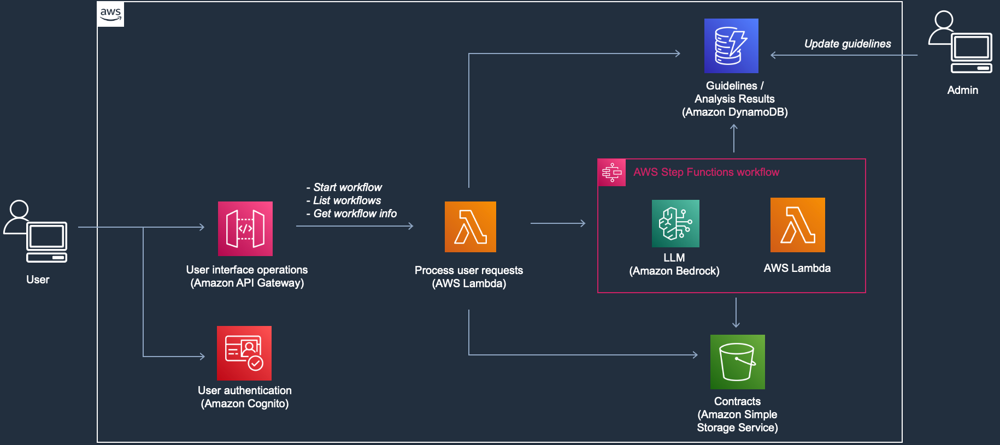
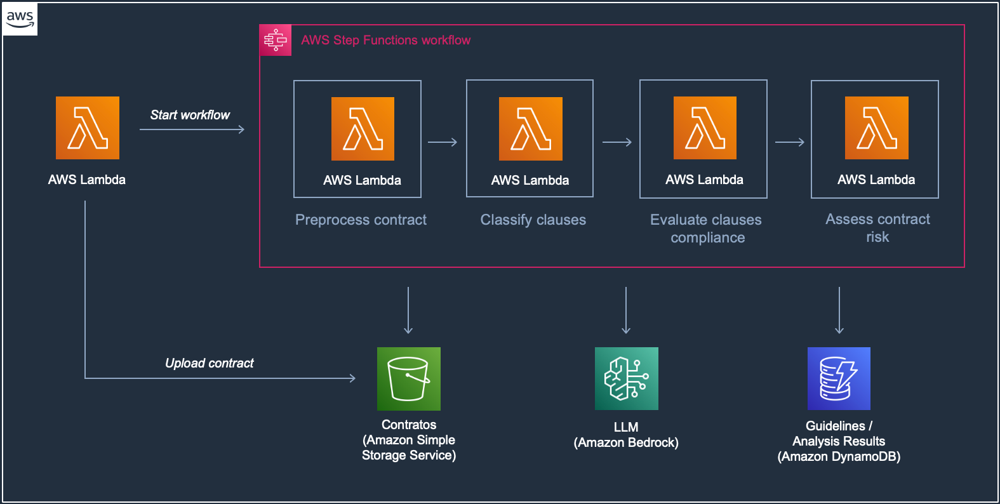

<!-- 
 Copyright Amazon.com, Inc. or its affiliates. All Rights Reserved.
 SPDX-License-Identifier: CC-BY-SA-4.0
 -->

# Automated Contract Compliance Analysis

**Content Level: 300**

## Suggested Pre-Reading
* [AWS Step Functions Workflow Design](https://docs.aws.amazon.com/step-functions/latest/dg/concepts-nested-workflows.html){:target="_blank" rel="noopener noreferrer"}

## TL;DR
This solution automates contract compliance analysis using generative AI to evaluate contract clauses against predefined guidelines. It leverages Amazon Bedrock and supported foundation models to systematically split contracts, classify clauses, assess compliance, and generate risk assessments. The architecture implements a serverless workflow using AWS Step Functions, Lambda, and DynamoDB to process contracts either individually or in batch, reducing manual review time while maintaining accuracy.

## Industry
**Cross-industry**: the solution serves organizations with significant contract analysis requirements, including but not limited to:

* Legal departments and law firms managing large volumes of contracts.
* Compliance teams in regulated industries.
* Financial services organizations reviewing agreements.
* Healthcare providers managing complex contracts.
* Procurement departments standardizing supplier agreements.
* Government agencies enforcing regulatory compliance.
* Insurance companies evaluating policy documents.
* Real estate organizations processing lease agreements.

## Business situation
Organizations face challenges in manually reviewing contracts for compliance with internal guidelines and regulations. Traditional contract review processes are:

* **Time-consuming**: Legal experts spend hours evaluating individual clauses against established standards, creating bottlenecks in contract processing.
* **Error-prone**: Manual review can miss important non-compliant clauses, especially in complex contracts with interdependencies.
* **Inconsistent**: Different reviewers may interpret guidelines differently, leading to varying compliance assessments.
* **Resource-intensive**: Skilled legal professionals spend time on routine compliance checks rather than higher-value strategic work.

## When to use
This solution can help organizations:

* Process high volumes of contracts requiring compliance review.
* Implement consistent compliance criteria across the organization.
* Support multi-language contract analysis requirements.

## Benefits
The solution delivers the following benefits through AI-powered automation:

**Business Benefits**

* Improves consistency in compliance evaluations.
* Enables scalable contract processing without proportional staffing increases.
* Allows legal experts to focus on complex cases.
* Reduces risk through systematic compliance checking.
* Enhances visibility into contract portfolio risks.
* Supports faster contract turnaround times.
* Enables proactive risk management.

**Technology Benefits**

* Implements natural language processing for legal documents.
* Provides integration through REST APIs.
* Enables customization of evaluation criteria.
* Leverages serverless architecture for automatic scaling.
* Enables workflow automation through Step Functions.

## Architecture
The solution has a user interface that connects to an AWS Lambda function through Amazon API Gateway to handle incoming requests. The Lambda function interfaces with an AWS Step Functions workflow. It manages three operations: starting workflows, listing workflows, and retrieving workflow information. Contracts are stored in Amazon S3, while analysis results are maintained in Amazon DynamoDB. The solution leverages a foundation model through Amazon Bedrock for contract analysis. An administrator imports into the solution predefined guidelines for contracts. These guidelines define all expected contract clause types and the standard wording for each clause type.

The solution implements a four-stage workflow for contract analysis as described below:

* **Preprocessing Stage**: The solution uses a foundation model from Amazon Bedrock to split contracts into clauses and each clause is stored in DynamoDB. The preprocessing Lambda function processes plain text files without formatting assumptions, enabling processing of contracts from multiple sources.

* **Classification Stage**: The clause classification process employs a prompt engineering approach that evaluates all possible clause types simultaneously. Through a Step Functions-orchestrated loop, the solution can process multiple clauses at a time. Said number of clauses can be configured to meet your organization’s needs. Classification results, including the model's reasoning, are stored in DynamoDB for transparency and audit purposes.

* **Evaluation Stage**: The solution evaluates each clause against predefined guidelines through a Question-Answering approach. The Lambda function retrieves clause text, context, and classification results from DynamoDB, then constructs prompts that include binary evaluation questions. The solution stores results with compliance assessments and rationale.

* **Risk Assessment Stage**: The final stage implements a nuanced risk calculation algorithm considering both non-compliant clauses and missing required clauses. The solution uses a risk matrix that factors in impact levels (low, medium, high) and compliance status (compliant, non-compliant, missing) to determine overall contract risk.

**AWS Services Used:**

* Amazon Bedrock provides foundation models for natural language processing.
* AWS Step Functions orchestrates the multi-stage analysis workflow.
* AWS Lambda handles processing steps and API requests.
* Amazon DynamoDB stores guidelines, clauses, and analysis results.
* Amazon S3 stores contract documents.
* Amazon API Gateway exposes REST APIs.
* Amazon Cognito manages user authentication.
* AWS CloudWatch enables monitoring and logging.
* AWS CloudFormation manages infrastructure deployment.

## Gen AI patterns used
The solution implements the following generative AI patterns that work together to enable accurate and efficient contract analysis:

* [**Workflow Orchestration**](../../../3_0_architecture_and_design_patterns/3_1_system_and_application_design_patterns_for_genai/3_1_1_foundation_architecture_components/3_1_1_2_application_engine/index.md): The solution breaks down complex AI tasks into discrete stages (preprocessing, classification, evaluation, risk assessment) and uses Step Functions to orchestrate the workflow between different AI operations.
* [**Prompt Engineering**](../../../2_0_technical_foundations_and_patterns/2_3_core_archtectural_concepts/2_3_2_prompt_engineering/index.md): A structured approach to clause classification that evaluates all possible types simultaneously, combined with using Question-Answering format for compliance evaluation.

## AWS Well-Architected Best Practices

### Security Pillar

#### [GENSEC01-BP01: Grant least privilege access to foundation model endpoints](https://docs.aws.amazon.com/wellarchitected/latest/generative-ai-lens/gensec01-bp01.html){:target="_blank" rel="noopener noreferrer"}

The solution implements Amazon Cognito for user authentication and Amazon API Gateway for secure API access. This provides a robust identity foundation for controlling access to the solution and its components.

### Reliability Pillar

#### [GENREL03-BP01: Use logic to manage prompt flows and gracefully recover from failure](https://docs.aws.amazon.com/wellarchitected/latest/generative-ai-lens/genrel03-bp01.html){:target="_blank" rel="noopener noreferrer"}
Through orchestrated Step Functions, the solution manages complex prompt sequences with built-in state management, concurrency control, and error handling for reliable processing of contract analysis tasks.

### Performance Efficiency Pillar

#### [GENPERF02-BP03: Select and customize the appropriate model for your use case](https://docs.aws.amazon.com/wellarchitected/latest/generative-ai-lens/genperf02-bp03.html){:target="_blank" rel="noopener noreferrer"}
The solution can use any foundation models from Amazon Bedrock, such as Amazon Nova.

### Cost Optimization Pillar

#### [GENCOST02-BP01: Balance cost and performance when selecting inference paradigms](https://docs.aws.amazon.com/wellarchitected/latest/generative-ai-lens/gencost02-bp01.html){:target="_blank" rel="noopener noreferrer"}
With this solution, your organization can select foundation models, such as Amazon Nova, based on workload requirements and cost considerations.

### Sustainability Pillar

#### [GENSUS01-BP01: Implement auto scaling and serverless architectures to optimize resource utilization](https://docs.aws.amazon.com/wellarchitected/latest/generative-ai-lens/gensus01-bp01.html){:target="_blank" rel="noopener noreferrer"}
The solution leverages serverless and fully-managed services throughout, including Amazon Bedrock, AWS Step Functions, Amazon API Gateway, and AWS Lambda, so that resources are only consumed when needed.

### Operational Excellence Pillar

#### [GENOPS02-BP01: Monitor all application layers](https://docs.aws.amazon.com/wellarchitected/latest/generative-ai-lens/genops02-bp01.html){:target="_blank" rel="noopener noreferrer"}
The solution tracks model performance metrics, workflow execution statistics, and resource utilization patterns. This monitoring enables rapid identification and resolution of processing bottlenecks while maintaining optimal performance.

#### [GENOPS02-BP02: Monitor foundation model metrics](https://docs.aws.amazon.com/wellarchitected/latest/generative-ai-lens/genops02-bp02.html){:target="_blank" rel="noopener noreferrer"}
The solution implements comprehensive monitoring across all foundation model interactions in Amazon Bedrock. CloudWatch metrics track key performance indicators including invocation counts, latency, token usage, and error rates. 

#### [GENOPS04-BP01: Automate generative AI application lifecycle with infrastructure as code (IaC)](https://docs.aws.amazon.com/wellarchitected/latest/generative-ai-lens/genops04-bp01.html){:target="_blank" rel="noopener noreferrer"}
The solution uses infrastructure as code deployment patterns for generative AI applications through AWS CDK.

## Design tradeoffs
The solution implements key decision tradeoffs that balance functionality with resource optimization:

* **Model flexibility versus cost efficiency**: the solution provides configuration options to select from models available through the Converse API. To optimize operational costs, Amazon Nova Lite serves as the default model choice.
* **Performance versus resource utilization**: the solution implements prompt caching for clause classification operations when supported by the selected LLM. This caching mechanism helps reduce redundant API calls while maintaining system responsiveness.

## Common customizations

* **Contract types and languages**: This solution is designed to support analysis of contracts of different types and of different languages. 
* **Guideline management**: The solution provides a feature that enables organizations to maintain and evolve their compliance requirements. Through an Excel-based interface, legal experts can define and refine compliance rules, evaluation criteria, and risk thresholds. 
* **Processing pipeline**: Organizations can extend the code base and customize the processing pipeline to address specific requirements, while maintaining the foundational architecture. The preprocessing stage can be enhanced to handle specialized document formats or extract additional metadata. Organizations can implement custom validation rules to address industry-specific compliance requirements. The risk assessment framework can be modified to implement scoring algorithms that reflect organizational risk tolerance. These customizations build on the existing workflow structure, for maintainable and reliable operation.
* **Integration patterns**: Organizations can implement custom endpoints to support specific business processes or integrate with existing document management systems. Authentication mechanisms can be customized to align with enterprise identity management systems. These integration capabilities enable the solution to become an integral part of broader business processes while maintaining security and performance requirements.

## Further Reading

* [Contract Compliance Analysis - Github repository](https://github.com/aws-samples/generative-ai-cdk-constructs-samples/tree/main/samples/contract-compliance-analysis){:target="_blank" rel="noopener noreferrer"}

## Contributors
**Author:** Guillermo Tantachuco - Principal AI Technologist 

**Reviewer** Givanildo Dantas Alves - Sr. Prototyping Architect, PACE 
