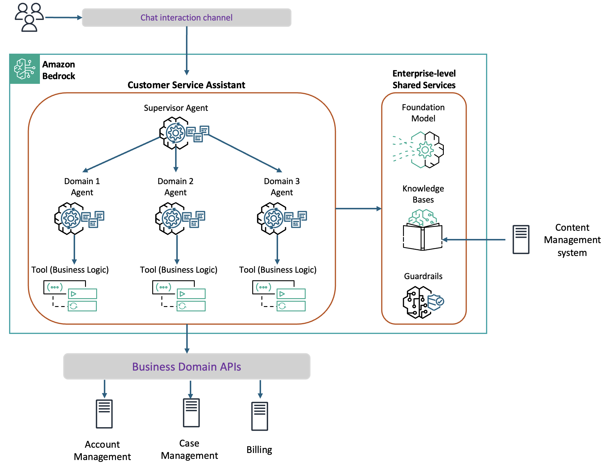

<!-- 
 Copyright Amazon.com, Inc. or its affiliates. All Rights Reserved.
 SPDX-License-Identifier: CC-BY-SA-4.0
 -->

# Customer Service Assistant

**Content Level: 300**

## Suggested Pre-Reading

* [Amazon Bedrock](https://aws.amazon.com/bedrock/){:target="_blank" rel="noopener noreferrer"}
* [Amazon Bedrock Knowledge Bases](https://aws.amazon.com/bedrock/knowledge-bases/){:target="_blank" rel="noopener noreferrer"}
* [Amazon Bedrock Agents](https://aws.amazon.com/bedrock/agents/){:target="_blank" rel="noopener noreferrer"}
* [Amazon Bedrock Guardrails](https://aws.amazon.com/bedrock/guardrails/){:target="_blank" rel="noopener noreferrer"}
* [AWS Lambda](https://aws.amazon.com/lambda/){:target="_blank" rel="noopener noreferrer"}

## TL;DR

The Customer Service Assistant is an AI-powered customer service solution that can handle a wide range of customer inquiries across multiple domains. This solution leverages Amazon Bedrock's foundation models and knowledge base capabilities to create intelligent, tool-using agents that can access information, perform actions, and provide comprehensive assistance to customers.

## Industry

Cross-Industry

## Business situation

Organizations receive millions of customer queries every year, motivating them to build a scalable solution that can fulfill customer requests in real-time and accurately to improve their customer experiences. However, organizations face the following challenges with customer service:

* **Dependence on Live Agents**: There is a heavy dependency on live agent interactions versus self-service options, leading to high operational costs and resource constraints.
* **Fragmented Knowledge Management**: Knowledge bases are typically fragmented across content management and customer relationship systems, creating operational inefficiencies in customer support.
* **Intent-Based System Limitations**: Intent-based knowledge management systems prove inadequate for handling diverse customer queries effectively.
* **Architectural Decision Challenges**: Organizations should determine whether knowledge retrieval and intelligent routing functions perform better as separate coordinated systems or as components of a unified agent architecture.

## When to use

You can use this Amazon Bedrock-based solution when you need to implement an intelligent RAG-based knowledge retrieval system and develop an optimal agent architecture for efficient query handling and action execution.

## Benefits

This solution demonstrates feasibility and effectiveness of an AI-powered customer service solution built on Amazon Bedrock. 

**Business Benefits:**

* **Cost Efficiency**: This solution can handle high volumes of customer interactions efficiently, creating significant savings in operational expenses while maintaining high service standards.
* **24/7 Service**: Your organization remains accessible 24/7, providing instant assistance to customers whenever they need it. 
* **Scalability**: During peak seasons or viral marketing campaigns, this solution can manage sudden increases in customer inquiries. This flexibility enables consistent service quality even during the busiest times.
* **Enhanced Customer Experience**: This solution provides instant, personalized responses to customer questions, offering quick solutions and relevant information. 

**Technology Benefits:**

* **Effective RAG Implementation**: Integration with Amazon Bedrock Knowledge Base provides accurate information retrieval with optimized parameters, achieving high recall with high answer quality.
* **Specialized Agent Architecture**: The multi-agent approach with domain-specific sub-agents demonstrates superior performance and efficiency compared to the single-agent approach.
* **Reduced Complexity per Agent**: Each sub-agent has a smaller, more focused prompt and tool set, reducing token usage and improving efficiency.

## Architecture

This architecture is based on the principle of specialization and separation of concerns. This approach divides responsibilities among multiple specialized agents, each focusing on a specific domain. It leverages foundation models, knowledge bases integration, and tool-using capabilities to provide comprehensive assistance to customers across multiple domains.

The solution relies on the following Amazon Bedrock enterprise-level services:

* **Foundation Model**: It handles natural language understanding and generation. Agents use foundation models as their reasoning engine to create intelligent, autonomous systems.
* **Knowledge Bases**: The architecture is built around Knowledge Bases, which provides vector search capabilities for retrieving relevant documents based on semantic similarity. The knowledge base helps your organization include only highly relevant documents in the context provided to the foundation model.
* **Guardrails**: Enforce your responsible AI policies by blocking topics and language that deviate from the goals of the experience.

The Customer Service Assistant leverages a multi-agent architecture, which helps reduce prompt size and improve specialization. This architecture consists of:

* **Supervisor agent**: It routes each request to the most appropriate specialized agent based on the query's domain, and manages the conversation flow. Also, it detects escalation messages from sub-agents and tracks which agents have been tried to avoid routing loops.
* **Sub-agents**: Specialized sub-agents are organized in specific domains of functionality. Clear boundaries between domains allow for more focused and efficient handling of customer queries. Each agent only has access to the tools and knowledge relevant to its domain. Each sub-agent can escalate queries they cannot handle to the supervisor agent for re-routing.
* **Tools**: Tools enable agents to perform various operations related to customer service. The agent can invoke the knowledge base tool to retrieve relevant documents when it determines that additional information is needed to answer a user query. The agent can use domain-specific tools to call APIs to provide customer assistance such as getting account information, manage paperless billing settings, or opening a support case. 

When the solution reaches its limits (maximum tool calls or total foundation model calls), users are informed that their request requires additional assistance and has been escalated to the support team.

**AWS Services Used:**
- Amazon Bedrock for gen AI models, knowledge bases, guardrails, and agents
- AWS Lambda for tool processing
- Amazon CloudWatch for monitoring and logging

## Gen AI patterns used

* [Multi-agent architecture](../../../2_0_technical_foundations_and_patterns/2_3_core_archtectural_concepts/2_3_7_agents_and_autonomous_systems/2_3_7-3_workflow_agents/design_patterns.md)
* [Retrieval Augmented Generation (RAG)](../../../2_0_technical_foundations_and_patterns/2_3_core_archtectural_concepts/2_3_3_RAG%28retrieval%20Augmented%20Generation%29/2_3_3-4-Advanced_RAG_patterns/2.3.3.4%20Advanced%20RAG%20Patterns.md)

## AWS Well-Architected Best Practices

These are the primary AWS Well-Architected best practices that this solution addresses:

### Security
#### [GENSEC02-BP01 Implement guardrails to mitigate harmful or incorrect model responses](https://docs.aws.amazon.com/wellarchitected/latest/generative-ai-lens/gensec02-bp01.html){:target="_blank" rel="noopener noreferrer"}

The solution detects hallucinations via: 

* **Sentence-Level Analysis**: The framework identifies specific sentences in the generated answer that contain information not found in the retrieved articles or system prompt.
* **Explanation Generation**: For each hallucinated sentence, the system provides an explanation of why it's considered a hallucination.

### Cost optimization
#### [GENCOST03-BP01 Reduce prompt token length](https://docs.aws.amazon.com/wellarchitected/latest/generative-ai-lens/gencost03-bp01.html){:target="_blank" rel="noopener noreferrer"}

A serverless architecture, a more focused prompt, and a reduced token usage translate to lower operational costs.

### Reliability
#### [GENREL03-BP01 Use logic to manage prompt flows and gracefully recover from failure](https://docs.aws.amazon.com/wellarchitected/latest/generative-ai-lens/genrel03-bp01.html){:target="_blank" rel="noopener noreferrer"}

The Supervisor agent includes error handling for routing decisions and sub-agent responses, with a default agent as the fallback mechanism so that the conversation continues even if errors occur. To enable reliable and predictable behavior, agents and tools provide robust error handling for:

* AWS service errors
* Tool execution failures
* Maximum tool call limits
* General exceptions during processing

### Performance efficiency
#### [GENPERF01-BP02 Collect performance metrics from generative AI workloads](https://docs.aws.amazon.com/wellarchitected/latest/generative-ai-lens/genperf01-bp02.html){:target="_blank" rel="noopener noreferrer"}

The solution tracks metrics such as the number of documents retrieved and the time taken for retrieval operations, which are useful for performance optimization.

### Sustainability
#### [GENSUS01-BP01 Implement auto scaling and serverless architectures to optimize resource utilization](https://docs.aws.amazon.com/wellarchitected/latest/generative-ai-lens/gensus01-bp01.html){:target="_blank" rel="noopener noreferrer"}

Amazon Bedrock is a fully-managed service, which means that AWS handles the infrastructure management, scaling, and maintenance. 

## Design tradeoffs

The cornerstone of the design tradeoffs was the adoption of a multi-agent architecture. This architecture allows for easier scaling and updating of specific domains without affecting the entire system, an important factor for evolving customer service needs. These are the key tradeoffs:

* **Slight routing overhead**: Each query is first processed by the supervisor agent before being directed to the appropriate sub-agent. This slight overhead is offset by the benefits of specialized handling and more efficient use of resources.

* **Potential for routing errors**: The supervisor agent may occasionally route queries to the wrong sub-agent, especially for ambiguous or multi-domain queries.

## Common customizations

Organizations implementing this solution might choose to adapt the multi-agent architecture to their specific industry context. Some examples include:

* **Financial services**: Institutions can create specialized sub-agents that align with regulatory requirements and customer interaction patterns. For instance, a wealth management firm might configure a portfolio advisory sub-agent to access real-time market data, integrate with portfolio management systems, and maintain awareness of client risk profiles. This agent would work alongside specialized tax reporting and compliance agents, each maintaining their own security protocols and data access patterns.

* **Healthcare**: Organizations can implement sub-agents specialized in appointment scheduling, medical record access, and insurance verification. These agents require careful configuration of knowledge bases to handle HIPAA compliance, along with specialized tools for interfacing with electronic health record systems and insurance databases. The supervisor agent in healthcare deployments can include additional verification steps to maintain patient privacy and data protection standards.

* **Transportation and logistics**: Companies can customize the solution to handle complex routing and tracking scenarios. They might implement sub-agents specialized in route optimization, delivery exception handling, and customs documentation. These agents can integrate with multiple tracking systems and customs databases, requiring specialized error handling and status monitoring.

* **Education**: Institutions can adapt the system to handle academic inquiries, enrollment processes, and student services. They might implement sub-agents specialized in course registration, financial aid, and academic advising. These implementations include integration with student information systems and learning management platforms.

## Further Reading

* [Build a knowledge base by connecting to a data source](https://docs.aws.amazon.com/bedrock/latest/userguide/knowledge-base-build.html){:target="_blank" rel="noopener noreferrer"}
* [Amazon Bedrock's multi-agent collaboration](https://docs.aws.amazon.com/bedrock/latest/userguide/agents-multi-agent-collaboration.html){:target="_blank" rel="noopener noreferrer"}
* [Detect and filter harmful content by using Amazon Bedrock Guardrails](https://docs.aws.amazon.com/bedrock/latest/userguide/guardrails.html){:target="_blank" rel="noopener noreferrer"}

## Contributors
**Author:** Guillermo Tantachuco - Principal AI Technologist 

**Reviewer** Randy DeFauw - Sr. Principal Solutions Architect 

**Reviewer** Henry Wang - Sr. Applied Scientist, Gen AI Innovation Center 