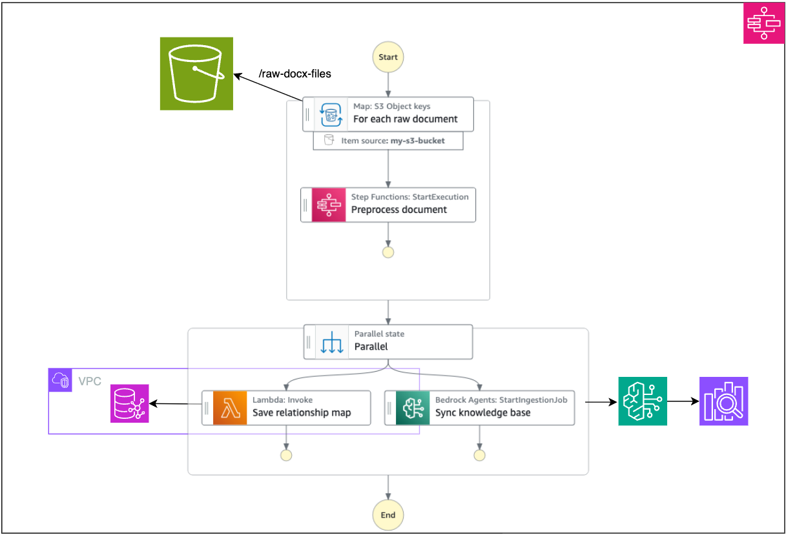
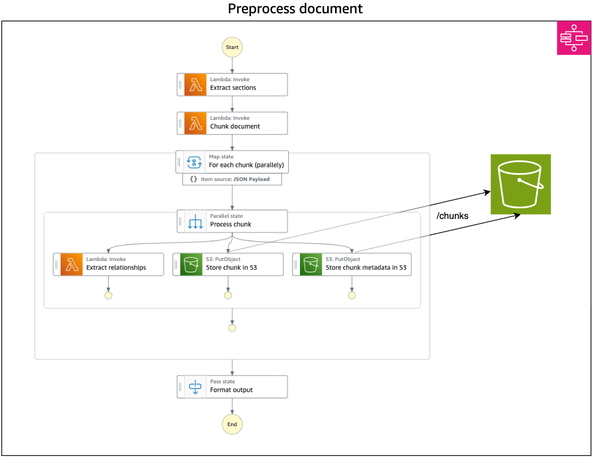
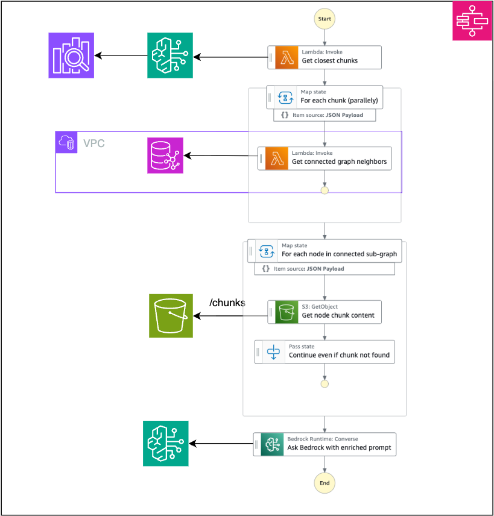

<!-- 
 Copyright Amazon.com, Inc. or its affiliates. All Rights Reserved.
 SPDX-License-Identifier: CC-BY-SA-4.0
 -->

# Dynamic Document Management with GraphRAG

**Content Level: 300**

## Suggested Pre-Reading

* [Advanced RAG Patterns](../../../2_0_technical_foundations_and_patterns/2_3_core_archtectural_concepts/2_3_3_RAG%28retrieval%20Augmented%20Generation%29/2_3_3-4-Advanced_RAG_patterns/2.3.3.4%20Advanced%20RAG%20Patterns.md)
* [Build GraphRAG applications using Amazon Bedrock Knowledge Bases](https://aws.amazon.com/blogs/machine-learning/build-graphrag-applications-using-amazon-bedrock-knowledge-bases/){:target="_blank" rel="noopener noreferrer"}

## TL;DR

Customers need to organize and retrieve thousands of interconnected policies, regulations, contracts, and important documents that frequently change through amendments and updates. To address this need, Amazon Bedrock Knowledge Bases [**supports GraphRAG**](https://docs.aws.amazon.com/bedrock/latest/userguide/knowledge-base-build-graphs.html){:target="_blank" rel="noopener noreferrer"} out-of-the-box. However, it has [**some limitations**](https://docs.aws.amazon.com/bedrock/latest/userguide/knowledge-base-build-graphs.html#knowledge-base-build-graphs-considerations){:target="_blank" rel="noopener noreferrer"}. 
Customers looking for more control and customization capabilities can use the Dynamic Document Management with GraphRAG solution. It implements an approach where nodes represent document chapters. Built on AWS services including Amazon S3, Bedrock Knowledge Bases, and Neptune, this solution transforms what was once a manual process taking hours into an automated solution delivering results in seconds. Organizations benefit from enhanced accuracy, optimized resource allocation, and significantly reduced response times.

## Industry

Cross-Industry

## Business situation

Organizations struggle to organize and retrieve thousands of interconnected policies, regulations, and important documents. Making informed decisions requires understanding not just individual documents, but their complex relationships and dependencies. Traditional document analysis solutions fall short in addressing several key challenges:

* Cross-referencing requirements force employees to manually review multiple documents for each decision, leading to hours of research time and increased risk of oversight or misinterpretation.

* Document versioning creates layers of complexity as new amendments, expansions, and removals modify the interpretation of existing content. This evolving nature of documentation makes maintaining decision accuracy increasingly difficult.

* Quality control demands extensive subject matter expert involvement to validate responses and conduct comprehensive document coverage. This creates operational bottlenecks, delays response times, and increases the risk of providing incomplete information.

## When to use

Use the Dynamic Document Management with GraphRAG solution when traditional text splitting approaches are not sufficient. This solution uses the LLM to intelligently extract coherent sections of the document. This is important because:

* Documents often have complex formatting.
* Sections may contain tables, lists, or other structured content.
* The LLM can understand context and enable each chunk to maintain its logical completeness.

## Benefits

The Dynamic Document Management with GraphRAG solution delivers significant improvements in how organizations handle and extract value from their document collections. These benefits manifest in both business operations and technological capabilities:

**Business Benefits**

* **Transparency and Visibility**: The increased transparency and visibility into document relationships enables early detection of potential conflicts.
* **Response Time and Efficiency**: It reduces query response times from hours to seconds, which enables faster decision-making and improving service delivery across the organization.
* **Enhanced Accuracy and Risk Reduction**: This solution conducts comprehensive analysis of all relevant document, versions, and their modifications, thus reducing the risk of errors from missed amendments or misinterpreted changes.
* **Productivity and Resource Optimization**: It frees subject matter experts from time-consuming manual document reviews, allowing skilled staff to focus on higher-value tasks while improving the quality of responses.

**Technology Benefits**

* **Intelligent Information Retrieval**: GraphRAG combines semantic search capabilities with graph-based relationship analysis to deliver comprehensive results that consider both content similarity and document relationships. GraphRAG resolves multi-chunk query challenges and provides more accurate responses compared to NaiveRAG, which relies solely on  semantic similarity searches.
* **Scalable Architecture**: It leverages serverless workflows and components that automatically scale based on demand, handling increasing document volumes and complexity without requiring infrastructure management. 
* **Source Verification**: It provides citations of the original paragraphs used to answer each question. Users can review these citations to check the quality and accuracy of the response.

## Architecture

The Dynamic Document Management with GraphRAG solution combines semantic search capabilities with graph-based relationship tracking to address the challenges of complex document management. It maintains a web of relationships between document sections and uses the graph database to understand how they modify each other. For instance: "Document B, Section 3 modifies Document A, Section 3".

This architecture processes both document content and relationships through two main stages: preprocessing and inference, which are designed to handle complex document relationships across various industries. The preprocessing and inference stages work together to transform complex document collections into searchable, relationship-aware knowledge bases that can provide rapid, accurate responses to user queries.

**Preprocessing Stage**

The Preprocessing Stage is the initial phase where raw documents are transformed into structured, searchable content with mapped relationships. This stage processes source documents from Amazon S3 through orchestrated steps via AWS Step Functions to extract sections, identify relationships between documents, and prepare the content for efficient retrieval. This stage creates the foundation for rapid and accurate information retrieval during the inference phase. 

For each source document, the preprocessing stage:

* Extracts sections of the document using a Lambda function that calls Bedrock to perform document analysis. As a result, it identifies section markers such as "1", "2", or "3" and their locations in the document.

* For each section,another Lambda function calls Bedrock to extract is actual text content. It creates discrete "chunks" that contain the section's content.

In parallel, for each chunk:

* A Lambda function identifies and extracts relationships between sections across documents.
* Stores chunk and chunk metadata in S3.

Once all files have been processed, this stage:

* Synchronizes Bedrock knowledge base with the chunks that have been uploaded to S3.
* The relationships between these sections are stored in Neptune using a Lambda function.

The result is an enriched knowledge base that captures both the content and the interconnected nature of the documents, enabling the system to understand how newer documents modify, expand, or supersede older versions. 

**Inference Stage**

The Inference Stage is the runtime phase where the system processes user queries and generates responses by leveraging the structured knowledge created during preprocessing. This stage produces two main components in its response: a complete answer that considers all relevant document versions and their relationships; and, supporting citations and references that allow users to verify the source information. This stage combines semantic search, graph traversal, and language model processing to provide accurate, contextualized answers with supporting citations.
When a user submits a query, the inference stage:

* Retrieves top K closest chunks to the query, based on similarity, from the Bedrock Knowledge Base using the Retrieve API.
* For each chunk retrieved, it traverses the Neptune graph to find its 3-hop neighbors.
* For each graph neighbor found, it retrieves its content from S3 and enrich the context with it.
* Sends request with aggregated information to Bedrock to generate a comprehensive response.
* Provides citations and references to source documents for verification.

The inference stage delivers responses in seconds, which represent an improvement over traditional manual processes. Manual processes might require hours given teams review entire documents to trace dependency chains. This stage maintains accuracy while providing rapid responses, enabling organizations to make informed decisions based on the full context of their documented knowledge. This is achieved through parallel processing and efficient data retrieval from the preprocessed knowledge base.

**AWS Services Used:**
This architecture combines the following AWS services into a cohesive system that handles both content discovery and relationship understanding:

* Amazon S3 as the object storage for chunk content and metadata.
* Amazon Bedrock Knowledge Bases with Amazon OpenSearch as the vector database for semantic search capabilities.
* Amazon Neptune as the graph database for relationship mapping.
* AWS Step Functions for workflow orchestration.
* AWS Lambda functions for custom chunk processing.
* Amazon CloudWatch for monitoring and logging.

## Gen AI patterns used

* [**Graph RAG**](../../../2_0_technical_foundations_and_patterns/2_3_core_archtectural_concepts/2_3_3_RAG%28retrieval%20Augmented%20Generation%29/2_3_3-4-Advanced_RAG_patterns/2.3.3.4%20Advanced%20RAG%20Patterns.md?h=graph#graph-based-retrieval): This represents an evolution of standard RAG by incorporating graph database capabilities. The solution combines vector similarity search with graph-based relationship tracking to handle cases where semantic similarity alone is insufficient. This pattern is particularly valuable when newer documents reference and modify older ones.
## AWS Well-Architected Best Practices

These are the primary AWS Well-Architected best practices that this solution addresses:

### Security

#### [GENSEC01-BP01 Grant least privilege access to foundation model endpoints](https://docs.aws.amazon.com/wellarchitected/latest/generative-ai-lens/gensec01-bp01.html){:target="_blank" rel="noopener noreferrer"}

The architecture uses IAM roles with least privilege principles for accessing Amazon Bedrock endpoints. Each Lambda function has specific permissions limited to required AWS services. Service-to-service communication uses role-based access without embedded credentials.

### Operational excellence

#### [GENOPS02-BP01: Monitor all application layers](https://docs.aws.amazon.com/wellarchitected/latest/generative-ai-lens/genops02-bp01.html){:target="_blank" rel="noopener noreferrer"}

The solution implements monitoring across all layers including preprocessing and inference stages. Amazon CloudWatch provides real-time visibility into Step Functions execution, Lambda performance, and Bedrock API calls. CloudWatch dashboards provide metrics for stage, error tracking, and performance monitoring. The Step Functions orchestration enables detailed workflow visibility and troubleshooting capabilities.

#### [GENOPS02-BP03 Implement rate limiting and throttling to mitigate the risk of system overload](https://docs.aws.amazon.com/wellarchitected/latest/generative-ai-lens/genops02-bp03.html){:target="_blank" rel="noopener noreferrer"}

The solution uses AWS Step Functions for managing complex retry workflows.

#### [GENOPS03-BP02 Enable tracing for agents and RAG workflows](https://docs.aws.amazon.com/wellarchitected/latest/generative-ai-lens/genops03-bp02.html){:target="_blank" rel="noopener noreferrer"}

This solution stores trace data in Amazon CloudWatch Logs for quick access and analysis.

### Reliability

#### [GENREL01-BP01: Scale and balance foundation model throughput as a function of utilization](https://docs.aws.amazon.com/wellarchitected/latest/generative-ai-lens/genrel01-bp01.html){:target="_blank" rel="noopener noreferrer"}

The serverless architecture automatically scales Lambda functions, Step Functions, and Neptune database based on processing volume.

### Performance efficiency

#### [GENPERF01-BP02: Collect performance metrics from generative AI workloads](https://docs.aws.amazon.com/wellarchitected/latest/generative-ai-lens/genperf01-bp02.html){:target="_blank" rel="noopener noreferrer"}

The solution implements monitoring for Bedrock endpoints. CloudWatch metrics capture processing latency, throughput, and error rates. 

### Sustainability

#### [GENSUS01-BP01: Implement auto scaling and serverless architectures to optimize resource utilization](https://docs.aws.amazon.com/wellarchitected/latest/generative-ai-lens/gensus01-bp01.html){:target="_blank" rel="noopener noreferrer"}

The solution uses serverless AWS services including Lambda, Step Functions, and Neptune. Automatic scaling prevents over-provisioning while providing processing capacity during peak periods and demonstrating efficient resource utilization.

## Design tradeoffs
This solution has made the following design tradeoffs:

* **For scanned documents**: Some organizations need to handle images of scanned documents. However, this solution does not implement optical character recognition (OCR). To perform OCR of said documents, these organizations should consider integrating this solution with the [Intelligent Document Processing (IDP) solution](./idp_with_genai.md) to orchestrate the OCR process and handle large volumes of documents consistently. The resulting documents are stored in S3 and used as source documents as part of the aforementioned preprocessing stage. 
* **Custom chunking of documents**: To support specialized document structures, versions and relationships, the solution needs to have full control over the chunking process. To that end, it uses a Lambda function to implement custom logic for chunking as opposed to Bedrock’s built-in chunking strategies. 

## Common customizations

* **Performance customization**: The Lambda function in the last inference step can be configured to provide either synchronous or streaming responses. 
* **Industry-specific schemas**: This solution can support industry-specific document types such as medical forms, legal contracts, financial statements, to name a few. While this solution implements an approach where nodes represent document chapters, organizations can extend the code base to support alternative graph shapes.
* **Multi-language support**: Extend the solution to process documents in multiple languages by configuring appropriate OCR and language models. 
* **Multi-hop reasoning**: This solution utilizes a 3-step hop approach from the initial query node. Organizations can customize this approach to support use cases that might require advanced traversal strategies.
* **Flexible integration framework**: The solution provides enterprise-ready integration through monitoring solutions for operational insights and authentication and authorization using your preferred identity provider. It also provides APIs and modular components that can integrate with your existing document management systems while supporting customized preprocessing for various document formats and structures. 
* **User Interface customization**: Modify the user interface to match organizational branding and workflows.

## Further Reading

* [Introducing the GraphRAG Toolkit](https://aws.amazon.com/blogs/database/introducing-the-graphrag-toolkit/){:target="_blank" rel="noopener noreferrer"}

## Contributors
**Author:** Guillermo Tantachuco - Principal AI Technologist 

**Reviewer** Don Simpson - Principal Technologist 

**Reviewer** Oz Altagar - Prototype Architect, PACE 