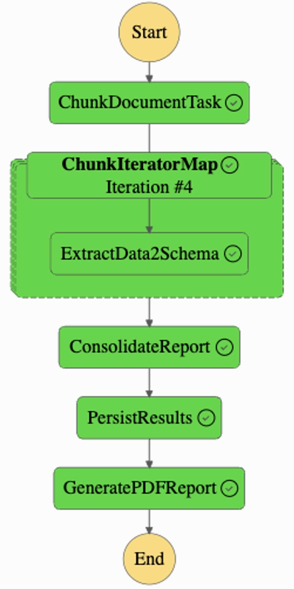

<!-- 
 Copyright Amazon.com, Inc. or its affiliates. All Rights Reserved.
 SPDX-License-Identifier: CC-BY-SA-4.0
 -->

# Multi-Page Document Analysis

**Content Level: 300**

## Suggested Pre-Reading

* [AWS Step Functions Map Pattern](https://docs.aws.amazon.com/step-functions/latest/dg/state-map-distributed.html){:target="_blank" rel="noopener noreferrer"}
* [Prompt composition](../../../2_0_technical_foundations_and_patterns/2_3_core_archtectural_concepts/2_3_2_prompt_engineering/2_3_2-7_composition/composition.md)

## TL;DR
This solution introduces a Map-Reduce approach for processing large documents using generative AI. It leverages Amazon Bedrock's foundation models to extract and consolidate information from arbitrarily large documents, for instance long legal or financial documents. The architecture implements a parallel processing workflow using AWS Step Functions, enabling scalable document analysis while maintaining accuracy and reducing processing time.

## Industry
**Cross-industry**: The solution serves organizations dealing with large volumes of complex documents, such as:

* Financial Services institutions processing legal agreements and company charters.
* Law firms managing extensive document reviews.
* Regulatory compliance departments analyzing legal documents. 
* Corporate legal departments handling contracts and company documentation.
* Government agencies reviewing legal and regulatory filings. 
* Insurance companies analyzing policy documents.
* Business process outsourcing firms handling document processing.

## Business situation
Organizations face challenges in processing large, complex documents that contain important information. The traditional approach relies on manual review by subject matter experts, which is time-consuming, expensive, and prone to errors. This manual process can take weeks to complete and requires resources from highly skilled professionals. The advent of generative AI has given rise to Intelligent Document Processing (IDP), an umbrella term for all document processing done with generative AI tools. Nevertheless the processing of really large documents still poses the following challenges:

* Very long documents can easily exceed standard LLM context windows.
* Managing document complexity and maintaining accuracy becomes harder as the document grows.
* Handling sensitive information requires careful validation.
* Scaling document processing while controlling costs.
* Maintaining consistent extraction across multiple document sections.

## When to use
This architecture is ideal for organizations that need to:

* Process multi-page documents with information spread across multiple sections.
* Extract structured information from complex documents (such as legal or finance documents).
* Reduce manual review time for document processing.

## Benefits
This solution transforms document processing through parallelization and AI-powered analysis:

**Business Benefits**

* Implement cost-effective document processing at scale, without proportional staffing increases.
* Enables faster business decisions by reducing document processing time from weeks to hours.
* Enables professionals to focus on high-value analysis.
* Improves accuracy through systematic extraction.

**Technology Benefits**

* Implement parallel processing for large document volumes that exceed standard LLM context windows.
* Provides consistent, structured output for downstream processing.
* Supports both automated and human-in-the-loop processing.
* Maintain audit trails of extraction results.

## Architecture
The solution implements the Map-Reduce pattern for processing large documents, orchestrated through AWS Step Functions. 

The workflow consists of these key stages:

* **Document Preprocessing Stage**: The process begins with document ingestion, where the solution converts PDF documents to text using optical character recognition (OCR) capabilities. This initial stage preserves document structure while creating machine readable content. The solution then partitions the document into chunks, considering natural document boundaries and context requirements. With this chunking strategy, each section maintains sufficient context for accurate processing while staying within model token limits.
* **Map Stage - Information Extraction**: During the map phase, the solution processes document chunks in parallel using a foundation model. Each chunk undergoes analysis through metaprompting techniques. These techniques break down complex extraction tasks into manageable steps. The solution employs prompt engineering that guides the model to extract specific information while maintaining accuracy. This parallel processing approach handles large documents while managing costs effectively.
* **Reduce Stage - Information Consolidation**: The reduce phase employs a foundation model to consolidate information extracted from individual chunks. This stage implements conflict resolution and information synthesis to provide consistent output even when information appears in multiple sections. The solution maintains context across chunks while eliminating redundancies and resolving potential contradictions in extracted data.

**AWS Services Used:**

* Amazon Textract converts PDF documents to text using OCR capabilities. 
* An Amazon SNS topic is notified when the text extraction process is finished.
* An Amazon SQS queue subscribed to the SNS topic receives the notification that the text has been extracted from the PDF source document .
* Amazon EventBridge is used to trigger the document processing workflow as soon as the text has been extracted from the source document.
* AWS Step Functions orchestrates and manages parallel processing of tasks and error handling. 
* Lambda functions handle individual processing tasks that are part of the workflow.
* Amazon Bedrock provides access to foundation models for both information extraction and information consolidation. 
* Amazon S3 stores source documents and results documents.
* DynamoDB stores both workflow status and JSON results.
* API Gateway publishes, maintains, monitors, and secures document analysis APIs. 
* Security is implemented through Amazon Cognito for user authentication and AWS WAF for API endpoints protection.
* CloudWatch enables monitoring and logging of the entire process.

## Gen AI patterns used
The solution employs [**metaprompting techniques**](../../../2_0_technical_foundations_and_patterns/2_3_core_archtectural_concepts/2_3_2_prompt_engineering/2_3_2-7_composition/composition.md) that break down complex document analysis into structured steps. This approach begins with problem decomposition, where extraction tasks are divided into logical components. The solution then implements step-by-step analysis, guiding the model through increasingly detailed levels of understanding. This structured approach improves accuracy while reducing hallucinations in extracted information.

## AWS Well-Architected Best Practices

### Operational Excellence Pillar

#### [GENOPS02-BP01: Monitor all application layers](https://docs.aws.amazon.com/wellarchitected/latest/generative-ai-lens/genops02-bp01.html){:target="_blank" rel="noopener noreferrer"}
The solution tracks model performance metrics, workflow execution statistics, and resource utilization patterns. This monitoring enables rapid identification and resolution of processing bottlenecks while maintaining optimal performance.

#### [GENOPS02-BP02: Monitor foundation model metrics](https://docs.aws.amazon.com/wellarchitected/latest/generative-ai-lens/genops02-bp02.html){:target="_blank" rel="noopener noreferrer"}
The solution implements comprehensive monitoring across all foundation model interactions in Amazon Bedrock. CloudWatch metrics track key performance indicators including invocation counts, latency, token usage, and error rates. 

#### [GENOPS04-BP01: Automate generative AI application lifecycle with infrastructure as code (IaC)](https://docs.aws.amazon.com/wellarchitected/latest/generative-ai-lens/genops04-bp01.html){:target="_blank" rel="noopener noreferrer"}
The solution uses infrastructure as code deployment patterns for generative AI applications through AWS CDK.

### Security Pillar

#### [GENSEC01-BP01: Grant least privilege access to foundation model endpoints](https://docs.aws.amazon.com/wellarchitected/latest/generative-ai-lens/gensec01-bp01.html){:target="_blank" rel="noopener noreferrer"}
The solution implements access controls throughout the document processing pipeline. Each component operates with minimal required permissions, enabling secure handling of sensitive documents. Access controls extend to both automated processing and human review stages, maintaining security throughout the workflow.

### Reliability Pillar

#### [GENREL03-BP01: Use logic to manage prompt flows and gracefully recover from failure](https://docs.aws.amazon.com/wellarchitected/latest/generative-ai-lens/genrel03-bp01.html){:target="_blank" rel="noopener noreferrer"}
The solution implements workflow management for document processing. Each processing stage includes error handling and recovery mechanisms, enabling reliable document processing even with complex content. The solution maintains processing state throughout the workflow, enabling recovery from interruptions without data loss. Step Functions orchestration provides automatic retry handling and state management, enabling consistent processing completion.

### Performance Efficiency Pillar

#### [GENPERF02-BP03: Select and customize the appropriate model for your use case](https://docs.aws.amazon.com/wellarchitected/latest/generative-ai-lens/genperf02-bp03.html){:target="_blank" rel="noopener noreferrer"}
The solution balances model capability against processing efficiency. A smaller model handles parallel extraction tasks where speed and cost efficiency are crucial, while an advanced model manages complex consolidation requiring deeper understanding. This tiered approach optimizes both performance and cost while maintaining accuracy.

### Cost Optimization Pillar

#### [GENCOST03-BP01: Reduce prompt token length](https://docs.aws.amazon.com/wellarchitected/latest/generative-ai-lens/gencost03-bp01.html){:target="_blank" rel="noopener noreferrer"}
The solution implements metaprompting, which enables complex instruction delivery, while reducing token usage. 

### Sustainability Pillar

#### [GENSUS01-BP01: Implement auto scaling and serverless architectures to optimize resource utilization](https://docs.aws.amazon.com/wellarchitected/latest/generative-ai-lens/gensus01-bp01.html){:target="_blank" rel="noopener noreferrer"}
The solution leverages serverless and fully-managed services throughout, including Amazon Bedrock, AWS Step Functions, Amazon API Gateway, and AWS Lambda, so that resources are only consumed when needed.

## Design tradeoffs
The solution balances automated processing against accuracy requirements. While full automation enables faster processing, sensitive documents require human validation. It also employs metaprompting instead of few-shot learning. Even though few-shot learning yields accurate results, its higher token requirements per invocation increase both costs and latency.

## Common customizations
Organizations implementing this solution might choose to adapt it to their specific industry context. Some examples include:

* **Document type adaptation**: Organizations can customize the solution for specific document types through specialized preprocessing and extraction rules. 
* **Validation workflow**: Organizations can define validation rules and thresholds specific to their needs while maintaining processing efficiency. Implementation options range from fully automated processing to human review workflows.

## Further Reading

* [Multi-page document analysis - Github](https://github.com/aws-samples/generative-ai-ml-latam-samples/tree/main/blueprints/multipage-document-analysis){:target="_blank" rel="noopener noreferrer"}

## Contributors
**Author:** Guillermo Tantachuco - Principal AI Technologist 

**Reviewer:** David Laredo - Sr. Prototyping Architect, PACE 