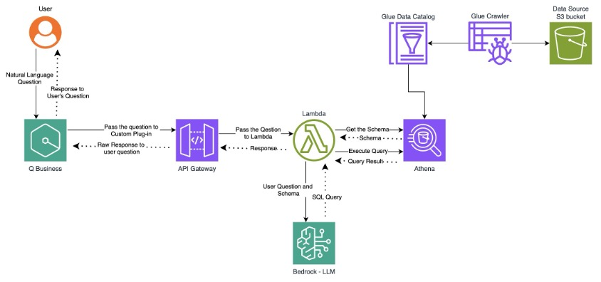
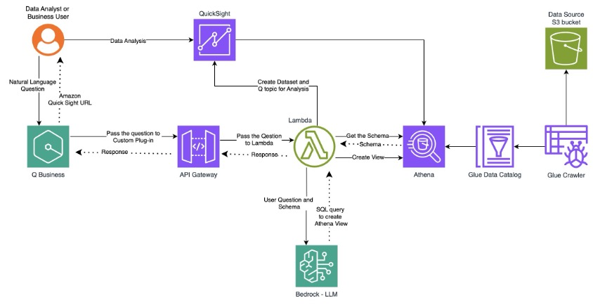

<!-- 
 Copyright Amazon.com, Inc. or its affiliates. All Rights Reserved.
 SPDX-License-Identifier: CC-BY-SA-4.0
 -->

# Self-Service Analytics Platform

**Content Level: 300**

## Suggested Pre-Reading
* [Natural language to SQL translation](../../../3_0_architecture_and_design_patterns/3_1_system_and_application_design_patterns_for_genai/3_1_2_architecture_patterns_by_application_type/3_1_2_4_data_insight_architecture/3_1_2_4_1_text_to_sql_application/3_1_2_4_1_text_to_sql_application.md)
* [Generative business intelligence (BI)](../../../3_0_architecture_and_design_patterns/3_1_system_and_application_design_patterns_for_genai/3_1_2_architecture_patterns_by_application_type/3_1_2_4_data_insight_architecture/3_1_2_4_2_generative_bi/3_1_2_4_2_generative_bi.md)

## TL;DR
With the Self-Service Analytics Platform, non-technical users obtain data insights through natural language queries, eliminating the need for technical expertise. The platform provides a seamless self-service analytics ecosystem that automates reporting, enhances decision-making, and improves operational efficiency. This autonomy reduces dependency on IT teams for data analysis.

## Industry
**Cross-Industry**: Business users across industries can instantly access insights from their data sources. For financial service organizations, the solution learns to interpret "AUM" as "Assets Under Management" or understand regulatory reporting requirements. Manufacturing companies can customize it to understand supply chain terminology, while healthcare organizations can implement HIPAA-compliant configurations with medical terminology recognition.

## Business situation
Organizations are constantly seeking ways to make data analytics more accessible to non-technical business users. However, business teams need data that is scattered across multiple systems. Traditional analytics infrastructure cannot keep pace with sophisticated business needs. Users often spend more time managing fragmented data sources and manual reporting processes than delivering strategic insights. The challenge is twofold:

* How can organizations empower their business teams with real-time, unified views of data? Teams need this data to deliver exceptional services. How can they simultaneously reduce the operational burden that limits their effectiveness?
* How can they make data analytics more accessible to non-technical users, eliminating bottlenecks and accelerating decision-making processes?

This situation creates an important need for a solution that can transform how organizations approach their operations, reporting capabilities, and data accessibility across all levels of the business.

## When to use
Consider implementing this solution when your organization needs to accelerate decision-making and improve business performance through strategic collaboration between business and IT teams.

## Benefits
When IT teams shift from handling routine reports to partnering with the business on complex analytical challenges, both sides benefit tremendously:

**Business Benefits**

* **Faster decision-making**: Business teams gain autonomy and access data insights quickly. 
* **Improved productivity**: This solution reduces time spent on manual data gathering and report creation.
* **Increased agility**: Business teams respond faster to market changes or new business opportunities.
* **Improved customer service**: Customer-facing teams access relevant data to assist customers better.
* **Cost reduction**: This solution replaces weeks of manual report creation with instant self-service insights.

**Technology Benefits**

* **Contextual data storytelling**: Users can generate narrative explanations of data patterns, automatically identifying trends, outliers, and correlations while providing business-relevant interpretations.
* **Natural language processing**: Users can query data using natural language, without requiring database expertise.
* **Conversational Analytics Flow**: The solution remembers previous queries, allowing users to drill down with follow-up questions.
* **Better resource allocation**: This solution allows IT teams to focus on strategic analytical tasks.

## Architecture
The solution uses a dual-architecture approach to address different analytical needs:

* **Ad-hoc query and visualization**: Delivers quick insights and immediate answers for exploratory analysis.
* **Persistent view and advanced analysis**: Creates reusable analytical assets for recurring reporting and deep data exploration.

### Architecture 1: Ad-hoc query and visualization

The process starts when users ask natural language questions to Amazon Q Business such as "show me onboarding completion rates by client segment". To provide immediate answers to the user’s question, the solution implements these capabilities:

* **Plugin integration**: Amazon Q Business passes the question to a custom plugin that serves as the bridge to your data infrastructure. The custom plugin forwards the question through API Gateway, enabling secure and scalable access. API Gateway routes the question to a Lambda function that serves as the intelligent orchestrator.
* **AI-Powered query generation**: The Lambda function retrieves current schema information from Athena, building queries against the most up-to-date data structure. Athena provides detailed schema information, including table structures, relationships, and data types. Lambda sends both the user question and schema context to Amazon Bedrock's foundation model. Amazon Bedrock automatically generates an optimized SQL query that accurately represents the user's natural language intent.
* **Query execution**: Lambda executes the generated SQL query against Athena, which processes it against the S3 data lake and returns structured results. Lambda then formats the raw query results for optimal presentation.
* **Answer delivery**: Amazon Q Business analyzes the results and presents them in a user-friendly, contextually relevant format. The user receives a comprehensive answer to their question, complete with relevant data points and insights.

### Architecture 2: Persistent view and advanced analysis 

The second architecture extends the first architecture to create permanent analytical assets for recurring reporting needs:

* **Persistent view creation**: Instead of executing a query, Lambda creates a persistent view in Athena, establishing a reusable data structure.
* **QuickSight integration**: Lambda automatically creates both a dataset and Q topic in Amazon QuickSight, enabling advanced visualization capabilities. API Gateway returns a comprehensive response to Amazon Q Business, including both immediate answers and dashboard access. 
* **Extended analysis**: Amazon Q Business provides users with both the immediate answer and a direct URL to the QuickSight dashboard. The persistent view and QuickSight assets remain available for advanced data analysis, interactive visualizations, and future analysis.

**AWS Services Used:**

* Amazon S3 serves as the scalable data lake that stores all business data requiring analysis.
* AWS Glue Crawler and Data Catalog automatically discover and catalog data schemas in S3 so that the natural language system always has current metadata for query generation.
* Amazon Athena executes SQL queries directly against S3 data and provides detailed schema information.
* AWS Lambda acts as the intelligent orchestrator that retrieves schema information, sends questions to Bedrock, executes queries, formats results, and creates persistent views and QuickSight assets.
* Amazon Bedrock provides foundation models that automatically generate optimized SQL queries from natural language requests.
* Amazon Q Business serves as the natural language interface that allows non-technical users to ask questions and receive user-friendly, contextually relevant answers.
* Amazon QuickSight provides advanced visualization capabilities through automatically created datasets and Q topics for interactive dashboards and recurring reporting.
* Amazon API Gateway provides secure and scalable access between Amazon Q Business and the backend services.
* Amazon CloudWatch monitors performance by automatically capturing Lambda and Bedrock metrics and tracking key performance indicators such as processing latency and throughput.

## Gen AI patterns used
These two generative AI patterns power this solution: 

* [**Natural language to SQL translation**](../../../3_0_architecture_and_design_patterns/3_1_system_and_application_design_patterns_for_genai/3_1_2_architecture_patterns_by_application_type/3_1_2_4_data_insight_architecture/3_1_2_4_1_text_to_sql_application/3_1_2_4_1_text_to_sql_application.md): The solution understands natural language requests and automatically translates them into optimized SQL commands that you can dynamically execute against your data sources.
* [**Generative business intelligence (BI)**](../../../3_0_architecture_and_design_patterns/3_1_system_and_application_design_patterns_for_genai/3_1_2_architecture_patterns_by_application_type/3_1_2_4_data_insight_architecture/3_1_2_4_2_generative_bi/3_1_2_4_2_generative_bi.md): The solution analyzes query results and transforms raw data into narrative summaries and executive reports that business users can easily understand and act on.

## AWS Well-Architected Best Practices

### Operational Excellence Pillar

#### [GENOPS02-BP01: Monitor all application layers](https://docs.aws.amazon.com/wellarchitected/latest/generative-ai-lens/genops02-bp01.html){:target="_blank" rel="noopener noreferrer"}
The solution tracks model performance metrics and resource utilization patterns. This monitoring enables rapid identification and resolution of processing bottlenecks while maintaining optimal performance.

#### [GENOPS02-BP02: Monitor foundation model metrics](https://docs.aws.amazon.com/wellarchitected/latest/generative-ai-lens/genops02-bp02.html){:target="_blank" rel="noopener noreferrer"}
The solution implements comprehensive monitoring across all foundation model interactions in Amazon Bedrock. CloudWatch metrics track key performance indicators including invocation counts, latency, token usage, and error rates. 

### Security

#### [GENSEC01-BP01: Grant least privilege access to foundation model endpoints](https://docs.aws.amazon.com/wellarchitected/latest/generative-ai-lens/gensec01-bp01.html){:target="_blank" rel="noopener noreferrer"}
This solution gives each component only the minimum access it needs to function. For example, the processing function can only use one specific foundation model rather than having broad access to all available models. This "need-to-know" approach reduces security risks so that no component has more permissions than necessary.

### Cost optimization

#### [GENCOST03-BP01: Reduce prompt token length](https://docs.aws.amazon.com/wellarchitected/latest/generative-ai-lens/gencost03-bp01.html){:target="_blank" rel="noopener noreferrer"}
The solution leverages persistent views that enable shorter prompts for recurring analyses. For ad-hoc queries, the solution creates focused prompts with only relevant schema information from Glue Data Catalog.  This approach reduces token consumption while maintaining query accuracy.

### Sustainability

#### [GENSUS01-BP01: Implement auto scaling and serverless architectures to optimize resource utilization](https://docs.aws.amazon.com/wellarchitected/latest/generative-ai-lens/gensus01-bp01.html){:target="_blank" rel="noopener noreferrer"}
Amazon Bedrock and Amazon Q are fully-managed services, which means that AWS handles the infrastructure management, scaling, and maintenance. As a result, users focus on model development rather than infrastructure utilization. 

### Reliability

#### [GENREL01-BP01: Scale and balance foundation model throughput as a function of utilization](https://docs.aws.amazon.com/wellarchitected/latest/generative-ai-lens/genrel01-bp01.html){:target="_blank" rel="noopener noreferrer"}
The solution dynamically balances foundation model throughput by routing queries to Amazon Bedrock only when needed, while the serverless architecture automatically adjusts compute resources to match utilization patterns without manual intervention.

### Performance Efficiency

#### [GENPERF01-BP02: Collect performance metrics from generative AI workloads](https://docs.aws.amazon.com/wellarchitected/latest/generative-ai-lens/genperf01-bp02.html){:target="_blank" rel="noopener noreferrer"}
CloudWatch logs automatically capture Lambda and Bedrock invocation metrics, providing detailed visibility into AI model usage patterns and performance characteristics. In addition, CloudWatch metrics systematically track key performance indicators including processing latency, throughput, and error rates across all generative AI workloads.

## Design tradeoffs
Natural language queries create an intuitive entry point into data exploration for non-technical users. While queries democratize access to analytics, results may vary compared to precise SQL queries. To deal with this variability, users should refine their analytical thinking through iterative questioning.

## Common customizations
This AI-driven self-service analytics solution provides a foundational framework that adapts to any industry's data analysis requirements. You can choose to customize the solution in the following ways: 

* **Industry-specific adaptations**: Extend the natural language interface to understand your specific business terminology and industry jargon. Whether processing financial transactions, patient records, student performance data, or supply chain metrics, the underlying architecture remains consistent while customers can choose any foundational model under Bedrock.
* **Enterprise Integration**: Create Lambda functions to connect to your existing data sources, including existing databases, Enterprise Resource Planning (ERP) systems, and Customer Relationship Management (CRM) platforms.
* **Geographic and Compliance Customization**: Implement region-specific business rules, date formats, currencies, and regulatory requirements while keeping the user experience consistent across locations.

## Further Reading
* [Custom plugins for Amazon Q Business - Amazon Q Business](https://docs.aws.amazon.com/amazonq/latest/qbusiness-ug/custom-plugin.html){:target="_blank" rel="noopener noreferrer"}

## Contributors

**Author:** Kalyan Arunachalam - Sr. Solutions Architect 

**Reviewer:** Guillermo Tantachuco - Principal AI Technologist 

**Reviewer:** Jan Smaak - Specialist Sr. Sales Rep 

**Reviewer:** Praful Kava - Sr Analytics & AI SA 

 
  