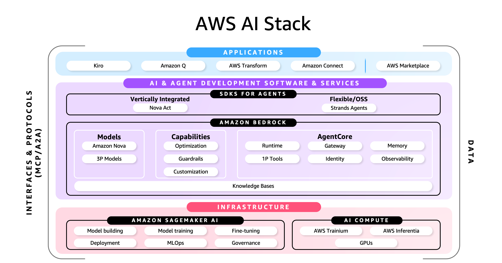

<!-- 
 Copyright Amazon.com, Inc. or its affiliates. All Rights Reserved.
 SPDX-License-Identifier: CC-BY-SA-4.0
 -->

# AWS Services

**Content Level: 100**

## Suggested Pre-Reading
* [Core Concepts and Terminology](../../1_0_generative_ai_fundamentals/1_1_core_concepts_and_terminology/core_concepts_and_terminology.md)
* [Introduction to GenAI Primitives](../../2_0_technical_foundations_and_patterns/index.md)

## TL;DR
This section provides a high-level overview of the primary AWS services for Generative AI and Machine Learning. It explores some available AI services, from foundational infrastructure to ready-to-use applications, helping developers and architects choose the right approach for their projects. Additionally, it highlights the AWS Support Network, which provides expert programs and partners to accelerate the development process.

## AWS Generative AI and ML Services
AWS provides AI capabilities across multiple service categories, from infrastructure to ready-to-use applications. Organizations can choose the approach that best matches their technical capabilities and organizational needs to achieve their business outcomes, with most beginning with ready-to-use solutions and progressing to custom development as specific requirements are identified.

  

The **AWS AI Stack** represents this architecture through three distinct tiers: AI-Powered Applications at the top, Tools to Build and Customize Models in the middle, and Foundational AI Infrastructure at the base. Each layer provides different levels of control and abstraction, enabling teams to start at any level and move between layers as their expertise and requirements evolve. The following sections explore each layer of this stack in detail.

**AI-Powered Applications**

The most direct way to leverage AI is through ready-to-use, intelligent applications. This layer abstracts away the underlying complexity of machine learning, allowing organizations to deploy solutions quickly. A primary example is **Amazon Q**, a generative AI–powered assistant that can be tailored for both business users and developers, providing immediate productivity gains with enterprise-grade security.

**Tools to Build and Customize Models**

For teams that require more control or need to build custom solutions, AWS provides managed services that simplify AI and machine learning development. **Amazon Bedrock** offers access to a wide range of leading Foundation Models through a single API, simplifying the process of building and scaling generative AI applications, including those using Retrieval-Augmented Generation (RAG) or agentic systems. To deliver more relevant, accurate, and customized responses, **Amazon Bedrock Knowledge Bases** can provide contextual information for foundation models based on organizations' private data sources. It supports multiple RAG approaches including traditional vector-based RAG, GraphRAG, and structured RAG.

Amazon Bedrock also enables the development of agentic systems, which are designed to handle complex, multi-step tasks autonomously. Unlike simple prompt-and-response interactions, agents can orchestrate workflows, integrate with various tools, and interact with company data sources to automate business processes like content generation or data analysis. **Amazon Bedrock Agents** provides managed capabilities for building and deploying these agents with built-in AWS service integration, while **Amazon Bedrock AgentCore** addresses production infrastructure challenges at scale, supporting multiple agent frameworks and both Bedrock and external foundation models.

For teams requiring even greater flexibility, **Amazon SageMaker AI** offers a comprehensive environment to build, train, and deploy custom models, supporting the entire ML lifecycle from data preparation through model monitoring in production.

**Foundational AI Infrastructure**

The foundation of the AWS AI Stack is its high-performance, cost-effective infrastructure, designed for the most demanding AI workloads. This layer gives experts maximum control to run deep learning workloads. It provides powerful GPU instances optimized for high-throughput and high-performance inference. It also includes custom silicon like AWS Inferentia and Trainium-powered instances, accessible via the **AWS Neuron SDK**, to optimize performance for both training and inference.

This section provides a high-level overview of AWS's major AI/ML service categories. For detailed service information and specific features, please refer to the linked resources in the Further Reading section.

## Making it Practical
Choosing the right AWS AI/ML service depends on your technical capabilities and specific requirements. Here's a quick guide to get started:

**Choose Your Starting Point:**

* **Start with AI-Powered Applications** if you need immediate results without ML expertise. Amazon Q provides ready-to-use AI assistance for common business and development tasks.

* **Use Amazon Bedrock** when you need to build custom applications with foundation models but want AWS to handle the infrastructure complexity. This is ideal for RAG applications, chatbots, agents, and content generation.

* **Select Amazon SageMaker AI** when you require full control over the ML lifecycle, including custom model training, fine-tuning, and deployment at scale.

* **Leverage Foundational Infrastructure** when you have specialized requirements for training large models or need maximum control over hardware optimization.

**Accelerate with the AWS Support Network**

AWS provides extensive resources to help you succeed:

* The **AWS Generative AI Innovation Center** connects customers with AWS experts to collaborate on building and deploying customer solutions.

* **AWS Generative AI Competency Partners** are a network of validated partners with deep expertise who can help strategize and implement generative AI applications.

* **AWS GenAI Lofts (for startups)** are community spaces offering hands-on workshops and 1:1 access to AI experts to fast-track development.

## Further Reading
**Core Concepts and Capabilities**

* [Generative AI on AWS:](https://aws.amazon.com/ai/generative-ai/){:target="_blank" rel="noopener noreferrer"} Explore the fundamentals of generative AI, including key services like Amazon Bedrock and common use cases.

* [Agentic AI on AWS:](https://aws.amazon.com/ai/agentic-ai/){:target="_blank" rel="noopener noreferrer"} Learn about agentic AI systems that can act independently to perform complex tasks and achieve goals.

* [Machine Learning on AWS:](https://aws.amazon.com/ai/machine-learning/){:target="_blank" rel="noopener noreferrer"} Discover the comprehensive set of services for the entire machine learning lifecycle, from pre-trained models to building and deploying your own.

* [Responsible AI on AWS:](https://aws.amazon.com/ai/responsible-ai/){:target="_blank" rel="noopener noreferrer"} Understand AWS's commitment and approach to developing artificial intelligence responsibly.

* [Generative AI Security on AWS:](https://aws.amazon.com/ai/generative-ai/security/){:target="_blank" rel="noopener noreferrer"} Learn about the security features and best practices for building secure generative AI applications.

**Services and Infrastructure**

* [AWS AI Services:](https://aws.amazon.com/ai/services/){:target="_blank" rel="noopener noreferrer"} A directory of purpose-built AI services that can be integrated into applications for use cases like speech, vision, and document analysis.

* [Data and Analytics on AWS:](https://aws.amazon.com/data/){:target="_blank" rel="noopener noreferrer"} Learn about the services that provide the data foundation necessary for any successful AI or machine learning implementation.

* [AI Infrastructure on AWS:](https://aws.amazon.com/ai/infrastructure/){:target="_blank" rel="noopener noreferrer"} An overview of the high-performance, secure, and cost-effective infrastructure for AI training and inference needs, including GPUs and custom silicon.

**Support Network and Acceleration**

* [AWS Generative AI Innovation Center:](https://aws.amazon.com/ai/generative-ai/innovation-center/){:target="_blank" rel="noopener noreferrer"} A program that connects customers with AWS experts to collaborate on building and deploying custom generative AI solutions.

* [AWS Generative AI Competency Partners:](https://aws.amazon.com/ai/generative-ai/partners/){:target="_blank" rel="noopener noreferrer"} A network of validated partners with deep expertise who can help strategize and implement generative AI applications.

* [AWS GenAI Lofts for Startups:](https://aws.amazon.com/startups/lp/aws-gen-ai-lofts){:target="_blank" rel="noopener noreferrer"} Community spaces offering hands-on workshops and 1:1 access to AI experts to fast-track development.

## Contributors
**Author:** 

* Fernando Galves - Gen AI Solutions Architect 

**Reviewers:**

* Don Simpson - Principal Technologist 