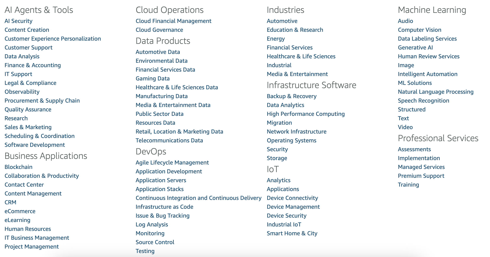

<!-- 
 Copyright Amazon.com, Inc. or its affiliates. All Rights Reserved.
 SPDX-License-Identifier: CC-BY-SA-4.0
 -->

# Selling your SaaS product with AWS

**Content Level: 100**

## Suggested Pre-Reading

[Previous page: Overview: Why a section for ISVs?](../index.md) 

## TL;DR

Amazon has been enabling its ISV customers to sell to other AWS customers since the introduction of AWS Marketplace in 2012. Since then, Amazon has launched SageMaker Marketplace, Bedrock Marketplace, and AI Agent products marketplaces. These additional marketplace offerings bring categories of AWS Marketplace products and services into the AWS console to reach even more AWS customers at the right time in their service evaluation journeys.

## AWS Marketplace

[AWS Marketplace](https://aws.amazon.com/marketplace){:target="_blank" rel="noopener noreferrer"} is the longest-running cloud product marketplace on any major cloud provider. With its extensive offerings, it's a great choice for AWS customers to accelerate their cloud journeys by buying instead of building. Therefore it's a great way for AWS's ISV partners to find qualified leads.

_Figure 1: Screenshot of AWS Marketplace Categories as of 18-Sep-2025_

To learn more about selling on the AWS Marketplace, see [Getting started as an AWS Marketplace seller](https://docs.aws.amazon.com/marketplace/latest/userguide/user-guide-for-sellers.html){:target="_blank" rel="noopener noreferrer"}.

To accelerate your marketplace journey, we strongly encourage customers to reach out to their AWS Account Manager ([or request one here](https://aws.amazon.com/contact-us/sales-support/){:target="_blank" rel="noopener noreferrer"}). 

Your account manager can help you get on AWS Marketplace and start selling your software. They can advise on how to differentiate your offering in a crowded space, and help you build a strategy to sell _with_ AWS.

They can help you find other specialized resources, like Partner Development Representatives, who can accelerate the process of getting your product vetted by AWS ([through its Foundational Technical Review process](https://aws.amazon.com/partners/foundational-technical-review/){:target="_blank" rel="noopener noreferrer"}) and enabled in the AWS Marketplace.

AWS has experts to help you go to market on AWS Marketplace and accelerate your success. The key findings of a 2022 Forrester Research study were as follows:[1]

* Richer deal sizes. Sellers realized deal sizes 80% larger when transacting on AWS Marketplace.

* Increased win rates. Sellers closed 27% more deals when transacting in AWS Marketplace versus other sales channels.

* Accelerated sales cycle. Sellers accelerated their sales cycle by 40% from five months to three months. They did this by using AWS Marketplace’s standard End User License Agreement (EULA) and templated statements of work (SOWs). Furthermore, by associating with AWS, ISVs benefitted from increased credibility, which helped customers justify and ultimately approve the purchase faster.

* Incremental pipeline contribution. Sellers experienced as much as 20% of their pipeline generated through AWS as their relationship with AWS and AWS Marketplace matured.

## SageMaker Marketplace

SageMaker Marketplace is a SageMaker integration with the AWS Marketplace above. It links the AWS Marketplace categories of proprietary models, algorithms, and data products to the SageMaker console. By bringing relevant parts of the AWS Marketplace to users in the SageMaker console, AWS provides potential customers in-context access to the offerings relevant to their AI journey, and makes it easy for them to consume those ISV products.

After registering as an AWS Marketplace seller, you can [List Your Algorithm or Model Package on AWS Marketplace](https://docs.aws.amazon.com/sagemaker/latest/dg/sagemaker-mkt-list.html){:target="_blank" rel="noopener noreferrer"}

## Bedrock Marketplace

Announced at re:Invent 2024, [Amazon Bedrock Marketplace](https://aws.amazon.com/bedrock/marketplace/){:target="_blank" rel="noopener noreferrer"} is a  Bedrock feature that enables developers to discover, test, and use over 100 popular, emerging, and specialized foundation models (FMs) in addition to  the selection of industry-leading models provided for serverless, token-based consumption in Amazon Bedrock. 

This approach offers ISVs the opportunity to feature their models in a centralized catalog, streamlining the process for end-users to find, subscribe to, and deploy them on managed endpoints. For developer customers, this means they can leverage a standardized Bedrock API to access ISV offerings, ensuring compatibility with their existing codebase.

AWS encourages partners to take advantage of the options above, to maximize ISV growth through proven patterns of success.

## SaaS revenue models and their relevance to generative AI

The AWS Marketplace offers three billing methods to provide ISVs with flexibility on product pricing. They are:

* [Usage-based pricing](https://docs.aws.amazon.com/marketplace/latest/userguide/usage-pricing.html){:target="_blank" rel="noopener noreferrer"}

    * As a seller, you can choose one of the usage categories (users, hosts, bandwidth, data, tiers, or units for custom categories).

* [Annual pricing](https://docs.aws.amazon.com/marketplace/latest/userguide/annual-pricing.html){:target="_blank" rel="noopener noreferrer"}

    * As a seller, you can offer products to customers to purchase a 12-month subscription at a discount of your choosing, and the customer pays the full amount at the time of subscription.

* [Contract pricing](https://docs.aws.amazon.com/marketplace/latest/userguide/ami-contracts.html){:target="_blank" rel="noopener noreferrer"}

    * Used for Amazon Machine Image (AMI)-based products. The buyer pays an upfront fee for a single AMI product or AMI with CloudFormation stack.

    * Can be billed up-front or by payment schedule you define.

    * Contract durations can be 1 month, 12 months, 24 months, or 36 months, or for private offers, a custom duration of up to 60 months. 

## Footnotes

  [1] [A Total Economic Impact™ Partner Opportunity Analysis for AWS Marketplace sellers](https://aws.amazon.com/blogs/awsmarketplace/total-economic-impact-partner-opportunity-analysis-aws-marketplace-sellers-forrester/#:~:text=The%20Partner%20Opportunity%20for%20AWS%20Marketplace%20ISVs%20study%2C%20a%20Total,AWS%20and%20AWS%20Marketplace%20matured){:target="_blank" rel="noopener noreferrer"}

## Further Reading

  * [Getting started as an AWS Marketplace seller](https://docs.aws.amazon.com/marketplace/latest/userguide/user-guide-for-sellers.html){:target="_blank" rel="noopener noreferrer"}

## Contributors

### Authors

* Dave Thibault - Sr. Applied AI Architect 

* Felix Huthmacher - Sr. Applied AI Architect 

### Reviewers

* Don Simpson - Principal Technologist 

* Felix Huthmacher - Sr. Applied AI Architect 
