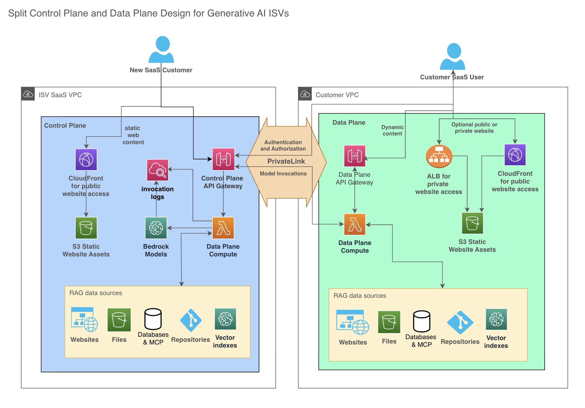

<!-- 
 Copyright Amazon.com, Inc. or its affiliates. All Rights Reserved.
 SPDX-License-Identifier: CC-BY-SA-4.0
 -->

# Control and Data Plane Considerations

**Content Level: 200**

## Suggested Pre-Reading

[Previous page: Protecting Intellectual Property](../8_5_protecting_intellectual_property/protecting_intellectual_property.md) 

## TL;DR

In order to operate successfully, an ISV's SaaS offering needs more than just the software features customers are willing to pay for. It also needs to allow customers to sign up, pick subscription levels, pay for, update, and cancel subscriptions, and provide other elements to control the platform as a whole.

The "data plane" of the SaaS application is the part where the user's data lives. 

The "control plane" of the SaaS application enables provisioning of new accounts and new customer resources into the data plane. The control plane also tracks which resources are owned by and accessible to which users.

This section will discuss the control plane and data plane implementation, given the advice in the previous sections concerning multi-tenancy and protection of intellectual property. 

In general, an ISV should proceed with the goal of keeping as much of the solution in their own accounts as possible, to maximize security, ease of operation and maintenance, and buying power with their cloud vendor. They should only deploy enough to their customers' accounts as is required to delight their customers.

In many software solutions, the value a customer gains from the ISV's offering is dependent on the business data they integrate with it. A business's value is in their data, and an ISV generally wants to help them leverage that data to gain more value from the ISV's SaaS offering. This is especially true in generative AI.

However, many customers like to keep that data in their own accounts as much as possible, rather than host it in the SaaS offering. This is also especially true in generative AI.

Therefore, generative AI SaaS offerings should strive to keep the customer's data in the customer's account, and only use it in transit for model invocations, without logging customer input/output payloads on the ISV side. 

## Control Plane Elements

The control plane should remain 100% within the ISV's accounts. There's generally no reason to extend this part to customer accounts. The control plane includes functionality like:

* Customer account management (create, retrieve, update, delete)
* Customer resource management (create, retrieve, update, delete)
* Customer billing
* Pricing management
* System observability and operational tools (monitoring, security, etc)
* Authentication and authorization

## Data Plane Elements

The data plane is where ISV customers' concerns about their own intellectual property (IP) come into play. Some of the ISV's customers may appreciate the fully-managed SaaS solution. Leaving the data plane in the SaaS account is typically the case with business-to-consumer (B2C) offerings.

For enterprise cloud offerings, many enterprise customers want the data plane stay in their own accounts as much as possible. A recommended approach is for the ISV's customers deploy one or more gateway containers or VPC endpoints in the customer accounts, which customers can use to connect contextual data sources in their own accounts to the ISV's SaaS offering, to keep their data local as much as possible.

## Control and Data Plane Architecture

The following diagram illustrates control and data plane architectures spanning ISV and customer accounts. In the simplified case of a SaaS solution housing all data, both control and data planes are located in the ISV's accounts.

_Figure 1: Split approach: control plane and model invocations in ISV account and remaining data plane in customer account._

In this case, a hypothetical customer has files stored on a file system or in object storage, a search index with information about products for their e-commerce site, and an internal website with procedural documentation for the sellers on their e-commerce site. 

The customer would like to create a chatbot experience on their e-commerce site to answer questions for sellers on their site and for buyers to query about sellers' products.

In this case, a gateway container in the customer's account hosts a web UI that connects to the SaaS control plane for authentication and authorization. It then allows the customer to connect the SaaS software to their data sources by creating the proper policies and permissions (in AWS this involves IAM roles and policies). The gateway container then accesses the customer's data sources, search index, and internal website.

The gateway container ingests those data sources into a vector index that stays in the customer's account, controlled by the gateway container. The resources created in the data plane are registered in the control plane by globally unique tenant ID and resource ID for authentication and authorization purposes.

With respect to model invocations, here's where the ISV's first choice is made: 

* Do they require the invocations to be sent to the ISV accounts to protect the IP represented by the prompt templates, or
* do they keep the invocations in the customer's account?

If they keep model invocations in the customer's account, they must either use the Bedrock API call to check for invocation logging enablement and refuse the request if logging is enabled, or they accept that their fully-populated prompts (with possible intellectual property) may be logged to their customers' logs.

If the ISV is doing the model invocations in their own SaaS accounts, then the gateway container in the customer's account sends the minimal user RAG context.
In this case the ISV must avoid logging the customer's input and output payloads in the SaaS account, to protect the IP and privacy of their customers.

## Further Reading

  * [Integrating your SaaS control plane with AWS Marketplace](https://aws.amazon.com/blogs/apn/integrating-your-saas-control-plane-with-aws-marketplace/){:target="_blank" rel="noopener noreferrer"}

## Contributors

### Authors

* Dave Thibault - Sr. Applied AI Architect 

* Felix Huthmacher - Sr. Applied AI Architect 

### Reviewers

* Don Simpson - Principal Technologist 

* Felix Huthmacher - Sr. Applied AI Architect 

